# Diagrammes UML - Portail Intranet d'Entreprise

> Tous les diagrammes utilisent la syntaxe Mermaid. Ils peuvent être rendus via :
> - Mermaid Live Editor (mermaid.live)
> - Extension VS Code "Markdown Preview Mermaid Support"
> - GitHub (rendu natif des blocs Mermaid)

---

## 1. Diagramme de Cas d'Utilisation

```mermaid
graph TB
    subgraph "Portail Intranet"

        subgraph "Authentification"
            UC1[Se connecter]
            UC2[Se déconnecter]
            UC3[Vérifier sa session]
        end

        subgraph "Gestion des utilisateurs"
            UC4[Créer un utilisateur]
            UC5[Modifier un utilisateur]
            UC6[Supprimer un utilisateur]
            UC7[Lister les utilisateurs]
            UC8[Attribuer une application]
            UC9[Retirer une application]
        end

        subgraph "Gestion des applications"
            UC10[Créer une application]
            UC11[Modifier une application]
            UC12[Supprimer une application]
            UC13[Voir le catalogue]
            UC14[Créer un groupe]
        end

        subgraph "Outils métier"
            UC15[Convertir EDI → Excel]
            UC16[Fusionner fichiers Excel]
            UC17[Traiter fichiers Silae]
            UC18[Détecter les doublons]
            UC19[Vérifier la TVA]
            UC20[Traiter le FEC]
            UC21[Gérer codes comptables]
        end

        subgraph "Analytics & Temps Réel"
            UC22[Consulter les statistiques]
            UC23[Voir les utilisateurs connectés]
            UC24[Enregistrer un événement]
        end
    end

    Visiteur((Visiteur)) --> UC1
    Utilisateur((Utilisateur)) --> UC2
    Utilisateur --> UC3
    Utilisateur --> UC13
    Utilisateur --> UC23

    Comptable((Comptable)) --> UC15
    Comptable --> UC16
    Comptable --> UC21
    Comptable --> UC17

    Auditeur((Auditeur)) --> UC18
    Auditeur --> UC19
    Auditeur --> UC20

    Admin((Admin)) --> UC4
    Admin --> UC5
    Admin --> UC6
    Admin --> UC7
    Admin --> UC8
    Admin --> UC9
    Admin --> UC10
    Admin --> UC11
    Admin --> UC12
    Admin --> UC14
    Admin --> UC22
    Admin --> UC24

    Comptable -.->|hérite| Utilisateur
    Auditeur -.->|hérite| Utilisateur
    Admin -.->|hérite| Utilisateur
```

---

## 2. Diagramme de Classes — Backend Go (Clean Architecture)

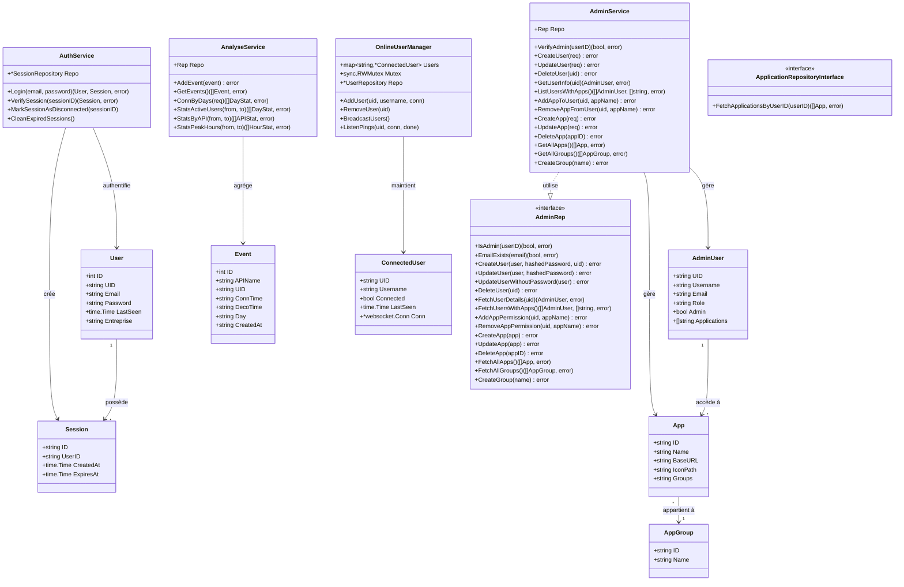

---

## 3. Diagramme de Classes — API Python (SQLAlchemy)

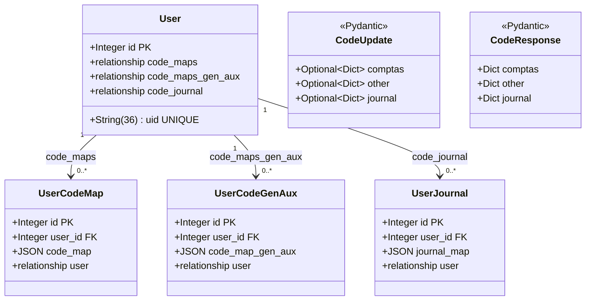

---

## 4. Diagramme de Séquence — Authentification

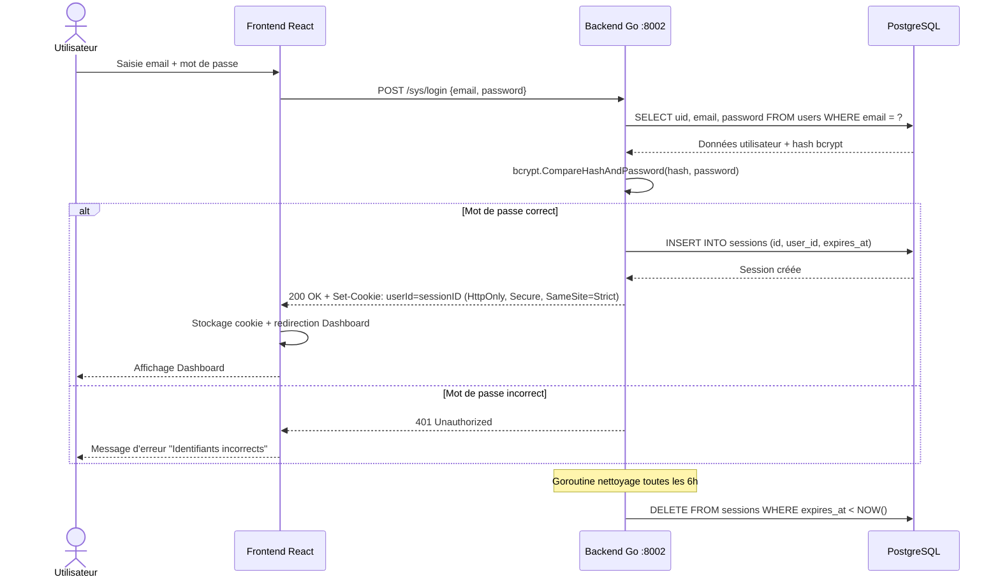

---

## 5. Diagramme de Séquence — Conversion de Fichier EDI

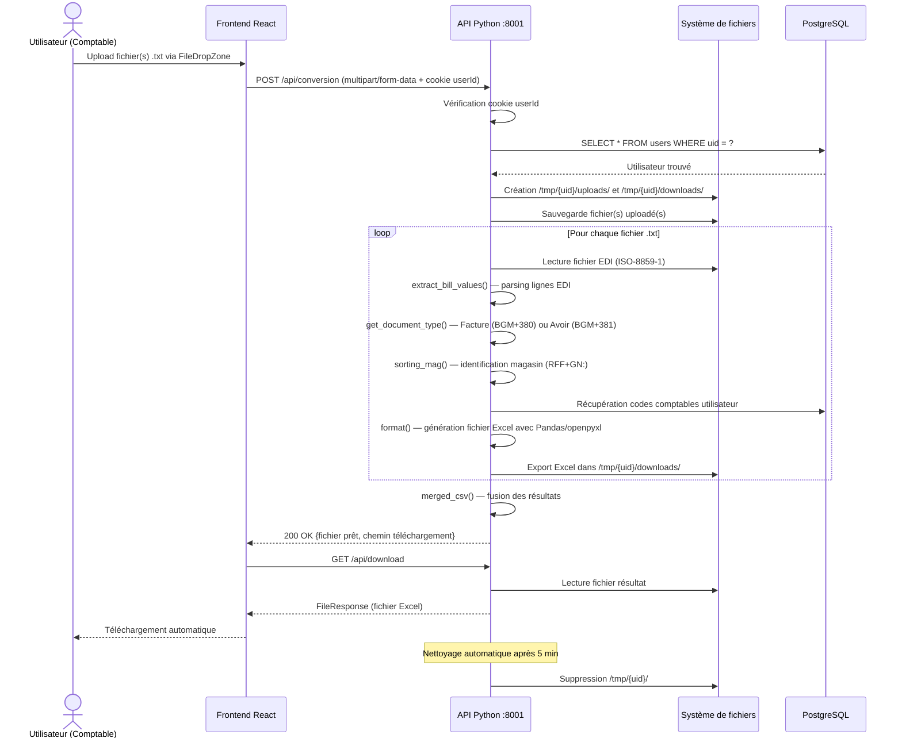

---

## 6. Diagramme de Séquence — WebSocket (Présence Temps Réel)

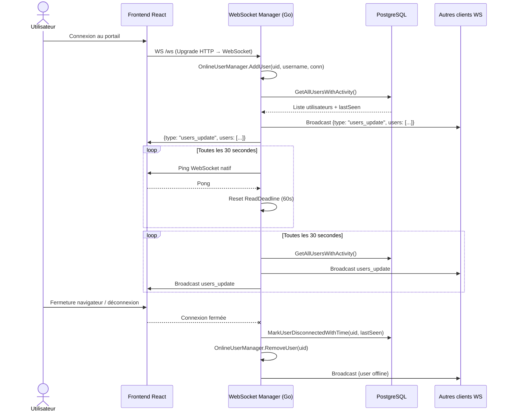

---

## 7. Diagramme de Séquence — CRUD Utilisateur (Admin)

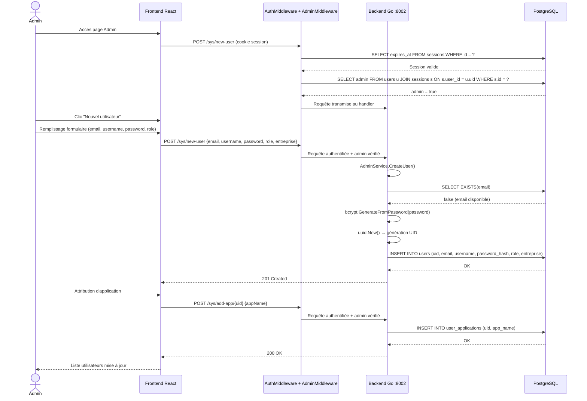

---

## 8. Diagramme de Déploiement

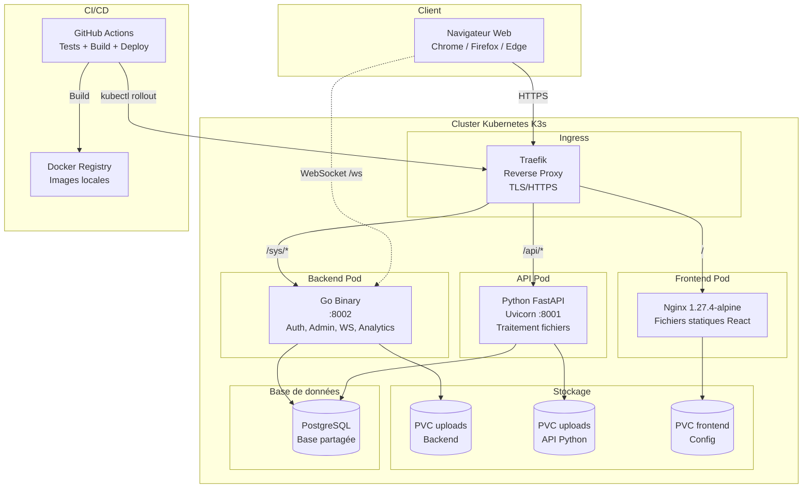

---

## 9. Diagramme d'Architecture en Couches (Backend Go)

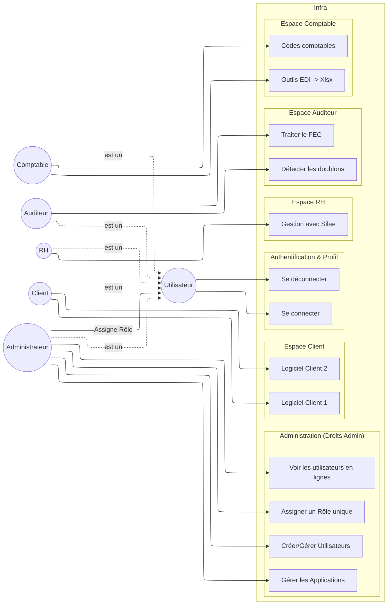

---

## 10. Diagramme Entité-Relation (MCD)

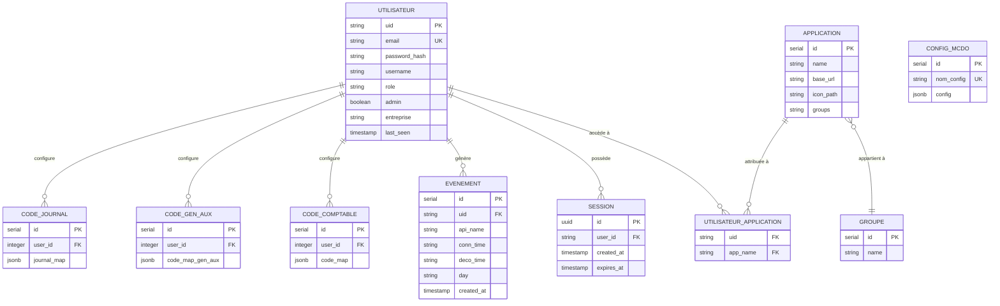

---

## 11. Diagramme de Composants — Frontend React

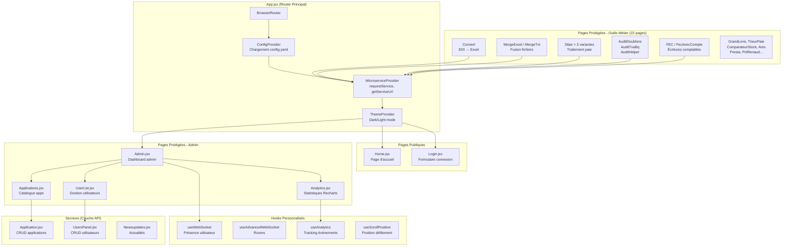
