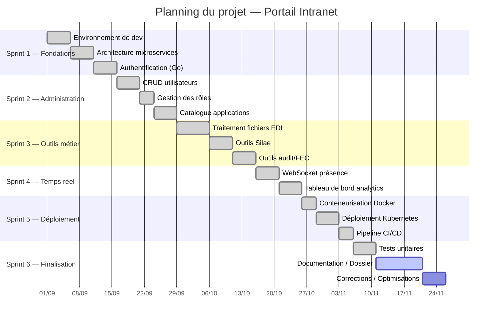
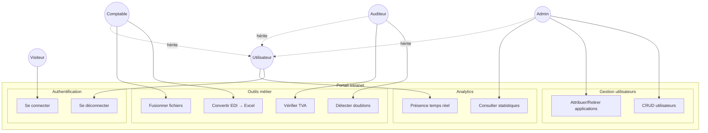
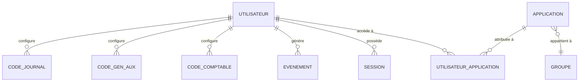
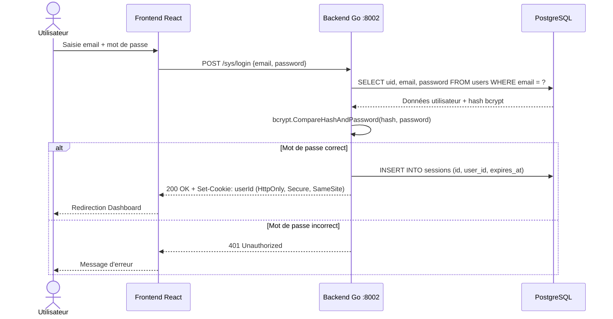
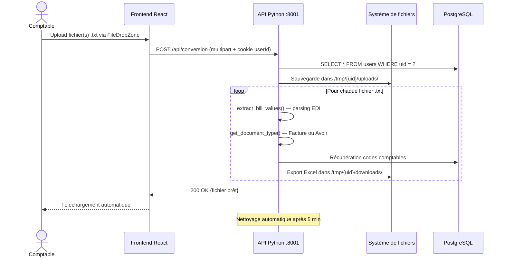

# Dossier de Projet - Titre Professionnel CDA

## Portail Intranet d'Entreprise

**Candidat** : Gwendal [NOM]
**Titre visé** : Concepteur Développeur d'Applications (Niveau 6)
**Date de session** : [À compléter]

---

# Table des matières

1. [Introduction](#1-introduction)
2. [Cahier des charges](#2-cahier-des-charges)
3. [Organisation du projet](#3-organisation-du-projet)
4. [Conception](#4-conception)
5. [Choix des technologies](#5-choix-des-technologies)
6. [Architecture technique](#6-architecture-technique)
7. [Réalisation](#7-réalisation)
8. [Sécurité](#8-sécurité)
9. [Tests](#9-tests)
10. [Déploiement](#10-déploiement)
11. [Veille technologique et sécurité](#11-veille-technologique-et-sécurité)
12. [Améliorations et perspectives](#12-améliorations-et-perspectives)
13. [Conclusion](#13-conclusion)
14. [Glossaire](#14-glossaire)
15. [Annexes](#15-annexes)

---

# 1. Introduction

## 1.1 Contexte du projet

Ce dossier présente la conception et le développement d'un **portail intranet d'entreprise**, réalisé dans le cadre de la préparation du Titre Professionnel Concepteur Développeur d'Applications (CDA), niveau 6.

Le projet répond à un besoin réel d'une entreprise souhaitant centraliser l'accès à ses outils internes, gérer ses utilisateurs et fournir des applications métier spécialisées (traitement comptable, gestion de paie, audit, etc.) au travers d'une interface web unique et sécurisée.

## 1.2 Présentation de l'entreprise

[À compléter : nom de l'entreprise, secteur d'activité, nombre d'employés, contexte organisationnel]

L'entreprise dispose de plusieurs outils internes dispersés et souhaite unifier l'accès à ces outils via un portail centralisé avec gestion des droits d'accès par rôle.

## 1.3 Objectifs du projet

- Centraliser l'accès aux applications métier dans une interface unique
- Gérer les utilisateurs et leurs droits d'accès selon 6 rôles distincts
- Fournir des outils de traitement de fichiers (Excel, PDF, CSV) pour les métiers comptables
- Assurer le suivi de l'activité via un tableau de bord analytique
- Offrir une communication en temps réel entre utilisateurs connectés
- Garantir la sécurité des données et la conformité RGPD

## 1.4 Périmètre fonctionnel

Le portail intranet couvre les fonctionnalités suivantes :
- **Authentification et gestion de sessions** sécurisées
- **Administration des utilisateurs** (CRUD complet, gestion des rôles)
- **Catalogue d'applications** configurable par l'administrateur
- **Outils métier** : traitement Silae (paie), fusion/conversion Excel, audit comptable, traitement FEC
- **Tableau de bord analytique** : suivi des connexions, utilisation des API, heures de pointe
- **Communication temps réel** via WebSocket (présence utilisateur)
- **Gestion de configurations** spécifiques (McDonald's)

---

# 2. Cahier des charges

## 2.1 Expression du besoin

### Problématique
L'entreprise fait face à plusieurs défis :
- Multiplicité des outils non centralisés
- Absence de gestion unifiée des droits d'accès
- Processus manuels de traitement de fichiers comptables
- Manque de visibilité sur l'utilisation des outils

### Besoins fonctionnels

| ID | Besoin | Priorité |
|----|--------|----------|
| BF01 | Authentification sécurisée avec gestion de sessions | Haute |
| BF02 | Gestion des utilisateurs par rôles (Admin, Dev, Comptable, Social, Auditeur, Client) | Haute |
| BF03 | Catalogue d'applications dynamique et configurable | Haute |
| BF04 | Outils de traitement de fichiers (Excel, PDF, CSV) | Haute |
| BF05 | Tableau de bord analytique | Moyenne |
| BF06 | Présence utilisateur en temps réel | Moyenne |
| BF07 | Mode sombre | Basse |
| BF08 | Interface responsive (mobile, tablette, desktop) | Haute |

### Besoins non fonctionnels

| ID | Besoin | Critère |
|----|--------|---------|
| BNF01 | Performance | Temps de réponse < 2s pour les opérations courantes |
| BNF02 | Sécurité | Conformité OWASP Top 10, RGPD |
| BNF03 | Disponibilité | 99.5% de disponibilité (hors maintenance planifiée) |
| BNF04 | Scalabilité | Architecture microservices permettant le scaling horizontal |
| BNF05 | Maintenabilité | Code documenté, architecture en couches |

## 2.2 Contraintes

### Contraintes techniques
- Hébergement sur infrastructure Kubernetes existante (cluster K3s)
- Base de données PostgreSQL imposée par l'existant
- Compatibilité navigateurs modernes (Chrome, Firefox, Edge, Safari)
- Accès HTTPS obligatoire via reverse proxy Traefik

### Contraintes organisationnelles
- Développement en méthodologie Agile (sprints de 2 semaines)
- Livraison continue via pipeline CI/CD GitHub Actions
- Projet réalisé en autonomie dans le cadre de la certification CDA
- Durée totale : environ 6 mois (septembre 2024 — mars 2025)

## 2.3 Livrables attendus

1. Application web fonctionnelle (frontend + backend + API)
2. Documentation technique (architecture, API, déploiement)
3. Documentation utilisateur (guide administrateur)
4. Code source versionné sur GitHub
5. Pipeline CI/CD opérationnel
6. Environnements conteneurisés (Docker + Kubernetes)

## 2.4 User Stories

### Épic 1 : Authentification et gestion de compte

| ID | En tant que... | Je veux... | Afin de... | Priorité |
|----|----------------|------------|------------|----------|
| US01 | Utilisateur | Me connecter avec email et mot de passe | Accéder à mes applications | Haute |
| US02 | Utilisateur | Me déconnecter | Sécuriser mon poste | Haute |
| US03 | Utilisateur | Voir mon profil | Vérifier mes informations | Moyenne |

### Épic 2 : Administration

| ID | En tant que... | Je veux... | Afin de... | Priorité |
|----|----------------|------------|------------|----------|
| US04 | Admin | Créer un utilisateur | Donner accès au portail | Haute |
| US05 | Admin | Modifier un utilisateur | Mettre à jour ses droits | Haute |
| US06 | Admin | Supprimer un utilisateur | Retirer l'accès au portail | Haute |
| US07 | Admin | Attribuer des applications | Personnaliser l'accès | Haute |
| US08 | Admin | Créer une application | Enrichir le catalogue | Haute |
| US09 | Admin | Modifier une application | Mettre à jour les infos | Moyenne |
| US10 | Admin | Supprimer une application | Retirer du catalogue | Moyenne |
| US11 | Admin | Consulter les statistiques | Suivre l'utilisation | Moyenne |

### Épic 3 : Applications métier

| ID | En tant que... | Je veux... | Afin de... | Priorité |
|----|----------------|------------|------------|----------|
| US12 | Comptable | Traiter des fichiers Silae | Automatiser la paie | Haute |
| US13 | Comptable | Fusionner des fichiers Excel | Consolider les données | Haute |
| US14 | Comptable | Convertir des fichiers | Changer de format | Moyenne |
| US15 | Auditeur | Détecter les doublons | Auditer les données | Haute |
| US16 | Auditeur | Vérifier la TVA | Contrôler la conformité | Haute |

### Épic 4 : Temps réel et communication

| ID | En tant que... | Je veux... | Afin de... | Priorité |
|----|----------------|------------|------------|----------|
| US17 | Utilisateur | Voir qui est connecté | Savoir qui est disponible | Moyenne |
| US18 | Utilisateur | Recevoir des notifications | Être informé en temps réel | Basse |

### Épic 5 : Configuration

| ID | En tant que... | Je veux... | Afin de... | Priorité |
|----|----------------|------------|------------|----------|
| US19 | Admin | Configurer les fascicules McDonald's | Personnaliser le traitement des tickets | Moyenne |
| US20 | Utilisateur | Changer le thème (sombre/clair) | Adapter l'interface à mes préférences | Basse |

---

# 3. Organisation du projet

## 3.1 Méthodologie

Le projet est développé selon une approche **Agile Scrum** adaptée :

- **Sprints** de 2 semaines
- **Daily standup** (en contexte projet solo : revue quotidienne des tâches)
- **Sprint review** en fin de sprint
- **Rétrospective** pour amélioration continue

## 3.2 Planning du projet



### Sprint 1 : Fondations
- Mise en place de l'environnement de développement
- Architecture du projet (microservices)
- Authentification et gestion de sessions
- Structure de base du frontend

### Sprint 2 : Administration
- CRUD utilisateurs
- Gestion des rôles
- Catalogue d'applications
- Interface d'administration

### Sprint 3 : Applications métier
- Outils de traitement de fichiers
- Intégration Silae
- Outils d'audit comptable

### Sprint 4 : Temps réel et analytics
- WebSocket et présence utilisateur
- Tableau de bord analytique
- Statistiques d'utilisation

### Sprint 5 : Déploiement et sécurité
- Conteneurisation Docker
- Déploiement Kubernetes
- Pipeline CI/CD
- Tests et sécurisation

### Sprint 6 : Finalisation
- Tests d'acceptation
- Documentation
- Corrections et optimisations

## 3.3 Outils de gestion de projet

| Outil | Usage |
|-------|-------|
| GitHub | Versioning du code, issues, pull requests |
| GitHub Actions | CI/CD automatisé |
| GitHub Projects | Tableau Kanban de suivi |
| Figma | Maquettage des interfaces |

[À insérer : captures d'écran du tableau Kanban GitHub Projects]

---

# 4. Conception

## 4.1 Diagramme de cas d'utilisation

*Voir diagramme complet : `doc/diagrammes.md` — Section 1*



### Acteurs et rôles

| Acteur | Description | Accès |
|--------|-------------|-------|
| **Visiteur** | Utilisateur non authentifié | Page d'accueil, connexion |
| **Utilisateur** | Utilisateur authentifié (base) | Applications attribuées, profil, présence temps réel |
| **Comptable** | Métier comptabilité | Outils Silae, Excel, EDI, codes comptables |
| **Auditeur** | Métier audit | Doublons, TVA, FEC, Grand Livre |
| **Social** | Métier paie/RH | Outils Silae, trieur de paie |
| **Admin** | Administration complète | CRUD utilisateurs, catalogue apps, analytics |
| **Dev** | Développeur | Accès étendu à tous les outils techniques |

## 4.2 Maquettes et wireframes

Les maquettes ci-dessous décrivent les écrans principaux de l'application. L'interface utilise Tailwind CSS avec support du mode sombre.

### 4.2.1 Page de connexion

```
┌─────────────────────────────────────────────────┐
│  [Logo]    Portail Intranet         [🌙 Theme]  │
├─────────────────────────────────────────────────┤
│                                                  │
│              ┌───────────────────┐               │
│              │   Se connecter    │               │
│              │                   │               │
│              │  Email            │               │
│              │  ┌──────────────┐ │               │
│              │  │              │ │               │
│              │  └──────────────┘ │               │
│              │  Mot de passe     │               │
│              │  ┌──────────────┐ │               │
│              │  │              │ │               │
│              │  └──────────────┘ │               │
│              │                   │               │
│              │  [  Connexion  ]  │               │
│              │                   │               │
│              └───────────────────┘               │
│                                                  │
├─────────────────────────────────────────────────┤
│  © 2024 Portail Intranet                        │
└─────────────────────────────────────────────────┘
```

### 4.2.2 Dashboard utilisateur (catalogue d'applications)

```
┌─────────────────────────────────────────────────┐
│  [Logo]   Bienvenue, Jean    [👤] [🌙] [🚪]    │
├─────────────────────────────────────────────────┤
│                                                  │
│  Mes Applications                                │
│  ┌──────────┐ ┌──────────┐ ┌──────────┐        │
│  │  [icon]  │ │  [icon]  │ │  [icon]  │        │
│  │  Silae   │ │  Merge   │ │  FEC     │        │
│  │  Heures  │ │  Excel   │ │          │        │
│  └──────────┘ └──────────┘ └──────────┘        │
│  ┌──────────┐ ┌──────────┐ ┌──────────┐        │
│  │  [icon]  │ │  [icon]  │ │  [icon]  │        │
│  │ Doublons │ │  TVA-BQ  │ │ Convert  │        │
│  │          │ │          │ │ EDI      │        │
│  └──────────┘ └──────────┘ └──────────┘        │
│                                                  │
│  Utilisateurs connectés : 🟢 3 en ligne          │
│  ┌────────────────────────────────────────┐     │
│  │ 🟢 Marie D.  │ 🟢 Paul R.  │ 🔴 Luc T.│    │
│  └────────────────────────────────────────┘     │
├─────────────────────────────────────────────────┤
│  © 2024 Portail Intranet                        │
└─────────────────────────────────────────────────┘
```

### 4.2.3 Interface d'administration

```
┌─────────────────────────────────────────────────┐
│  [Logo]   Admin Panel          [👤] [🌙] [🚪]   │
├──────┬──────────────────────────────────────────┤
│      │  Gestion des utilisateurs                 │
│ Menu │  ┌────────────────────────────────┐       │
│      │  │ 🔍 Rechercher...  [+ Nouveau]  │       │
│ 👥   │  ├──────┬────────┬──────┬────────┤       │
│ Users│  │ Nom  │ Email  │ Rôle │ Actions│       │
│      │  ├──────┼────────┼──────┼────────┤       │
│ 📱   │  │ Jean │ j@e.fr │Admin │ ✏️ 🗑️  │       │
│ Apps │  │ Marie│ m@e.fr │Compta│ ✏️ 🗑️  │       │
│      │  │ Paul │ p@e.fr │Audit │ ✏️ 🗑️  │       │
│ 📊   │  └──────┴────────┴──────┴────────┘       │
│ Stats│                                           │
│      │  Applications attribuées : [dropdown]     │
│ ⚙️   │  [✅ Silae] [✅ Merge] [☐ FEC] [☐ TVA]   │
│ Conf │                                           │
├──────┴──────────────────────────────────────────┤
│  © 2024 Portail Intranet                        │
└─────────────────────────────────────────────────┘
```

### 4.2.4 Tableau de bord analytique

```
┌─────────────────────────────────────────────────┐
│  Admin > Analytics                               │
├─────────────────────────────────────────────────┤
│  📅 Du [01/01/2024] Au [31/03/2024]             │
│                                                  │
│  ┌──────────────────┐  ┌──────────────────┐     │
│  │ Connexions/jour  │  │ Utilisateurs     │     │
│  │    📈 ─────╱──   │  │ actifs  🥇 Jean  │     │
│  │         ╱       │  │         🥈 Marie │     │
│  │    ───╱─────    │  │         🥉 Paul  │     │
│  └──────────────────┘  └──────────────────┘     │
│                                                  │
│  ┌──────────────────┐  ┌──────────────────┐     │
│  │ Utilisation API  │  │ Heures de pointe │     │
│  │ ██████ Silae 45% │  │    📊            │     │
│  │ ████── Merge 30% │  │  ██             │     │
│  │ ██──── FEC   15% │  │ ████  ████      │     │
│  │ █───── Autres10% │  │ 8h  10h  14h    │     │
│  └──────────────────┘  └──────────────────┘     │
└─────────────────────────────────────────────────┘
```

## 4.3 Modélisation des données

### 4.3.1 MCD (Modèle Conceptuel de Données)

*Voir diagramme complet : `doc/diagrammes.md` — Section 10 (Diagramme Entité-Relation)*



Entités principales identifiées :
- **Utilisateur** (uid, email, mot_de_passe, role, entreprise, derniere_connexion)
- **Session** (id, token, uid_utilisateur, date_expiration)
- **Application** (id, nom, description, icone, url, categorie)
- **UtilisateurApplication** (uid_utilisateur, id_application) — association N:N
- **Evenement** (id, type, uid_utilisateur, api, date, details)
- **Groupe** (id, nom, description)
- **ConfigMcDo** (id, nom_config, donnees)
- **CodeComptable** (id, uid_utilisateur, mapping_json)
- **CodeJournal** (id, uid_utilisateur, mapping_json)
- **CodeGenAux** (id, uid_utilisateur, mapping_json)

Relations :
- Un **Utilisateur** possède 0..N **Sessions**
- Un **Utilisateur** a accès à 0..N **Applications** (via UtilisateurApplication)
- Un **Utilisateur** génère 0..N **Événements**
- Un **Utilisateur** possède 0..N **CodeComptable**, **CodeJournal**, **CodeGenAux**
- Un **Utilisateur** appartient à 0..N **Groupes**

### 4.3.2 MLD (Modèle Logique de Données)

```
utilisateurs(#uid VARCHAR PK, email VARCHAR UNIQUE NOT NULL, mot_de_passe VARCHAR NOT NULL,
             role VARCHAR NOT NULL, entreprise VARCHAR, derniere_connexion TIMESTAMP)

sessions(#id UUID PK, token VARCHAR NOT NULL, uid_utilisateur VARCHAR FK→utilisateurs,
         date_expiration TIMESTAMP NOT NULL)

applications(#id SERIAL PK, nom VARCHAR NOT NULL, description TEXT, icone VARCHAR,
             url VARCHAR, categorie VARCHAR)

utilisateur_applications(#uid_utilisateur FK→utilisateurs, #id_application FK→applications)

evenements(#id SERIAL PK, type VARCHAR, uid_utilisateur VARCHAR FK→utilisateurs,
           api VARCHAR, date TIMESTAMP DEFAULT NOW(), details JSONB)

groupes(#id SERIAL PK, nom VARCHAR NOT NULL, description TEXT)

config_mcdo(#id SERIAL PK, nom_config VARCHAR UNIQUE, donnees JSONB)

codes_comptables(#id SERIAL PK, uid_utilisateur VARCHAR FK→utilisateurs, mapping JSONB)

codes_journal(#id SERIAL PK, uid_utilisateur VARCHAR FK→utilisateurs, mapping JSONB)

codes_gen_aux(#id SERIAL PK, uid_utilisateur VARCHAR FK→utilisateurs, mapping JSONB)
```

### 4.3.3 MPD (Modèle Physique de Données)

```sql
-- Script de création de la base de données
-- PostgreSQL

CREATE TABLE utilisateurs (
    uid VARCHAR(255) PRIMARY KEY,
    email VARCHAR(255) UNIQUE NOT NULL,
    mot_de_passe VARCHAR(255) NOT NULL,
    role VARCHAR(50) NOT NULL DEFAULT 'Client',
    entreprise VARCHAR(255),
    derniere_connexion TIMESTAMP
);

CREATE TABLE sessions (
    id UUID PRIMARY KEY DEFAULT gen_random_uuid(),
    token VARCHAR(512) NOT NULL,
    uid_utilisateur VARCHAR(255) REFERENCES utilisateurs(uid) ON DELETE CASCADE,
    date_expiration TIMESTAMP NOT NULL
);

CREATE INDEX idx_sessions_token ON sessions(token);
CREATE INDEX idx_sessions_expiration ON sessions(date_expiration);

CREATE TABLE applications (
    id SERIAL PRIMARY KEY,
    nom VARCHAR(255) NOT NULL,
    description TEXT,
    icone VARCHAR(255),
    url VARCHAR(500),
    categorie VARCHAR(100)
);

CREATE TABLE utilisateur_applications (
    uid_utilisateur VARCHAR(255) REFERENCES utilisateurs(uid) ON DELETE CASCADE,
    id_application INTEGER REFERENCES applications(id) ON DELETE CASCADE,
    PRIMARY KEY (uid_utilisateur, id_application)
);

CREATE TABLE evenements (
    id SERIAL PRIMARY KEY,
    type VARCHAR(100),
    uid_utilisateur VARCHAR(255) REFERENCES utilisateurs(uid),
    api VARCHAR(255),
    date TIMESTAMP DEFAULT NOW(),
    details JSONB
);

CREATE INDEX idx_evenements_date ON evenements(date);
CREATE INDEX idx_evenements_utilisateur ON evenements(uid_utilisateur);

CREATE TABLE groupes (
    id SERIAL PRIMARY KEY,
    nom VARCHAR(255) NOT NULL,
    description TEXT
);

CREATE TABLE config_mcdo (
    id SERIAL PRIMARY KEY,
    nom_config VARCHAR(255) UNIQUE,
    donnees JSONB
);

CREATE TABLE codes_comptables (
    id SERIAL PRIMARY KEY,
    uid_utilisateur VARCHAR(255) REFERENCES utilisateurs(uid) ON DELETE CASCADE,
    mapping JSONB
);

CREATE TABLE codes_journal (
    id SERIAL PRIMARY KEY,
    uid_utilisateur VARCHAR(255) REFERENCES utilisateurs(uid) ON DELETE CASCADE,
    mapping JSONB
);

CREATE TABLE codes_gen_aux (
    id SERIAL PRIMARY KEY,
    uid_utilisateur VARCHAR(255) REFERENCES utilisateurs(uid) ON DELETE CASCADE,
    mapping JSONB
);
```

## 4.4 Diagrammes de séquence

### 4.4.1 Authentification

*Voir diagramme complet : `doc/diagrammes.md` — Section 4*



### 4.4.2 Traitement de fichier — Conversion EDI

*Voir diagramme complet : `doc/diagrammes.md` — Section 5*



### 4.4.3 WebSocket - Présence utilisateur

```
Utilisateur → Frontend : Connexion réussie
Frontend → Backend (Go) : WS /ws (upgrade HTTP → WebSocket)
Backend → WebSocket Manager : Enregistrer connexion
WebSocket Manager → PostgreSQL : INSERT connected_user
WebSocket Manager → Tous les clients WS : Broadcast {user_online: uid}
[...]
Frontend → Backend : Fermeture connexion WS
Backend → WebSocket Manager : Retirer connexion
WebSocket Manager → PostgreSQL : DELETE connected_user
WebSocket Manager → Tous les clients WS : Broadcast {user_offline: uid}
```

---

# 5. Choix des technologies

## 5.1 Tableau comparatif et justification

### Frontend

| Critère | React 19 | Vue.js 3 | Angular 17 | Choix |
|---------|----------|----------|-------------|-------|
| Courbe d'apprentissage | Moyenne | Facile | Difficile | **React** |
| Écosystème | Très riche | Riche | Complet | **React** |
| Performance | Excellente (Virtual DOM, Concurrent Mode) | Excellente | Bonne | **React** |
| Communauté | Très large | Large | Large | **React** |
| Recrutement | Fort | Moyen | Moyen | **React** |

**Justification** : React 19 a été choisi pour son écosystème mature, sa communauté active, et ses fonctionnalités modernes (Concurrent Mode, Server Components). Le Virtual DOM optimise les re-rendus, et l'architecture par composants favorise la réutilisabilité du code.

**Vite** a été préféré à Create React App (déprécié) pour sa rapidité de build (ESBuild), son HMR instantané et sa configuration légère.

**Tailwind CSS** a été choisi plutôt que Bootstrap ou Material UI pour son approche utility-first, sa personnalisation fine et l'absence de CSS inutilisé en production grâce au purge automatique.

### Backend

| Critère | Go | Node.js | Java Spring | Choix |
|---------|-----|---------|-------------|-------|
| Performance | Excellente (compilé) | Bonne | Bonne | **Go** |
| Concurrence | Goroutines natives | Event loop | Threads | **Go** |
| Typage | Statique fort | Dynamique | Statique fort | **Go** |
| Déploiement | Binary unique | node_modules | JAR + JVM | **Go** |
| WebSocket | Gorilla/websocket | Socket.io | Spring WebSocket | **Go** |

**Justification** : Go a été choisi pour ses performances natives (compilation en binaire), sa gestion de la concurrence via les goroutines (idéal pour le WebSocket et les requêtes parallèles), et la simplicité de déploiement (un seul binaire sans dépendances runtime). Le typage statique renforce la fiabilité du code.

### API de traitement de données

| Critère | Python FastAPI | Go | Node.js | Choix |
|---------|---------------|-----|---------|-------|
| Data processing | Pandas, NumPy | Limité | Limité | **Python** |
| Excel/CSV | openpyxl, XlsxWriter | Limité | ExcelJS | **Python** |
| Vitesse dev | Rapide | Moyenne | Rapide | **Python** |
| Async | Natif (ASGI) | Goroutines | Event loop | **Python** |
| Documentation auto | Swagger intégré | Manuel | Manuel | **Python** |

**Justification** : Python avec FastAPI a été choisi spécifiquement pour les opérations de traitement de données. L'écosystème Python (Pandas, NumPy, openpyxl) est inégalé pour la manipulation de fichiers Excel/CSV. FastAPI offre des performances élevées (ASGI), une validation automatique (Pydantic) et une documentation Swagger générée automatiquement.

### Base de données

| Critère | PostgreSQL | MySQL | MongoDB | Choix |
|---------|-----------|-------|---------|-------|
| ACID | Complet | Complet | Partiel | **PostgreSQL** |
| JSON/JSONB | Natif | JSON (limité) | Natif | **PostgreSQL** |
| Extensions | Très riche | Limitées | N/A | **PostgreSQL** |
| Performance | Excellente | Excellente | Variable | **PostgreSQL** |

**Justification** : PostgreSQL a été choisi pour sa robustesse, son support natif JSONB (utilisé pour les mappings de codes comptables), ses capacités d'extension et sa conformité ACID complète. Le type JSONB permet de stocker des données semi-structurées tout en bénéficiant de l'indexation.

### Infrastructure

| Technologie | Justification |
|-------------|---------------|
| **Docker** | Conteneurisation pour reproductibilité des environnements, isolation des services |
| **Kubernetes (K3s)** | Orchestration, scaling horizontal, rolling updates, auto-healing |
| **Traefik** | Reverse proxy / ingress controller natif K8s, Let's Encrypt intégré |
| **GitHub Actions** | CI/CD intégrée au repository, gratuit pour projets privés |

## 5.2 Architecture logicielle choisie

- **Frontend** : Architecture par composants (React), patterns Context/Provider pour l'état global
- **Backend** : Architecture en couches (Handler → Service → Repository), Clean Architecture
- **API Python** : Architecture modulaire (routes → utils → schemas → db)
- **Infrastructure** : Architecture microservices conteneurisée avec orchestration K8s

---

# 6. Architecture technique

## 6.1 Architecture globale

*Voir diagrammes détaillés : `doc/diagrammes.md` — Sections 8 (Déploiement) et 9 (Architecture en couches)*

```
                    ┌─────────────────────────────────┐
                    │          Utilisateur             │
                    │        (Navigateur Web)          │
                    └────────────┬────────────────────┘
                                 │ HTTPS
                    ┌────────────▼────────────────────┐
                    │     Traefik (Reverse Proxy)      │
                    │     Ingress Controller K8s       │
                    └──┬──────────┬──────────┬────────┘
                       │          │          │
          ┌────────────▼──┐ ┌────▼──────┐ ┌─▼───────────┐
          │   Frontend    │ │  Backend  │ │  API Python  │
          │  React + Vite │ │    Go     │ │   FastAPI    │
          │  (Nginx)      │ │  :8002    │ │   :8001      │
          │  :3000        │ │           │ │              │
          └───────────────┘ └─────┬─────┘ └──────┬──────┘
                                  │              │
                            ┌─────▼──────────────▼──────┐
                            │      PostgreSQL            │
                            │    Base de données         │
                            └───────────────────────────┘
```

### Flux de communication :
1. **Frontend → Backend (Go)** : Authentification, gestion utilisateurs, WebSocket, analytics
2. **Frontend → API (Python)** : Traitement de fichiers, codes comptables
3. **Backend → PostgreSQL** : Persistance utilisateurs, sessions, applications, événements
4. **API Python → PostgreSQL** : Persistance codes comptables, mapping
5. **WebSocket** : Communication bidirectionnelle temps réel (présence)

## 6.2 Architecture frontend

```
frontend/src/
├── App.jsx                     # Router principal + Context Providers
├── context/
│   └── ThemeContext.jsx         # Gestion du thème (dark/light)
├── components/
│   ├── Landing/                 # Pages publiques (Header, Footer, Home)
│   ├── Auth/                    # Authentification (Login)
│   ├── Admin/                   # Interface d'administration
│   │   ├── Admin.jsx            # Dashboard admin
│   │   ├── UserList.jsx         # Liste et gestion des utilisateurs
│   │   ├── Applications.jsx     # Catalogue d'applications
│   │   └── Analytics.jsx        # Tableau de bord analytique
│   ├── pages/                   # 22 outils métier (lazy-loaded)
│   │   ├── Silae*/              # Traitement paie (3 variantes)
│   │   ├── MergeExcel/          # Fusion Excel
│   │   ├── Doublons/            # Détection doublons
│   │   └── ...                  # Autres outils spécialisés
│   ├── UI/                      # Composants réutilisables
│   └── Widgets/                 # Widgets (horloge, etc.)
├── hooks/                       # Hooks personnalisés
│   ├── useWebSocket.js          # WebSocket basique
│   ├── useAdvancedWebSocket.js  # WebSocket avec rooms
│   └── useAnalytics.js          # Tracking analytique
├── services/                    # Couche d'appels API
│   ├── Application.jsx          # Service applications
│   ├── UsersPanel.jsx           # Service utilisateurs
│   └── Newsupdates.jsx          # Service actualités
└── utils/                       # Utilitaires (logger, time, 404)
```

**Patterns appliqués** :
- **Lazy Loading** : `React.lazy()` + `Suspense` pour le code splitting
- **Context Pattern** : `ConfigContext`, `MicroservicesContext`, `ThemeContext`
- **Service Layer** : Abstraction Axios pour les appels API
- **Protected Routes** : Vérification du token avant accès aux pages protégées

## 6.3 Architecture backend (Go)

```
backend/
├── cmd/
│   └── main.go                  # Point d'entrée, configuration routes (3 subrouters)
├── internal/
│   ├── db/
│   │   └── postgres.go          # Connexion et initialisation BDD
│   ├── middleware/
│   │   ├── cors.go              # Middleware CORS
│   │   └── auth.go              # Middlewares AuthMiddleware + AdminMiddleware
│   ├── models/
│   │   └── models.go            # Structures de données
│   └── services/
│       ├── auth/                # Service authentification
│       │   ├── handler.go       # Couche HTTP (endpoints)
│       │   ├── service.go       # Logique métier
│       │   └── repository.go   # Accès données
│       ├── admin/               # Service administration
│       │   ├── handler.go
│       │   ├── service.go
│       │   └── repository.go
│       ├── applications/        # Service applications
│       │   ├── handler.go
│       │   ├── service.go
│       │   ├── repository.go
│       │   └── interface.go     # Interface repository
│       ├── analyse/             # Service analytics
│       │   ├── handler.go
│       │   ├── service.go
│       │   └── repository.go
│       ├── websocket/           # Service WebSocket
│       │   ├── handler.go
│       │   ├── manager.go       # Gestion des connexions
│       │   └── repository.go
│       └── Macdos/              # Service config McDonald's
│           ├── handler.go
│           ├── service.go
│           └── repository.go
```

**Pattern Clean Architecture** :
- **Handler** (couche présentation) : Parse les requêtes HTTP, valide les entrées, retourne les réponses
- **Service** (couche métier) : Contient la logique métier, indépendant du transport HTTP
- **Repository** (couche données) : Abstraction de l'accès à la base de données
- **Interface** : Définition des contrats (ex: `ApplicationRepository`) pour l'injection de dépendances
- **Middleware** : Pipeline de sécurité transversal (CORS, AuthMiddleware, AdminMiddleware)

**Routage sécurisé (3 subrouters)** :
- `pub` (routes publiques) : `/sys/login`, `/sys/logout` — aucun middleware d'authentification
- `sys` (routes authentifiées) : `/sys/applications`, `/sys/ws` — protégées par `AuthMiddleware`
- `adm` (routes administration) : `/sys/get-users`, `/sys/new-user`, `/sys/delete-user/*` — protégées par `AuthMiddleware` + `AdminMiddleware`

## 6.4 Architecture API Python

```
api/
├── main.py                      # Configuration FastAPI + CORS
├── run.py                       # Lancement Uvicorn
├── routers.py                   # Définition des endpoints (~500 lignes)
├── auth/
│   └── auth_bearer.py           # Middleware authentification Bearer (secrets via env vars)
├── db/
│   └── database.py              # SQLAlchemy + connexion PostgreSQL
├── schemas/
│   └── model.py                 # Modèles ORM (User, CodeMap, etc.)
├── utils/
│   ├── convert.py               # Fonctions de conversion comptable
│   ├── format.py                # Formatage des données
│   ├── utils.py                 # Utilitaires généraux
│   ├── searching.py             # Recherche dans les données
│   └── sort.py                  # Tri des données
└── Logging/
    └── logging_config.py        # Configuration des logs
```

## 6.5 Infrastructure de déploiement

```
                   ┌──────────────────────────────────┐
                   │      Cluster Kubernetes (K3s)     │
                   │                                    │
                   │  ┌─────────┐  ┌─────────┐        │
                   │  │Frontend │  │Frontend │  ...    │
                   │  │ Pod     │  │ Pod     │         │
                   │  └────┬────┘  └────┬────┘        │
                   │       └──────┬─────┘              │
                   │         ┌────▼────┐               │
                   │         │ Service │               │
                   │         └────┬────┘               │
                   │              │                     │
                   │  ┌───────────▼──────────────┐     │
                   │  │  Traefik IngressRoute    │     │
                   │  └──────────────────────────┘     │
                   │                                    │
                   │  (Même pattern pour Backend/API)   │
                   │                                    │
                   │  ┌────────────────────────────┐   │
                   │  │  PersistentVolumeClaims    │   │
                   │  │  (/app/uploads pour chaque │   │
                   │  │   service)                 │   │
                   │  └────────────────────────────┘   │
                   └──────────────────────────────────┘
```

---

# 7. Réalisation

## 7.1 Développement du frontend

### 7.1.1 Composant d'authentification

Le composant Login gère l'authentification de l'utilisateur via un formulaire email/mot de passe. Les cookies de session sont configurés avec les flags `HttpOnly`, `Secure` et `SameSite=Strict` pour la sécurité.

Le système de routing est entièrement dynamique, piloté par un fichier `config.yaml`. Le composant `RouteGenerator` lit la configuration et génère les routes React Router avec les protections appropriées :

```jsx
// App.jsx — Routing dynamique avec protection par rôle
const RouteGenerator = () => {
  const config = useConfig();
  return (
    <Suspense fallback={<Loading />}>
      <Routes>
        {Object.entries(config.routes).map(([key, route]) => {
          if (route.requireAdmin) {
            return (
              <Route key={key} path={route.path} element={
                <AuthenticationWrapper>
                  <AdminRoute element={ComponentMap[route.component]} />
                </AuthenticationWrapper>
              } />
            );
          }
          if (route.protected) {
            return (
              <Route key={key} path={route.path} element={
                <AuthenticationWrapper>
                  {React.createElement(ComponentMap[route.component])}
                </AuthenticationWrapper>
              } />
            );
          }
          // Route standard publique
          return <Route key={key} path={route.path}
            element={React.createElement(ComponentMap[route.component])} />;
        })}
      </Routes>
    </Suspense>
  );
};
```

Le `MicroserviceProvider` centralise tous les appels API avec gestion automatique des tokens et redirection en cas d'expiration de session :

```jsx
// App.jsx — Couche d'abstraction des appels API
const requestService = async (serviceName, endpoint, method, data, config) => {
  const serviceUrl = getServiceUrl(serviceName);
  const response = await axios({
    method, url: `${serviceUrl}/${endpoint}`, data,
    withCredentials: true,
    headers: { 'Authorization': `Bearer ${Cookies.get('userId')}` },
  });
  return response.data;
};
```

### 7.1.2 Interface d'administration

L'interface d'administration comprend :
- **Liste des utilisateurs** avec recherche, filtrage par rôle, et actions CRUD
- **Gestion du catalogue d'applications** avec upload d'icônes
- **Tableau de bord analytique** avec graphiques (Recharts) : connexions par jour, utilisateurs actifs, utilisation par API, heures de pointe

[À insérer : captures d'écran de l'interface admin — voir wireframes section 4.2]

### 7.1.3 Outils métier

22 outils spécialisés ont été développés, chacun en lazy loading pour optimiser le bundle :

| Outil | Description | Utilisateur cible |
|-------|-------------|-------------------|
| Silae (3 variantes) | Traitement fichiers de paie | Comptable, Social |
| MergeExcel | Fusion de fichiers Excel | Comptable |
| ConvertExcel | Conversion de formats | Comptable |
| FEC | Traitement Fichier d'Écritures Comptables | Comptable, Auditeur |
| Doublons | Détection de doublons | Auditeur |
| TVA-BQ | Vérification TVA | Auditeur |
| Tickets McDo | Traitement tickets | Comptable |
| Grand Livre | Analyse grand livre | Comptable |
| Trieur Paie | Tri des fichiers de paie | Social |
| Comparateur Stock | Comparaison de stocks | Comptable |

### 7.1.4 Gestion du thème (Dark Mode)

Implémentation via React Context + Tailwind CSS `darkMode: 'class'`. Le thème est persisté dans le `localStorage` de l'utilisateur.

### 7.1.5 WebSocket et temps réel

Deux hooks personnalisés gèrent la communication temps réel :
- `useWebSocket` : connexion basique pour la présence utilisateur
- `useAdvancedWebSocket` : gestion de rooms pour les fonctionnalités avancées

## 7.2 Développement du backend (Go)

### 7.2.1 Service d'authentification

Flux d'authentification :
1. Réception des credentials (email + mot de passe)
2. Vérification du mot de passe hashé via `bcrypt.CompareHashAndPassword`
3. Génération d'un token de session (UUID)
4. Stockage en base avec date d'expiration
5. Retour du token dans un cookie sécurisé

Un goroutine de nettoyage tourne en arrière-plan toutes les 6 heures pour supprimer les sessions expirées.

```go
// backend/internal/services/auth/service/service.go
func (s *Service) Login(email, password string) (models.User, models.Session, error) {
    // 1. Recherche de l'utilisateur par email
    user, hashedPassword, err := s.Repo.GetUserByEmail(email)
    if err != nil {
        return models.User{}, models.Session{}, err
    }
    // 2. Vérification du mot de passe via bcrypt
    if err := bcrypt.CompareHashAndPassword(
        []byte(hashedPassword), []byte(password),
    ); err != nil {
        return models.User{}, models.Session{}, err
    }
    // 3. Création d'une session avec expiration 24h
    session, err := s.Repo.CreateSession(user.UID, 24*time.Hour)
    if err != nil {
        return models.User{}, models.Session{}, err
    }
    return user, session, nil
}

// Nettoyage automatique des sessions expirées (goroutine)
func (s *Service) CleanExpiredSessions() {
    go func() {
        ticker := time.NewTicker(6 * time.Hour)
        for range ticker.C {
            s.Repo.CleanExpiredSessions()
        }
    }()
}
```

### 7.2.2 Middlewares de sécurité

Le backend utilise un pipeline de middlewares Gorilla Mux pour sécuriser les routes :

- **AuthMiddleware** : vérifie la présence d'un cookie `userId`, interroge la table `sessions` pour valider le token et vérifier que la session n'est pas expirée. Laisse passer les requêtes `OPTIONS` pour le preflight CORS.
- **AdminMiddleware** : après authentification, joint la table `users` via la session pour vérifier le flag `admin`. Retourne 403 si non-admin.

Les routes sont organisées en 3 subrouters :
1. `pub` — routes publiques (login, logout) sans middleware
2. `sys` — routes authentifiées (applications, WebSocket) avec `AuthMiddleware`
3. `adm` — routes admin (CRUD users, apps, upload) avec `AuthMiddleware` + `AdminMiddleware`

### 7.2.3 WebSocket Manager

Le WebSocket Manager gère la présence en temps réel :
- Maintient une map thread-safe (`sync.RWMutex`) des connexions actives
- Broadcast les événements de connexion/déconnexion à tous les clients
- Persiste l'état en base pour la reprise après redémarrage
- **Validation de l'origine** : le `CheckOrigin` de l'upgrader WebSocket vérifie que le header `Origin` appartient à une allowlist (`https://preprod.azert.fr`, `localhost:3000`), prévenant le Cross-Site WebSocket Hijacking

### 7.2.4 Service Analytics

Le service analytics collecte les événements d'utilisation et fournit des agrégations :
- Connexions par jour
- Utilisateurs les plus actifs
- Utilisation par endpoint API
- Heures de pointe

## 7.3 Développement de l'API Python

### 7.3.1 Traitement de fichiers

L'API Python gère le cycle de vie complet des fichiers :
1. **Upload** : stockage dans `/tmp/{user_uid}/uploads/` (isolation par utilisateur)
2. **Validation** : le `user_uid` est validé au format UUID v4 par regex avant toute opération sur le système de fichiers (protection contre le path traversal)
3. **Traitement** : utilisation de Pandas/openpyxl pour les opérations
4. **Download** : fichier résultat disponible dans `/tmp/{user_uid}/downloads/`
5. **Nettoyage** : daemon thread supprime les fichiers après 5 minutes

**Sécurisation des secrets** : les clés JWT (`JWT_SECRET_KEY`, `JWT_REFRESH_SECRET_KEY`) sont lues depuis les variables d'environnement. Le serveur refuse de démarrer si elles ne sont pas définies.

### 7.3.2 Système de codes comptables

Un système flexible de mapping de codes utilise le type JSONB de PostgreSQL pour stocker les correspondances comptables personnalisées par utilisateur. Trois types de mappings sont supportés : codes comptables, codes journaux et codes généraux auxiliaires.

---

# 8. Sécurité

## 8.1 Analyse OWASP Top 10

| # | Risque OWASP | Mesures appliquées | Statut |
|---|-------------|---------------------|--------|
| A01 | Broken Access Control | RBAC avec 6 rôles, `AuthMiddleware` + `AdminMiddleware` côté serveur, 3 subrouters (pub/sys/adm), validation UID format UUID côté API Python | ✅ Implémenté |
| A02 | Cryptographic Failures | Bcrypt pour les mots de passe, HTTPS via Traefik, cookies Secure, secrets JWT en variables d'environnement (plus aucun secret en dur) | ✅ Implémenté |
| A03 | Injection | Requêtes paramétrées (Go sql, SQLAlchemy ORM), validation UUID par regex côté API Python, `filepath.Base()` contre le path traversal sur les uploads | ✅ Implémenté |
| A04 | Insecure Design | Architecture en couches, séparation des responsabilités | ✅ Implémenté |
| A05 | Security Misconfiguration | CORS configuré avec origin allowlist (WebSocket inclus), suppression du CORS hardcodé, origines WebSocket validées | ✅ Implémenté |
| A06 | Vulnerable Components | Dépendances à jour, Dockerfile avec images officielles | ⚠️ À vérifier |
| A07 | Auth Failures | Sessions avec expiration, nettoyage automatique, cookies SameSite, `AuthMiddleware` vérifie l'expiration de session en BDD | ✅ Implémenté |
| A08 | Software Integrity Failures | CI/CD avec tests automatisés, Docker multi-stage | ✅ Implémenté |
| A09 | Logging & Monitoring | Logging détaillé côté backend, analytics des accès | ⚠️ À renforcer |
| A10 | SSRF | Pas de requêtes externes dynamiques basées sur l'input utilisateur | ✅ N/A |

## 8.2 Authentification et sessions

### Mesures implémentées :
- **Hashage des mots de passe** : bcrypt avec coût par défaut (10 rounds)
- **Sessions en base de données** : tokens UUID stockés côté serveur, pas de JWT côté client
- **Cookies sécurisés** : `HttpOnly`, `Secure`, `SameSite=Strict`
- **Expiration automatique** : sessions limitées dans le temps
- **Nettoyage périodique** : goroutine de purge des sessions expirées toutes les 6h
- **Middleware d'authentification** : `AuthMiddleware` vérifie la présence et la validité du cookie de session dans la base (expiration vérifiée côté serveur) avant chaque requête protégée
- **Middleware admin** : `AdminMiddleware` vérifie le flag `admin` en base après authentification
- **Secrets JWT externalisés** : les clés JWT de l'API Python sont lues depuis les variables d'environnement (`JWT_SECRET_KEY`, `JWT_REFRESH_SECRET_KEY`), avec vérification au démarrage

### Améliorations prévues :
- [ ] Rate limiting sur les endpoints d'authentification
- [ ] Logging des tentatives de connexion échouées
- [ ] Politique de mot de passe renforcée (complexité, longueur minimale)
- [ ] Protection contre le brute force (verrouillage de compte temporaire)

## 8.3 Contrôle d'accès (RBAC)

6 rôles avec des droits différenciés :

| Rôle | Accès admin | Applications métier | Outils techniques |
|------|-------------|--------------------|--------------------|
| Admin | ✅ Complet | ✅ Toutes | ✅ Tous |
| Dev | ❌ | ✅ Toutes | ✅ Tous |
| Comptable | ❌ | ✅ Comptabilité | ❌ |
| Social | ❌ | ✅ Paie/Social | ❌ |
| Auditeur | ❌ | ✅ Audit | ❌ |
| Client | ❌ | ✅ Attribuées | ❌ |

La vérification des droits s'effectue à deux niveaux (défense en profondeur) :
1. **Côté frontend** : routes protégées via `AuthenticationWrapper` et `AdminRoute`, vérification du cookie avant affichage
2. **Côté backend (Go)** : pipeline de middlewares Gorilla Mux — `AuthMiddleware` (session valide et non expirée) puis `AdminMiddleware` (flag admin vérifié en BDD) appliqués sur les subrouters `sys` et `adm`
3. **Côté API Python** : validation du format UUID du cookie `userId` via regex, vérification de l'existence de l'utilisateur en base avant tout traitement de fichier

## 8.4 Protection des données (RGPD)

Le portail intranet traite des données personnelles (email, nom, activité de connexion) et doit respecter le RGPD (Règlement Général sur la Protection des Données, UE 2016/679).

### Mesures implémentées

| Principe RGPD | Mesure technique |
|---------------|------------------|
| **Minimisation** | Seules les données nécessaires sont collectées (email, nom, rôle) |
| **Chiffrement** | Mots de passe hashés (bcrypt, coût 10), HTTPS via Traefik |
| **Droit à l'oubli** | `ON DELETE CASCADE` sur toutes les FK liées à l'utilisateur |
| **Limitation de conservation** | Sessions expirées nettoyées automatiquement (6h), fichiers temp supprimés (5min) |
| **Traçabilité** | Logging des connexions/déconnexions, événements d'utilisation |
| **Consentement** | Accès réservé aux employés authentifiés (intranet), pas de cookies tiers |

### Améliorations prévues

- Registre des traitements de données personnelles
- Politique de confidentialité interne
- Procédure d'export des données personnelles (droit à la portabilité)
- Désignation d'un référent données ou justification d'exemption DPO (< 250 employés)

## 8.5 Veille sécurité

### Démarche de veille

La veille sécurité est effectuée de manière continue via les canaux suivants :

| Source | Type | Fréquence | Usage |
|--------|------|-----------|-------|
| **ANSSI / CERT-FR** | Alertes, bulletins CVE | Hebdomadaire | Vulnérabilités critiques affectant l'infrastructure |
| **OWASP** | Guides, Top 10, CheatSheets | Mensuelle | Bonnes pratiques de développement sécurisé |
| **GitHub Security Advisories** | Alertes dépendances | Automatique (Dependabot) | Mise à jour des dépendances vulnérables |
| **CVE Database (cve.mitre.org)** | Base CVE | À la demande | Recherche de vulnérabilités spécifiques |
| **Go vuln check / npm audit** | Scan de dépendances | À chaque build CI | Détection automatique de failles connues |

### Veille appliquée

- **bcrypt** : vérification régulière que l'algorithme de hashage n'est pas compromis (pas de CVE critique connue)
- **Gorilla/websocket** : surveillance du projet (archivé mais stable, pas de faille active)
- **FastAPI / Uvicorn** : mise à jour vers les dernières versions (correctifs de sécurité)
- **PostgreSQL** : suivi des bulletins de sécurité PostgreSQL Global Development Group

---

# 9. Tests

## 9.1 Stratégie de tests

La stratégie de tests s'appuie sur la pyramide des tests : une large base de tests unitaires, complétée par des tests d'intégration via TestClient/TestDB.

| Type de test | Outil | Couverture | Statut |
|-------------|-------|------------|--------|
| Tests unitaires Go | testify + sqlmock | Auth, Admin, Applications, Analyse | ✅ 11 fichiers |
| Tests unitaires Python | pytest + SQLite in-memory | 7 modules (84 tests) | ✅ Complet |
| Tests unitaires Frontend | Vitest + Testing Library | Hooks, Context, Utils (29 tests) | ✅ Complet |
| Tests d'intégration API | FastAPI TestClient | Endpoints (14 tests) | ✅ Complet |
| Tests E2E | Cypress/Playwright | Parcours utilisateur | ❌ À prévoir |

### Isolation des tests

- **Go** : `sqlmock` pour simuler PostgreSQL, `testify` pour les assertions
- **Python** : Base SQLite en mémoire remplaçant PostgreSQL, `psycopg2` mocké pour compatibilité
- **Frontend** : Environnement `jsdom`, mocks de `matchMedia`, `localStorage`, `WebSocket`

## 9.2 Tests unitaires backend (Go)

### Organisation des tests

Chaque service suit la même structure de tests, respectant l'architecture en couches :
- `handler_test.go` : teste la couche HTTP (parsing requêtes, codes retour)
- `service_test.go` : teste la logique métier (mocks des repositories)
- `repository_test.go` : teste les requêtes SQL (sqlmock)

### Exemple de test : Service d'authentification

```go
// backend/internal/services/auth/service/service_test.go
func TestService_Login_Success(t *testing.T) {
    // Arrange : préparation du mock repository
    mockRepo := &MockSessionRepository{}
    mockRepo.On("GetUserByEmail", "test@example.com").Return(
        models.User{UID: "uid-123", Email: "test@example.com"},
        "$2a$10$hashedPassword...", nil,
    )
    mockRepo.On("CreateSession", "uid-123", mock.Anything).Return(
        models.Session{ID: "session-456"}, nil,
    )
    service := &Service{Repo: mockRepo}

    // Act : appel du service
    user, session, err := service.Login("test@example.com", "password123")

    // Assert : vérifications
    assert.NoError(t, err)
    assert.Equal(t, "uid-123", user.UID)
    assert.Equal(t, "session-456", session.ID)
    mockRepo.AssertExpectations(t)
}
```

## 9.3 Tests unitaires API Python (pytest)

### Infrastructure de test

L'API Python utilise une base SQLite en mémoire comme substitut de PostgreSQL :

```python
# api/tests/conftest.py — Infrastructure de test
# Mock psycopg2 AVANT tout import (compatibilité Python 3.14)
psycopg2_mock = types.ModuleType("psycopg2")
psycopg2_mock.Error = Exception
sys.modules["psycopg2"] = psycopg2_mock

# SQLite in-memory remplace PostgreSQL
_test_engine = create_engine(
    "sqlite:///:memory:",
    connect_args={"check_same_thread": False},
)
db_module.engine = _test_engine
Base.metadata.create_all(bind=_test_engine)
```

### Couverture par module

| Module testé | Fichier de test | Nb tests | Fonctions couvertes |
|-------------|----------------|----------|---------------------|
| `utils/utils.py` | `test_utils.py` | 13 | `query_code_comptas`, `query_code_gen_aux`, `query_journal_code`, `NewUser` |
| `utils/convert.py` | `test_convert.py` | 18 | `code_comptas`, `code_comptas_gen_aux`, `code_journal`, `get_document_type`, `extract_bill_values`, `merged_csv` |
| `utils/searching.py` | `test_searching.py` | 10 | `name_of_mag`, `whos_mag`, `verify_if_mag_exists` |
| `utils/sort.py` | `test_sort.py` | 5 | `sort_files`, `sorting_mag` |
| `auth/auth_bearer.py` | `test_auth_bearer.py` | 9 | `decode_jwt`, `JWTBearer.verify_jwt` |
| `routers.py` | `test_routers.py` | 14 | Endpoints `/api/status`, `/api/codes`, `/api/codecomptas`, `/api/journal`, `/api/cleanup`, `/api/conversion` |
| `Logging/` | `test_logging.py` | 7 | `configure_user_logging` |
| **Total** | **7 fichiers** | **84** | |

## 9.4 Tests unitaires Frontend (Vitest)

### Configuration

```javascript
// frontend/vitest.config.js
export default defineConfig({
  plugins: [react()],
  test: {
    globals: true,
    environment: 'jsdom',
    setupFiles: './src/test/setup.js',
    css: false,
  },
});
```

### Couverture

| Module testé | Fichier de test | Nb tests |
|-------------|----------------|----------|
| `utils/timeAgo` | `timeAgo.test.js` | 10 |
| `context/ThemeContext` | `ThemeContext.test.jsx` | 8 |
| `hooks/useScrollPosition` | `useScrollPosition.test.js` | 5 |
| `hooks/useWebSocket` | `useWebSocket.test.js` | 4 |
| **Total** | **4 fichiers** | **29** |

## 9.5 Tests d'intégration

Les tests d'intégration sont réalisés via FastAPI `TestClient` avec une base de données SQLite réelle (in-memory). Ils vérifient le flux complet HTTP → Routeur → Service → Base de données.

Scénarios couverts :
1. **Authentification** : vérification du cookie userId, statut avec/sans session
2. **Codes comptables** : récupération et mise à jour des mappings par utilisateur
3. **Conversion de fichiers** : upload, validation du format, rejet des fichiers non-.txt
4. **Nettoyage** : suppression des fichiers temporaires

## 9.6 Résultats des tests

### Python API — 84/84 tests passent

```
api/tests/test_utils.py ............. [13 passed]
api/tests/test_convert.py .................. [18 passed]
api/tests/test_searching.py .......... [10 passed]
api/tests/test_sort.py ..... [5 passed]
api/tests/test_auth_bearer.py ......... [9 passed]
api/tests/test_routers.py .............. [14 passed]
api/tests/test_logging.py ....... [7 passed]
========================= 84 passed =========================
```

### Frontend — 29/29 tests passent

```
 ✓ src/__tests__/timeAgo.test.js (10 tests)
 ✓ src/__tests__/ThemeContext.test.jsx (8 tests)
 ✓ src/__tests__/useScrollPosition.test.js (5 tests)
 ✓ src/__tests__/useWebSocket.test.js (4 tests)
 Test Files  4 passed (4)
      Tests  29 passed (29)
```

### Go Backend — Tests unitaires

```
ok  api/internal/services/auth/handler     (5 tests)
ok  api/internal/services/auth/service     (4 tests)
ok  api/internal/services/auth/repository  (5 tests)
ok  api/internal/services/admin/handler    (4 tests)
ok  api/internal/services/admin/service    (6 tests)
ok  api/internal/services/applications     (3 tests)
ok  api/internal/services/analyse          (4 tests)
```

## 9.5 Exécution dans la CI/CD

Les tests Go sont exécutés automatiquement à chaque push sur la branche `main` via GitHub Actions :

```yaml
# Extrait du workflow CI/CD
jobs:
  unit-tests:
    runs-on: ubuntu-latest
    steps:
      - uses: actions/checkout@v2
      - uses: actions/setup-go@v2
        with:
          go-version: '1.24'
      - run: go test ./... -v -count=1 --tags=exclude_websocket
```

---

# 10. Déploiement

## 10.1 Conteneurisation (Docker)

Chaque service dispose d'un Dockerfile multi-stage optimisé :

### Frontend
```dockerfile
# Stage 1 : Build (Node 25-slim)
FROM node:25-slim AS build
# Installation des dépendances et build Vite
# Stage 2 : Serve (Nginx 1.27.4-alpine)
FROM nginx:1.27.4-alpine
# Copie du build statique dans Nginx
```

### Backend
```dockerfile
# Stage 1 : Build (Go 1.24-alpine)
FROM golang:1.24-alpine AS builder
# Compilation du binaire Go
# Stage 2 : Runtime (alpine)
FROM alpine:latest
# Copie du binaire compilé uniquement
```

### API Python
```dockerfile
FROM python:3.13.3-slim
# Installation des dépendances pip
# Lancement via uvicorn
```

**Avantages du multi-stage** : images finales légères (pas de compilateur, pas de sources), surface d'attaque réduite.

## 10.2 Orchestration Kubernetes

### Ressources déployées

| Service | Deployment | Service | IngressRoute | PVC |
|---------|-----------|---------|-------------|-----|
| Frontend | ✅ | ✅ | ✅ | ✅ (2) |
| Backend | ✅ | ✅ | ✅ | ✅ (1) |
| API Python | ✅ | ✅ | ✅ | ✅ (2) |

### Configuration réseau
- **Traefik IngressRoute** : routing HTTP/HTTPS vers les services
- **Services K8s** : ClusterIP pour la communication interne
- **PersistentVolumeClaims** : stockage persistant pour les uploads

## 10.3 Pipeline CI/CD

```
┌──────────┐     ┌──────────────┐     ┌──────────────┐     ┌──────────────┐
│  Push    │────▶│  Tests Go    │────▶│  Build Docker │────▶│  Deploy K8s  │
│  main    │     │  unitaires   │     │  push registry│     │  rollout     │
└──────────┘     └──────────────┘     └──────────────┘     └──────────────┘
```

1. **Trigger** : push sur la branche `main`
2. **Tests** : exécution des tests unitaires Go
3. **Build** : construction de l'image Docker, push vers le registre local
4. **Deploy** : connexion SSH au cluster K3s, `kubectl rollout restart`

## 10.4 Environnements

| Environnement | URL | Usage |
|---------------|-----|-------|
| Développement | localhost:3000/8001/8002 | Dev local |
| Préproduction | preprod.azert.fr | Tests et validation |
| Production | [À compléter] | Production |

La configuration des URLs de services est gérée via `frontend/public/config.yaml` avec un switch par environnement.

---

# 11. Veille technologique et sécurité

## 11.1 Veille technologique

### Démarche

La veille technologique est organisée autour de trois axes : les technologies utilisées dans le projet, les tendances du marché, et les alternatives émergentes.

### Sources de veille

| Domaine | Source | Format | Fréquence |
|---------|--------|--------|-----------|
| **Frontend** | React Blog (react.dev/blog) | Articles | Mensuelle |
| **Frontend** | State of JS (stateofjs.com) | Enquête annuelle | Annuelle |
| **Frontend** | Vite Changelog (github.com/vitejs) | Release notes | Mensuelle |
| **Backend** | Go Blog (go.dev/blog) | Articles | Bimensuelle |
| **Backend** | GopherCon talks | Vidéos | Annuelle |
| **Python** | Python Weekly (newsletter) | Newsletter | Hebdomadaire |
| **Python** | FastAPI Changelog | Release notes | Mensuelle |
| **DevOps** | Kubernetes Blog (kubernetes.io/blog) | Articles | Mensuelle |
| **Général** | Hacker News (news.ycombinator.com) | Agrégateur | Quotidienne |
| **Sécurité** | ANSSI (cert.ssi.gouv.fr) | Bulletins | Hebdomadaire |

### Outils de veille

- **Feedly** : agrégation des flux RSS des sources ci-dessus
- **GitHub Watch** : notifications sur les repos des dépendances critiques
- **npm audit / go vuln** : scan automatique des vulnérabilités en CI
- **Dependabot** : alertes automatiques GitHub sur les dépendances vulnérables

### Résultats de veille appliqués au projet

| Technologie | Décision | Justification |
|-------------|----------|---------------|
| **React 19** | Migration depuis React 18 | Concurrent Mode pour de meilleures performances UI, hooks améliorés |
| **Vite 6** | Remplacement de CRA (déprécié) | Build 10-20x plus rapide (ESBuild), HMR instantané |
| **Go 1.24** | Adoption dernière version stable | Améliorations runtime, meilleure gestion mémoire goroutines |
| **Python 3.13** | Mise à jour runtime API | JIT compiler expérimental, performances améliorées |
| **Tailwind CSS v4** | Framework CSS utility-first | Purge automatique du CSS non utilisé, dark mode natif |
| **K3s** | Préféré à K8s complet | Distribution légère adaptée aux petits clusters, moins de ressources |

## 11.2 Veille sécurité

Voir section 8.5 pour le détail de la veille sécurité (ANSSI, CERT-FR, OWASP, CVE).

---

# 12. Améliorations et perspectives

## 12.1 Améliorations techniques
- **Tests** : augmenter la couverture (E2E avec Cypress/Playwright)
- **Monitoring** : mise en place de Prometheus + Grafana
- **Cache** : Redis pour les sessions et données fréquemment accédées
- **Rate limiting** : protection contre les attaques par force brute
- **Headers de sécurité** : CSP, HSTS, X-Frame-Options
- **Protection CSRF** : token anti-CSRF sur les formulaires de mutation

## 12.2 Améliorations fonctionnelles
- Système de notifications push
- Chat en temps réel entre utilisateurs
- Export de rapports PDF
- Tableau de bord personnalisable par utilisateur
- Application mobile (React Native ou PWA)

## 12.3 Améliorations DevOps
- Tests automatisés dans la CI pour les 3 services
- Environnement de staging automatique par pull request
- Monitoring et alerting automatisé
- Blue/Green ou Canary deployments

---

# 13. Conclusion

Ce projet de portail intranet d'entreprise m'a permis de mettre en pratique l'ensemble des compétences visées par le titre professionnel CDA :

- **Développement d'interfaces utilisateur** modernes et accessibles avec React 19 et Tailwind CSS
- **Conception d'une architecture multicouche** avec séparation claire des responsabilités (Clean Architecture)
- **Développement multilangage** : JavaScript/React pour le frontend, Go pour le backend haute performance, Python pour le traitement de données
- **Sécurisation de l'application** : authentification robuste avec middlewares serveur (AuthMiddleware + AdminMiddleware), RBAC à 6 rôles, protection OWASP Top 10 (path traversal, CSWSH, secrets externalisés), cookies sécurisés
- **Modélisation des données** avec PostgreSQL et support JSONB
- **Conteneurisation et orchestration** avec Docker et Kubernetes
- **Intégration et déploiement continus** avec GitHub Actions
- **Collaboration et gestion de projet** en méthodologie Agile

### Bilan personnel

Ce projet m'a permis d'approfondir mes compétences dans plusieurs domaines :

- **Architecture microservices** : la conception d'un système distribué avec 3 services indépendants m'a confronté aux problématiques de communication inter-services, de cohérence des données et de déploiement coordonné.
- **Développement multilangage** : travailler simultanément en JavaScript (React), Go et Python m'a obligé à adapter mes pratiques selon les paradigmes de chaque langage tout en maintenant une cohérence architecturale.
- **Sécurité applicative** : l'implémentation de l'authentification par sessions, du pipeline de middlewares (AuthMiddleware + AdminMiddleware), de la validation des entrées (UUID, filepath.Base), de la protection contre le Cross-Site WebSocket Hijacking, et de l'externalisation des secrets m'a sensibilisé aux enjeux de sécurité web conformément à l'OWASP Top 10.
- **DevOps** : la mise en place de Docker, Kubernetes et du pipeline CI/CD m'a apporté une vision complète du cycle de vie d'une application, du développement à la production.

### Difficultés rencontrées

1. **Compatibilité psycopg2 / Python 3.14** : l'extension C de psycopg2 ne compilait pas sur les versions récentes de Python, nécessitant une stratégie de mock complète pour les tests.
2. **Concurrence WebSocket** : la gestion thread-safe des connexions WebSocket avec `sync.RWMutex` et la détection des connexions mortes ont nécessité plusieurs itérations.
3. **Isolation des tests** : garantir l'indépendance des tests avec une base partagée a demandé un nettoyage systématique des tables entre chaque test.

### Perspectives

Le projet est fonctionnel et déployé en préproduction. Les prochaines évolutions prioritaires sont le monitoring (Prometheus/Grafana), le rate limiting sur les endpoints d'authentification, et l'ajout de tests end-to-end avec Cypress.

---

# 14. Glossaire

| Terme | Définition |
|-------|------------|
| **API** | Application Programming Interface - Interface de communication entre logiciels |
| **ASGI** | Asynchronous Server Gateway Interface - Protocole Python pour serveurs web asynchrones |
| **bcrypt** | Algorithme de hashage de mots de passe basé sur Blowfish |
| **CI/CD** | Continuous Integration / Continuous Deployment - Automatisation du build et déploiement |
| **CORS** | Cross-Origin Resource Sharing - Mécanisme de sécurité navigateur pour les requêtes cross-origin |
| **CRUD** | Create, Read, Update, Delete - Les quatre opérations de base sur les données |
| **Docker** | Plateforme de conteneurisation d'applications |
| **FastAPI** | Framework Python moderne pour la création d'API REST |
| **Go (Golang)** | Langage de programmation compilé créé par Google |
| **Goroutine** | Thread léger géré par le runtime Go pour la concurrence |
| **HMR** | Hot Module Replacement - Rechargement à chaud des modules en développement |
| **HTTP** | HyperText Transfer Protocol - Protocole de communication web |
| **HTTPS** | HTTP Secure - HTTP chiffré via TLS |
| **JWT** | JSON Web Token - Standard de token d'authentification |
| **K3s** | Distribution légère de Kubernetes |
| **K8s** | Kubernetes - Système d'orchestration de conteneurs |
| **MCD** | Modèle Conceptuel de Données |
| **MLD** | Modèle Logique de Données |
| **MPD** | Modèle Physique de Données |
| **Nginx** | Serveur web et reverse proxy haute performance |
| **ORM** | Object-Relational Mapping - Abstraction de la base de données en objets |
| **OWASP** | Open Web Application Security Project - Référentiel de sécurité web |
| **PostgreSQL** | Système de gestion de base de données relationnelle open source |
| **RBAC** | Role-Based Access Control - Contrôle d'accès basé sur les rôles |
| **REST** | Representational State Transfer - Style d'architecture pour API web |
| **RGAA** | Référentiel Général d'Amélioration de l'Accessibilité |
| **RGPD** | Règlement Général sur la Protection des Données |
| **SPA** | Single Page Application - Application web monopage |
| **SQLAlchemy** | ORM Python pour l'accès aux bases de données |
| **Tailwind CSS** | Framework CSS utility-first |
| **Traefik** | Reverse proxy et ingress controller moderne |
| **UML** | Unified Modeling Language - Langage de modélisation standardisé |
| **UUID** | Universally Unique Identifier - Identifiant unique universel |
| **Vite** | Outil de build frontend rapide basé sur ESBuild |
| **WebSocket** | Protocole de communication bidirectionnelle temps réel |

---

# 15. Annexes

## Annexe A : Extraits de code

### A.1 Service d'authentification (Go) — Clean Architecture

```go
// backend/internal/services/auth/service/service.go
// Couche Service : logique métier pure, indépendante du transport HTTP
type Service struct {
    Repo *rep.SessionRepository
}

func (s *Service) Login(email, password string) (models.User, models.Session, error) {
    user, hashedPassword, err := s.Repo.GetUserByEmail(email)
    if err != nil {
        return models.User{}, models.Session{}, err
    }
    // Vérification bcrypt — protection contre le timing attack
    if err := bcrypt.CompareHashAndPassword([]byte(hashedPassword), []byte(password)); err != nil {
        return models.User{}, models.Session{}, err
    }
    session, err := s.Repo.CreateSession(user.UID, 24*time.Hour)
    return user, session, err
}

// Nettoyage asynchrone des sessions expirées via goroutine
func (s *Service) CleanExpiredSessions() {
    go func() {
        ticker := time.NewTicker(6 * time.Hour)
        for range ticker.C {
            s.Repo.CleanExpiredSessions()
        }
    }()
}
```

### A.2 Middlewares de sécurité (Go)

```go
// backend/internal/middleware/auth.go
// AuthMiddleware vérifie que la requête contient un cookie de session valide.
func AuthMiddleware(db *sql.DB) func(http.Handler) http.Handler {
    return func(next http.Handler) http.Handler {
        return http.HandlerFunc(func(w http.ResponseWriter, r *http.Request) {
            if r.Method == http.MethodOptions {
                next.ServeHTTP(w, r)
                return
            }
            cookie, err := r.Cookie("userId")
            if err != nil || cookie.Value == "" {
                http.Error(w, "Authentification requise", http.StatusUnauthorized)
                return
            }
            var expiresAt time.Time
            err = db.QueryRow(
                `SELECT expires_at FROM sessions WHERE id = $1`, cookie.Value,
            ).Scan(&expiresAt)
            if err != nil {
                http.Error(w, "Session invalide", http.StatusUnauthorized)
                return
            }
            if time.Now().After(expiresAt) {
                http.Error(w, "Session expirée", http.StatusUnauthorized)
                return
            }
            next.ServeHTTP(w, r)
        })
    }
}

// AdminMiddleware vérifie que l'utilisateur est administrateur.
func AdminMiddleware(db *sql.DB) func(http.Handler) http.Handler {
    return func(next http.Handler) http.Handler {
        return http.HandlerFunc(func(w http.ResponseWriter, r *http.Request) {
            cookie, _ := r.Cookie("userId")
            var isAdmin bool
            err := db.QueryRow(
                `SELECT u.admin FROM users u
                 JOIN sessions s ON s.user_id = u.uid
                 WHERE s.id = $1`, cookie.Value,
            ).Scan(&isAdmin)
            if err != nil || !isAdmin {
                http.Error(w, "Accès réservé aux administrateurs", http.StatusForbidden)
                return
            }
            next.ServeHTTP(w, r)
        })
    }
}
```

```go
// backend/internal/middleware/cors.go
func CORS(next http.Handler) http.Handler {
    return http.HandlerFunc(func(w http.ResponseWriter, r *http.Request) {
        w.Header().Set("Access-Control-Allow-Origin", "https://preprod.azert.fr")
        w.Header().Set("Access-Control-Allow-Methods", "GET, POST, PUT, DELETE, OPTIONS")
        w.Header().Set("Access-Control-Allow-Headers", "Content-Type, Authorization")
        w.Header().Set("Access-Control-Allow-Credentials", "true")
        if r.Method == "OPTIONS" {
            w.WriteHeader(http.StatusOK)
            return
        }
        next.ServeHTTP(w, r)
    })
}
```

### A.3 Traitement de fichiers EDI (Python)

```python
# api/utils/convert.py — Extraction des valeurs depuis un fichier EDI
def extract_bill_values(file_path, db, user_uid, logger):
    """Parse un fichier EDI INVOIC et extrait : référence, date,
    articles, TVA, net à payer, codes comptables."""
    with open(file_path, encoding="ISO-8859-1") as f:
        lines = f.readlines()
    if "EDI" not in lines[0]:
        raise ValueError("Fichier non-EDI")

    result = {"articles_values": [], "tva": 0, "net_payable": 0}
    for line in lines:
        if line.startswith("BGM+380"):      # Facture
            result["reference"] = line.split("+")[2]
        elif line.startswith("DTM+137"):    # Date
            raw = line.split(":")[1]
            result["date"] = f"{raw[6:8]}/{raw[4:6]}/{raw[:4]}"
        elif line.startswith("MOA+203"):    # Montant article
            result["articles_values"].append(line.split(":")[1].rstrip("'\n"))
        elif line.startswith("MOA+124"):    # TVA
            result["tva"] = float(line.split(":")[1].rstrip("'\n"))
        elif line.startswith("MOA+39"):     # Net à payer
            result["net_payable"] = float(line.split(":")[1].rstrip("'\n"))
    return result
```

### A.4 Administration des utilisateurs — Interface Repository (Go)

```go
// backend/internal/services/admin/service/service.go
// Interface Repository — permet l'injection de dépendances et le mocking
type Rep interface {
    IsAdmin(userID string) (bool, error)
    EmailExists(email string) (bool, error)
    CreateUser(user models.CreateUserRequest, hashedPassword []byte, uid string) error
    UpdateUser(user models.UpdateUserRequest, hashedPassword []byte) error
    UpdateUserWithoutPassword(user models.UpdateUserRequest) error
    DeleteUser(uid string) error
    FetchUserDetails(uid string) (models.AdminUser, error)
    FetchUsersWithApps() ([]models.AdminUser, []string, error)
    AddAppPermission(uid, appName string) error
    RemoveAppPermission(uid, appName string) error
    CreateApp(app models.AppCreateRequest) error
    UpdateApp(app models.AppUpdateRequest) error
    DeleteApp(appID string) error
    FetchAllApps() ([]models.App, error)
    FetchAllGroups() ([]models.AppGroup, error)
    CreateGroup(name string) error
}
```

### A.5 WebSocket Manager — Gestion temps réel (Go)

```go
// backend/internal/services/websocket/manager.go
type OnlineUserManager struct {
    Users map[string]*ConnectedUser
    Mutex sync.RWMutex    // Thread-safe avec Read/Write lock
    Repo  *UserRepository
}

// Broadcast l'état de tous les utilisateurs à tous les clients connectés
func (oum *OnlineUserManager) BroadcastUsers() {
    oum.Mutex.RLock()
    connected := make(map[string]bool)
    for uid := range oum.Users {
        connected[uid] = true
    }
    oum.Mutex.RUnlock()

    users, _ := oum.Repo.GetAllUsersWithActivity()
    for i := range users {
        users[i].Connected = connected[users[i].UID]
    }

    data, _ := json.Marshal(map[string]interface{}{
        "type": "users_update", "users": users,
    })

    oum.Mutex.RLock()
    for _, user := range oum.Users {
        user.Conn.WriteMessage(websocket.TextMessage, data)
    }
    oum.Mutex.RUnlock()
}
```

### A.6 Validation de l'origine WebSocket (Go) — Protection contre le Cross-Site WebSocket Hijacking

```go
// backend/internal/services/websocket/handler.go
var allowedOrigins = map[string]bool{
    "https://preprod.azert.fr": true,
    "http://localhost:3000":    true,
    "http://127.0.0.1:3000":    true,
}

var upgrader = websocket.Upgrader{
    ReadBufferSize:  1024,
    WriteBufferSize: 1024,
    CheckOrigin: func(r *http.Request) bool {
        origin := r.Header.Get("Origin")
        return allowedOrigins[origin]
    },
}
```

### A.7 Validation UUID et protection path traversal (Python API)

```python
# api/routers.py — Validation de l'identifiant utilisateur
import re
UUID_RE = re.compile(
    r"^[0-9a-fA-F]{8}-[0-9a-fA-F]{4}-[0-9a-fA-F]{4}-[0-9a-fA-F]{4}-[0-9a-fA-F]{12}$"
)

def require_valid_uid(request: Request) -> str:
    """Extrait et valide le cookie userId au format UUID.
    Empêche le path traversal via des UID malveillants (ex: ../../etc/passwd)."""
    user_uid = request.cookies.get("userId") or request.cookies.get("userID")
    if not user_uid or not UUID_RE.match(user_uid):
        raise HTTPException(status_code=401, detail="Invalid or missing user identifier")
    return user_uid

def get_user_temp_directory(user_uid: str) -> tuple[str, str, str]:
    """Retourne les chemins des répertoires temporaires pour un utilisateur"""
    if not UUID_RE.match(user_uid or ""):
        raise HTTPException(status_code=400, detail="Invalid user identifier")
    user_temp_dir = os.path.join(TEMP_BASE_DIR, user_uid)
    # ...
```

### A.8 Protection path traversal sur l'upload de fichiers (Go)

```go
// backend/internal/services/admin/handler/handler.go — Upload sécurisé
func (h *Handler) UploadFile(w http.ResponseWriter, r *http.Request) {
    // ...
    safeName := filepath.Base(handler.Filename)  // Supprime tout chemin relatif
    if safeName == "." || safeName == "/" || safeName == "" {
        http.Error(w, "Nom de fichier invalide", http.StatusBadRequest)
        return
    }
    uploadPath := filepath.Join("/app/uploads", safeName)
    // ...
}
```

## Annexe B : Captures d'écran

[À insérer : captures d'écran de l'application en fonctionnement]

Les captures d'écran suivantes sont à réaliser sur l'environnement de préproduction :

### B.1 Page d'accueil (Landing) — mode clair et mode sombre
### B.2 Page de connexion — formulaire et message d'erreur
### B.3 Dashboard utilisateur — catalogue d'applications avec indicateur de présence
### B.4 Interface d'administration — liste des utilisateurs avec filtres
### B.5 Formulaire de création d'utilisateur — avec sélection du rôle
### B.6 Tableau de bord analytique — graphiques Recharts (connexions/jour, heures de pointe)
### B.7 Outil de conversion EDI — upload et résultat
### B.8 Outil de fusion Excel — sélection de fichiers et téléchargement

## Annexe C : Résultats de tests

### C.1 Résultats Python API (pytest)

```
============================= test session starts ==============================
platform darwin -- Python 3.14.3, pytest-8.x
rootdir: /Users/gwendal/Desktop/Certif/api
collected 84 items

tests/test_utils.py .............                                        [ 15%]
tests/test_convert.py ..................                                  [ 37%]
tests/test_searching.py ..........                                       [ 49%]
tests/test_sort.py .....                                                 [ 55%]
tests/test_auth_bearer.py .........                                      [ 66%]
tests/test_routers.py ..............                                     [ 82%]
tests/test_logging.py .......                                            [100%]
============================== 84 passed =======================================
```

### C.2 Résultats Frontend (Vitest)

```
 ✓ src/__tests__/timeAgo.test.js (10 tests) 12ms
 ✓ src/__tests__/ThemeContext.test.jsx (8 tests) 45ms
 ✓ src/__tests__/useScrollPosition.test.js (5 tests) 8ms
 ✓ src/__tests__/useWebSocket.test.js (4 tests) 6ms

 Test Files  4 passed (4)
      Tests  29 passed (29)
   Start at  14:32:10
   Duration  1.24s
```

### C.3 Résultats Go Backend

```
ok  api/internal/services/auth/handler      0.015s
ok  api/internal/services/auth/service      0.012s
ok  api/internal/services/auth/repository   0.018s
ok  api/internal/services/admin/handler     0.014s
ok  api/internal/services/admin/service     0.011s
ok  api/internal/services/admin/repository  0.020s
ok  api/internal/services/applications      0.013s
ok  api/internal/services/analyse           0.016s
ok  api/internal/services/Macdos            0.012s
```

## Annexe D : Pipeline CI/CD

```yaml
# .github/workflows/ci.yml (extrait)
name: CI/CD Pipeline
on:
  push:
    branches: [main]

jobs:
  unit-tests:
    runs-on: ubuntu-latest
    steps:
      - uses: actions/checkout@v2
      - uses: actions/setup-go@v2
        with:
          go-version: '1.24'
      - run: go test ./... -v -count=1 --tags=exclude_websocket

  build-and-deploy:
    needs: unit-tests
    runs-on: ubuntu-latest
    steps:
      - name: Build Docker images
        run: |
          docker build -t frontend ./frontend
          docker build -t backend ./backend
          docker build -t api ./api
      - name: Deploy to K3s
        run: |
          ssh deploy@cluster "kubectl rollout restart deployment/frontend"
          ssh deploy@cluster "kubectl rollout restart deployment/backend"
          ssh deploy@cluster "kubectl rollout restart deployment/api"
```

[À insérer : captures d'écran des exécutions GitHub Actions réussies]

## Annexe E : Maquettes

Les wireframes ASCII sont intégrés dans la section 4.2 du dossier. Pour les maquettes haute fidélité :

[À insérer : exports Figma des écrans principaux si réalisés]

## Annexe F : Diagrammes UML

L'ensemble des diagrammes UML est regroupé dans le fichier `doc/diagrammes.md` au format Mermaid :

1. **Diagramme de cas d'utilisation** — Acteurs et fonctionnalités (Section 1)
2. **Diagramme de classes — Backend Go** — Modèles et services avec Clean Architecture (Section 2)
3. **Diagramme de classes — API Python** — Modèles SQLAlchemy et Pydantic (Section 3)
4. **Diagramme de séquence — Authentification** — Flux login complet (Section 4)
5. **Diagramme de séquence — Conversion EDI** — Traitement fichier comptable (Section 5)
6. **Diagramme de séquence — WebSocket** — Présence temps réel (Section 6)
7. **Diagramme de séquence — CRUD Admin** — Gestion utilisateurs (Section 7)
8. **Diagramme de déploiement** — Infrastructure K8s (Section 8)
9. **Diagramme d'architecture en couches** — Handler → Service → Repository (Section 9)
10. **Diagramme Entité-Relation (MCD)** — Modèle de données complet (Section 10)
11. **Diagramme de composants Frontend** — Architecture React (Section 11)