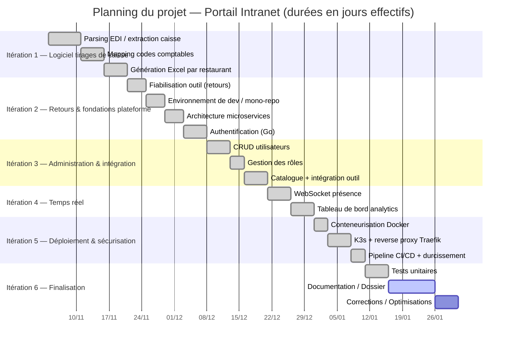
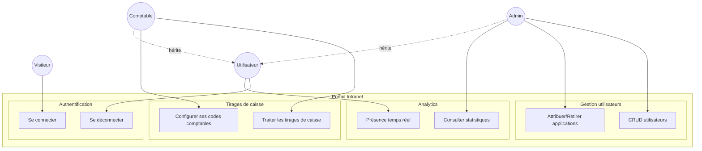
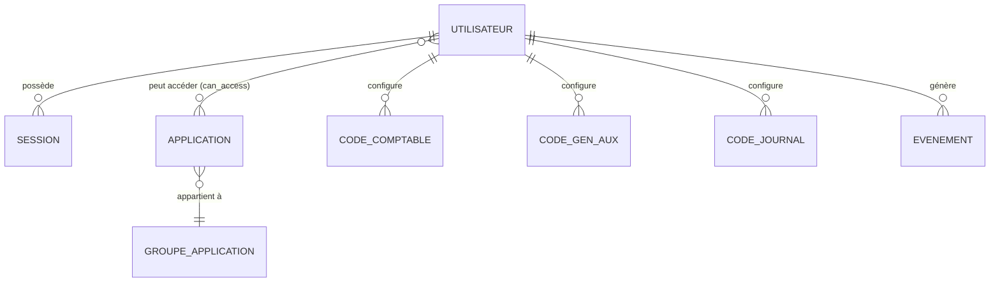
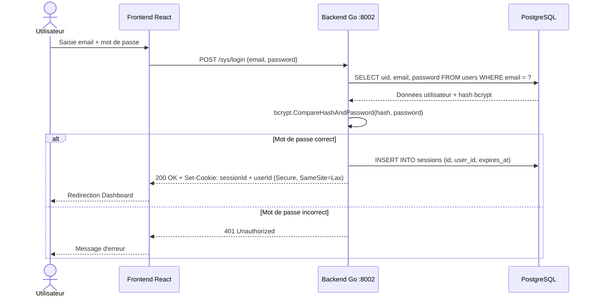
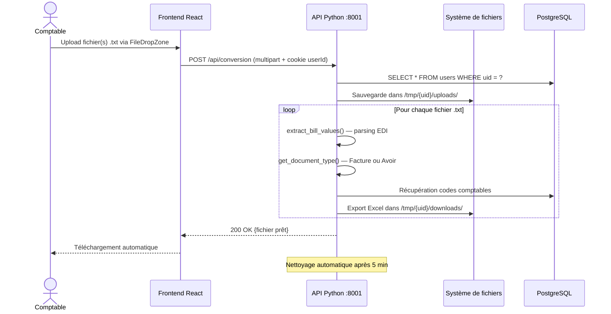
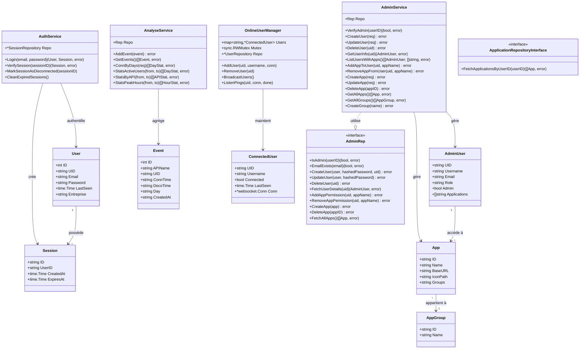

# Titre professionnel — Concepteur Développeur d'Applications

## Niveau 6 (Bac +3)

**Dossier de Projet Professionnel**
*Présenté dans le cadre de la certification RNCP*

---

**Nom du candidat** : Bénard Gwendal
**Centre de formation** : Zone01 Normandie
**Entreprise d'accueil** : Cabinet Martini — cabinet d'expertise comptable, Rouen
**Référentiel RNCP** : 37873

---

### MISE EN PLACE D'UNE PLATEFORME POUR LES COLLABORATEURS ET LES CLIENTS PERMETTANT DE REGROUPER LES DIFFÉRENTS OUTILS DÉVELOPPÉS

**Conception et développement d'un portail intranet multi-services pour la centralisation des outils métier et la gestion sécurisée des utilisateurs**

---

**Période d'alternance** : novembre 2024 – septembre 2026
**Durée du projet** : novembre 2024 – avril 2025 (environ 6 mois)
**Temps de développement estimé** : ≈ 600 heures (~88 jours effectifs, à raison de 3 jours par semaine)

---

## Remerciements

Je tiens d'abord à remercier l'équipe de Zone01 — Bastien Lagrue, Vivien Frébourg et Anne-Marie Oliviera — qui a été présente tout au long de la formation. Leur confiance et leur disponibilité ont été d'une grande aide dans mon apprentissage et ma progression.

Un grand merci également au Cabinet Martini, qui a supervisé mon alternance, ainsi qu'à toute l'équipe avec qui le travail a été formidable. Cette expérience m'a été en tous points bénéfique, enrichissante et intéressante, tant sur le plan professionnel que technique.

---

# Table des matières

1. **Introduction**
   - 1.1 Contexte du projet
   - 1.2 Présentation de l'entreprise
   - 1.3 Objectifs du projet
   - 1.4 Périmètre fonctionnel
2. **Cahier des charges**
   - 2.1 Expression du besoin (BF / BNF)
   - 2.2 Contraintes
   - 2.3 Livrables attendus
   - 2.4 User Stories (5 épics)
3. **Organisation du projet**
   - 3.1 Méthodologie
   - 3.2 Planning et itérations
   - 3.3 Outils de gestion de projet
   - 3.4 Conventions de commit
   - 3.5 Stratégie de branching Git
4. **Conception**
   - 4.1 Diagramme de cas d'utilisation
   - 4.2 Maquettes et wireframes
   - 4.3 Principes UX et accessibilité (RGAA)
   - 4.4 Modélisation des données (Dictionnaire, MCD, MLD, MPD, justifications)
   - 4.5 Diagrammes de séquence
   - 4.6 Diagramme de classes UML
5. **Choix des technologies**
   - 5.1 Tableau comparatif et justifications
   - 5.2 Outillage de développement
   - 5.3 Architecture logicielle choisie
6. **Architecture technique**
   - 6.1 Architecture globale
   - 6.2 Architecture frontend
   - 6.3 Architecture backend (Go)
   - 6.4 Architecture API Python
   - 6.5 Documentation des API REST (OpenAPI)
   - 6.6 Infrastructure de déploiement
7. **Réalisation** *(par module fonctionnel)*
   - 7.1 Authentification et sessions
   - 7.2 Panneau d'administration
     - 7.2.1 Gestion des utilisateurs
     - 7.2.2 Gestion du catalogue d'applications
     - 7.2.3 Tableau de bord analytique
     - 7.2.4 Présence temps réel (WebSocket)
   - 7.3 Catalogue d'applications (côté utilisateur — Home)
   - 7.4 Outil de traitement des tirages de caisse (dont configuration McDonald's)
   - 7.5 Thème (Dark Mode)
8. **Sécurité**
   - 8.1 Analyse OWASP Top 10
   - 8.2 Authentification et sessions
   - 8.3 Contrôle d'accès (RBAC)
   - 8.4 Protection des données (RGPD)
   - 8.5 Protection CSRF et headers HTTP
   - 8.6 Rate limiting
   - 8.7 Logging de sécurité
   - 8.8 Gestion des secrets
   - 8.9 Veille sécurité
   - 8.10 Modélisation des menaces (threat modeling / STRIDE)
9. **Tests**
   - 9.1 Stratégie de tests
   - 9.2 Tests unitaires Backend (Go)
   - 9.3 Tests unitaires API Python (pytest)
   - 9.4 Tests unitaires Frontend (Vitest)
   - 9.5 Tests d'intégration
   - 9.6 Tests end-to-end (Playwright)
   - 9.7 Résultats des tests
   - 9.8 Tests manuels et jeux de données
   - 9.9 Exécution dans la CI/CD
   - 9.10 Cas de test détaillés
10. **Déploiement**
    - 10.1 Conteneurisation (Docker)
    - 10.2 Orchestration Kubernetes
    - 10.3 Pipeline CI/CD
    - 10.4 Environnements
    - 10.5 Procédure de déploiement step-by-step
    - 10.6 Stratégie de rollback
    - 10.7 Versioning sémantique et CHANGELOG
11. **Veille technologique et sécurité**
12. **Améliorations et perspectives**
13. **Conclusion**
14. **Annexes**

---

# 1. Introduction

## 1.1 Contexte du projet

Ce dossier présente la conception et le développement du **portail intranet du Cabinet Martini**, réalisé dans le cadre de mon alternance pour la préparation du Titre Professionnel **Concepteur Développeur d'Applications** (niveau 6).

Le projet répond à un besoin réel du cabinet : disposer d'outils internes propres à chaque pôle, gérer ses utilisateurs et leurs droits, et mettre à disposition des applications métier spécialisées (traitement comptable, gestion de paie, audit) au travers d'une interface web unique, simple et sécurisée. Le besoin a d'abord porté sur l'**automatisation du traitement des tirages de caisse** des restaurants clients, avant d'évoluer vers la **centralisation de l'ensemble des outils** — actuels et futurs — derrière un accès unique.

## 1.2 Présentation de l'entreprise

Le **Cabinet Martini** est un cabinet d'expertise comptable basé à Rouen. Il officie majoritairement en Normandie et compte des clients dans toute la France. Le cabinet réunit une quarantaine de collaborateurs répartis en trois pôles : **comptabilité** (qui rassemble la majorité des effectifs), **social** et **juridique**.

Le souhait du cabinet était de mettre en place des outils internes répondant à des problématiques propres à chaque pôle. Cette idée a ensuite évolué vers un **portail centralisé** donnant accès à chaque outil, avec la possibilité d'en mettre certains à la disposition des clients.

## 1.3 Objectifs du projet

Les objectifs fixés, en accord avec le besoin exprimé, étaient les suivants :

- **Créer** des applications métier spécialisées ;
- **Gérer** les utilisateurs et leurs accès selon leur rôle ;
- **Assurer** le suivi de l'activité via un tableau de bord analytique ;
- **Offrir** une communication entre les utilisateurs connectés ;
- **Garantir** la sécurisation des données et la conformité au RGPD.

## 1.4 Périmètre fonctionnel

Le portail couvre les fonctionnalités suivantes :

- **Authentification et gestion de sessions** sécurisées ;
- **Administration des utilisateurs** (CRUD complet, gestion des rôles) ;
- **Catalogue d'applications** configurable par un administrateur ;
- **Outil métier** : traitement des tirages de caisse `.EDI` (import multi-fichiers, application de codes comptables paramétrables, restitution d'un Excel par restaurant) ;
- **Tableau de bord analytique** : suivi des connexions, utilisation des applications, heures de pointe ;
- **Communication en temps réel** via WebSocket (présence utilisateur) ;
- **Gestion de configurations** : exemple de configuration pour un McDonald's.

---

# 2. Cahier des charges

## 2.1 Expression du besoin

### Problématique

Le besoin a émergé en deux temps. J'ai d'abord développé un **logiciel de traitement des tirages de caisse** pour automatiser une tâche que les comptables réalisaient manuellement, puis j'ai conçu une **plateforme** destinée à héberger cet outil — et les futurs outils du cabinet — derrière un accès unique et sécurisé.

Le principe de l'outil est simple : il **récupère les fichiers issus des caisses** (`.EDI`), leur **applique les transformations comptables paramétrées** (mapping de codes), puis **restitue un fichier Excel** exploitable par le comptable.

En analysant la situation de départ, j'ai identifié plusieurs difficultés concrètes :

- un **traitement manuel et chronophage** des tirages de caisse, restaurant par restaurant ;
- des **codes comptables propres à chaque client**, à ressaisir à chaque traitement ;
- une **multiplicité d'outils non centralisés**, sans point d'accès unique ;
- l'**absence de gestion unifiée** des droits d'accès ;
- un **manque de visibilité** sur l'utilisation réelle des outils.

### Besoins fonctionnels

**Logiciel métier — Traitement des tirages de caisse**

| ID | Besoin | Priorité |
|----|--------|----------|
| BF01 | Importer plusieurs fichiers de tirages de caisse `.EDI` en une seule opération | Haute |
| BF02 | Appliquer aux données de caisse un mapping de codes comptables paramétrable par client | Haute |
| BF03 | Enregistrer et réutiliser ses codes comptables (comptables, généraux/auxiliaires, journal) en base | Haute |
| BF04 | Regrouper les données par restaurant et restituer un fichier Excel (une feuille par restaurant) | Haute |
| BF05 | Configurer les fascicules McDonald's propres à chaque établissement | Moyenne |

**Plateforme**

| ID | Besoin | Priorité |
|----|--------|----------|
| BF06 | Authentification sécurisée (JWT) avec gestion de sessions | Haute |
| BF07 | Gestion des utilisateurs par rôles (Admin, Dev, Comptable, Social, Auditeur, Client) | Haute |
| BF08 | Catalogue d'applications dynamique (nom, icône, groupe, CRUD) | Haute |
| BF09 | Attribution des applications par utilisateur | Haute |
| BF10 | Tableau de bord analytique (connexions, utilisation des API) | Moyenne |
| BF11 | Vision en temps réel des utilisateurs connectés (WebSocket) | Moyenne |
| BF12 | Mode sombre / clair | Basse |
| BF13 | Interface responsive (mobile, tablette, desktop) | Haute |

### Besoins non fonctionnels

| ID | Besoin | Critère |
|----|--------|---------|
| BNF01 | Performance | Temps de réponse < 2s pour les opérations courantes |
| BNF02 | Sécurité | Conformité OWASP Top 10, RGPD |
| BNF03 | Disponibilité | 99.5% (hors maintenance planifiée) |
| BNF04 | Scalabilité | Architecture microservices permettant le scaling horizontal |
| BNF05 | Maintenabilité | Code documenté, architecture en couches |

## 2.2 Contraintes

### Contraintes techniques

- **Unique contrainte d'infrastructure imposée** : un **serveur vierge** mis à disposition, sur lequel j'ai dû provisionner et configurer l'intégralité de l'environnement (système, runtime, base de données, orchestration, reverse proxy) ;
- Tous les **autres choix techniques relèvent de mes propres décisions** d'architecture : PostgreSQL, backend Go, API Python (FastAPI), frontend React, conteneurisation Docker, orchestration K3s, reverse proxy Traefik ;
- **Format d'entrée imposé par le métier** : fichiers de tirage de caisse `.EDI` / `.txt` ; **format de sortie** attendu par les comptables : Excel (`.xlsx`) ;
- Accès **HTTPS** et compatibilité **navigateurs modernes** (Chrome, Firefox, Edge, Safari).

### Contraintes organisationnelles

- Projet réalisé **en autonomie**, dans le cadre de mon alternance au Cabinet Martini ;
- Développement **itératif et incrémental** suivi en Kanban (carnet de bord), à raison de **3 jours par semaine** ;
- Livraison continue via **pipeline CI/CD** GitHub Actions ;
- Durée totale : environ **6 mois** (novembre 2024 — avril 2025).

## 2.3 Livrables attendus

L'attendu initial était un **logiciel de traitement des tirages de caisse**, puis une **plateforme web unique** capable de regrouper cet outil et les futurs outils du cabinet derrière un accès sécurisé.

Ce que je présente dans le cadre de la certification :

1. La **plateforme** : frontend React + backend Go ;
2. L'**API de traitement des tirages de caisse** (Python/FastAPI) ;
3. La **base de données** PostgreSQL ;
4. La **documentation** technique et utilisateur (architecture, API, déploiement, guide administrateur) ;
5. Le **code source versionné** sur GitHub et le **pipeline CI/CD** ;
6. Les **environnements conteneurisés** (Docker + Kubernetes/K3s).

## 2.4 User Stories

### Épic 1 : Authentification et gestion de compte

| ID | En tant que… | Je veux… | Afin de… | Priorité |
|----|----------------|------------|------------|----------|
| US01 | Utilisateur | Me connecter avec email et mot de passe | Accéder à mes applications | Haute |
| US02 | Utilisateur | Me déconnecter | Sécuriser mon poste | Haute |
| US03 | Utilisateur | Voir mon profil | Vérifier mes informations | Moyenne |

### Épic 2 : Administration

| ID | En tant que… | Je veux… | Afin de… | Priorité |
|----|----------------|------------|------------|----------|
| US04 | Admin | Créer un utilisateur | Donner accès au portail | Haute |
| US05 | Admin | Modifier un utilisateur | Mettre à jour ses droits | Haute |
| US06 | Admin | Supprimer un utilisateur | Retirer l'accès au portail | Haute |
| US07 | Admin | Attribuer des applications | Personnaliser l'accès | Haute |
| US08 | Admin | Créer une application | Enrichir le catalogue | Haute |
| US09 | Admin | Modifier une application | Mettre à jour les infos | Moyenne |
| US10 | Admin | Supprimer une application | Retirer du catalogue | Moyenne |
| US11 | Admin | Consulter les statistiques | Suivre l'utilisation | Moyenne |

### Épic 3 : Traitement des tirages de caisse

| ID | En tant que… | Je veux… | Afin de… | Priorité |
|----|----------------|------------|------------|----------|
| US12 | Comptable | Importer plusieurs fichiers `.EDI` en une seule fois | Traiter tous mes restaurants d'un coup | Haute |
| US13 | Comptable | Appliquer mes codes comptables aux données de caisse | Adapter le traitement à chaque dossier | Haute |
| US14 | Comptable | Enregistrer et réutiliser mes codes comptables | Ne pas les ressaisir à chaque traitement | Haute |
| US15 | Comptable | Récupérer un Excel avec une feuille par restaurant | Importer directement dans mon logiciel comptable | Haute |
| US16 | Comptable | Retrouver le bon restaurant pour chaque fichier traité | Garantir un classement comptable fiable | Moyenne |

### Épic 4 : Temps réel et communication

| ID | En tant que… | Je veux… | Afin de… | Priorité |
|----|----------------|------------|------------|----------|
| US17 | Utilisateur | Voir qui est connecté | Savoir qui est disponible | Moyenne |
| US18 | Utilisateur | Recevoir des notifications | Être informé en temps réel | Basse |

### Épic 5 : Configuration et préférences

| ID | En tant que… | Je veux… | Afin de… | Priorité |
|----|----------------|------------|------------|----------|
| US19 | Admin | Configurer les fascicules McDonald's | Personnaliser le traitement par établissement | Moyenne |
| US20 | Utilisateur | Changer le thème (sombre/clair) | Adapter l'interface à mes préférences | Basse |

---

# 3. Organisation du projet

## 3.1 Méthodologie

J'ai conduit ce projet seul, à raison de **3 jours par semaine**, sur environ six mois. J'ai donc retenu une **démarche itérative et incrémentale, suivie en Kanban**, plutôt qu'un cadre Scrum dont les rôles et les cérémonies (daily standup, sprint review) supposent une équipe et se vident de leur sens pour une personne seule. C'est un choix assumé : la méthode doit servir le contexte, pas l'inverse.

Concrètement :

- **Backlog priorisé** : les user stories (§ 2.4) constituent le backlog ; à chaque session de travail, je tirais la tâche la plus prioritaire — flux tiré, sans timebox artificiel, ce qui absorbe naturellement un rythme de travail à temps partiel ;
- **Suivi Kanban sur carnet de bord** : un carnet papier tenait lieu de tableau — tâches à faire listées par itération, tâche en cours marquée, tâches terminées rayées, reports explicitement recopiés d'une session à l'autre. Un outil rudimentaire, mais toujours à jour, relu systématiquement en début de session pour recharger le contexte après plusieurs jours d'interruption ;
- **Travail en cours limité (WIP = 1)** : chaque semaine de 3 jours consécutifs en entreprise était dédiée à **une fonctionnalité précise**, choisie en début de session — une seule tâche de développement ouverte à la fois, pour ne jamais laisser de chantier à moitié terminé entre deux sessions espacées ;
- **Itérations jalonnées** : le travail est découpé en six itérations correspondant à des blocs fonctionnels livrables (§ 3.2) ; chaque fin d'itération donnait lieu à un point avec le commanditaire (démonstration de l'incrément, ajustement des priorités) et à une courte rétrospective personnelle notée dans le carnet ;
- **Définition de « terminé »** : une tâche n'est rayée que lorsque le code est écrit, testé, passé au lint et commité selon les conventions du projet (§ 3.4).

Ce cadre m'a apporté ce que j'attendais d'une méthode : une priorisation toujours explicite, une visibilité permanente sur le reste à faire, et des jalons réguliers pour confronter l'avancement au besoin réel du commanditaire.

## 3.2 Planning du projet

Le séquencement suit la logique de valeur du projet, telle qu'elle s'est réellement déroulée :

1. **D'abord le logiciel de tirages de caisse** — la priorité explicite des collaborateurs, livré en autonome pour apporter de la valeur au plus vite ;
2. **Ensuite la plateforme**, développée en parallèle des retours des collaborateurs sur l'outil — retours qui ont directement alimenté son évolution (persistance des codes comptables par utilisateur, notamment) ;
3. **Enfin le déploiement** : provisioning du serveur vierge, mise en place du reverse proxy et sécurisation du VPS.

Les durées du diagramme sont exprimées en **jours effectifs de travail**. Au rythme réel de 3 jours par semaine, l'étalement calendaire est environ le double : ~88 jours effectifs répartis sur la période novembre 2024 → avril 2025.


```mermaid
gantt
    title Planning du projet — Portail Intranet (durées en jours effectifs)
    dateFormat YYYY-MM-DD
    axisFormat %d/%m

    section Itération 1 — Logiciel tirages de caisse
    Parsing EDI / extraction caisse :done, s1a, 2024-11-04, 7d
    Mapping codes comptables        :done, s1b, after s1a, 5d
    Génération Excel par restaurant :done, s1c, after s1b, 5d

    section Itération 2 — Retours & fondations plateforme
    Fiabilisation outil (retours)   :done, s2a, after s1c, 4d
    Environnement de dev / mono-repo :done, s2b, after s2a, 4d
    Architecture microservices      :done, s2c, after s2b, 4d
    Authentification (Go)           :done, s2d, after s2c, 5d

    section Itération 3 — Administration & intégration
    CRUD utilisateurs               :done, s3a, after s2d, 5d
    Gestion des rôles               :done, s3b, after s3a, 3d
    Catalogue + intégration outil   :done, s3c, after s3b, 5d

    section Itération 4 — Temps réel
    WebSocket présence              :done, s4a, after s3c, 5d
    Tableau de bord analytics       :done, s4b, after s4a, 5d

    section Itération 5 — Déploiement & sécurisation
    Conteneurisation Docker         :done, s5a, after s4b, 3d
    K3s + reverse proxy Traefik     :done, s5b, after s5a, 5d
    Pipeline CI/CD + durcissement   :done, s5c, after s5b, 3d

    section Itération 6 — Finalisation
    Tests unitaires                 :done, s6a, after s5c, 5d
    Documentation / Dossier         :active, s6b, after s6a, 10d
    Corrections / Optimisations     :s6c, after s6b, 5d
```

J'ai découpé le travail en six itérations successives, chacune se concluant par un incrément livrable et un point avec le commanditaire. Pour chacune, je rappelle ci-dessous l'objectif, ce que j'ai effectivement livré, la principale difficulté rencontrée et l'enseignement que j'en ai tiré en rétrospective.

### Itération 1 — Logiciel de tirages de caisse, version autonome (17 jours effectifs, ~6 semaines)

**Objectif** : livrer au plus vite l'outil à plus forte valeur pour les comptables — leur priorité explicite —, sous forme de logiciel autonome.

**Réalisations** :

- API Python FastAPI dédiée au traitement des fichiers de caisse ;
- parsing EDI (extraction des données de caisse, détection facture/avoir) ;
- application d'un mapping de codes comptables (paramétrage initial par fichier de configuration) ;
- regroupement des données par restaurant et génération d'un Excel (une feuille par restaurant).

**Difficulté rencontrée** : les fichiers EDI réels présentaient des encodages variables (ISO-8859-1 vs UTF-8) et des segments optionnels. J'ai dû rendre le parsing tolérant aux variations sans masquer les vraies erreurs de format.

**Rétrospective** : confronter le code à de vrais jeux de données anonymisés (et non à des cas idéaux) a fait émerger des bugs que je n'aurais jamais anticipés sur le papier.

### Itération 2 — Retours collaborateurs et fondations de la plateforme (17 jours effectifs, ~6 semaines)

**Objectif** : fiabiliser l'outil à partir de son usage réel par les comptables, et poser en parallèle les bases de la plateforme qui l'hébergera.

**Réalisations** :

- corrections issues des retours des comptables sur l'outil (tolérance du parsing, messages d'erreur explicites) ;
- **persistance des codes comptables par utilisateur en base** (`user_code_maps` / `user_code_maps_gen_aux` / `code_journal`, colonnes JSON), en remplacement du fichier de configuration initial — évolution directement demandée par les utilisateurs, chacun voulant retrouver ses propres codes ;
- mise en place du dépôt mono-repo (frontend / api / backend) et des conventions de commit ;
- choix et installation de la chaîne d'outillage (ESLint/Prettier, golangci-lint, ruff/black) ;
- schéma initial de la base PostgreSQL et script `init.sql` ;
- premier service Go en architecture Handler → Service → Repository : l'authentification ;
- squelette du frontend React (routing, ThemeContext, layout).

**Difficulté rencontrée** : j'ai d'abord tenté de partager des structures de données entre Go et Python via un format commun, avant de réaliser que le couplage que cela introduisait n'en valait pas la peine. J'ai tranché pour un contrat d'API JSON explicite (§ 6.5) plutôt qu'un schéma partagé.

**Rétrospective** : investir tôt dans l'outillage (lint + format automatiques) m'a fait gagner du temps sur toutes les itérations suivantes — la dette technique ne s'accumulait pas. Et recevoir des retours d'utilisateurs réels dès la deuxième itération a validé le choix de livrer l'outil avant la plateforme.

### Itération 3 — Administration et intégration de l'outil au portail (13 jours effectifs, ~4,5 semaines)

**Objectif** : permettre à un administrateur de gérer le cycle de vie des utilisateurs et le catalogue, et faire de l'outil de caisse la première application du portail.

**Réalisations** :

- CRUD complet des utilisateurs côté Go (service `admin`) avec hachage bcrypt ;
- matrice de rôles RBAC à 6 rôles et middleware `AdminMiddleware` ;
- catalogue d'applications (CRUD) et table d'association `user_application_permissions` ;
- interface d'administration React (liste filtrable, modales de confirmation) ;
- intégration du logiciel de caisse comme première application du catalogue : page dédiée, composants partagés `FileDropZone` / `ResultDownloader`, nettoyage automatique des fichiers temporaires (thread daemon, 5 min).

**Difficulté rencontrée** : la vérification du rôle administrateur devait être infaillible. Je l'ai d'abord implémentée côté frontend uniquement, avant de comprendre que c'était une faille de contrôle d'accès (A01 OWASP). J'ai déplacé la vérification côté serveur via un middleware dédié, le frontend ne servant plus qu'au confort d'affichage.

**Rétrospective** : « ne jamais faire confiance au client » est passé du statut de slogan à celui de réflexe ancré.

### Itération 4 — Temps réel et analytics (10 jours effectifs, ~3,5 semaines)

**Objectif** : ajouter la présence temps réel et le suivi d'activité.

**Réalisations** :

- service WebSocket Go avec `OnlineUserManager` thread-safe ;
- broadcast de la liste des utilisateurs en ligne ;
- collecte d'événements (`login`, `logout`, `api_call`) et tableau de bord analytique (Recharts).

**Difficulté rencontrée** : la gestion concurrente des connexions WebSocket (accès simultané à la `map` des utilisateurs) provoquait des *data races* détectées par `go test -race`. La résolution via `sync.RWMutex` a demandé plusieurs itérations pour éviter les interblocages lors des broadcasts.

**Rétrospective** : la concurrence ne se « teste » pas à l'œil — l'outil `-race` de Go a été décisif (cf. § 9.2).

### Itération 5 — Déploiement et sécurisation du serveur (11 jours effectifs, ~4 semaines)

**Objectif** : mettre l'application en service sur le serveur mis à disposition (vierge, cf. § 2.2) et la durcir.

**Réalisations** :

- provisioning complet du VPS vierge : système, runtime, orchestrateur K3s ;
- mise en place du **reverse proxy Traefik** (terminaison HTTPS, routage vers les services) ;
- Dockerfiles multi-stage pour les trois services ;
- manifests Kubernetes (Deployment, Service, IngressRoute, PVC) ;
- pipeline CI/CD GitHub Actions (tests → build → rollout) ;
- sécurisation du VPS et passe de sécurité OWASP (§ 8) : externalisation des secrets, validation d'origine WebSocket, requêtes paramétrées.

**Difficulté rencontrée** : un typo dans la configuration CORS de préproduction bloquait toutes les requêtes authentifiées. Le diagnostic m'a appris à lire méthodiquement les erreurs CORS du navigateur plutôt qu'à modifier la config au hasard.

**Rétrospective** : la sécurité traitée « en fin de projet » est un anti-pattern ; j'aurais dû intégrer certaines mesures (secrets, paramétrage SQL) dès les premières itérations — ce que je formalise désormais en *security by design*.

### Itération 6 — Finalisation (20 jours effectifs, ~7 semaines)

**Objectif** : fiabiliser, tester et documenter.

**Réalisations** :

- tests unitaires Go / Python / Frontend (cf. § 9) ;
- tests d'intégration FastAPI TestClient ;
- campagne de tests manuels (matrice de parcours) ;
- rédaction du présent dossier et des diagrammes.

**Difficulté rencontrée** : l'incompatibilité de `psycopg2` avec Python 3.14 cassait toute la suite de tests Python. J'ai conçu une stratégie de mock du module au niveau `sys.modules` et une bascule vers SQLite in-memory (cf. § 9.3).

**Rétrospective** : documenter au fil de l'eau aurait été plus efficace que de tout rédiger en fin de parcours — leçon retenue pour mes prochains projets.

## 3.3 Outils de gestion de projet

| Outil | Usage |
|-------|-------|
| Carnet de bord (papier) | Tableau Kanban personnel : tâches par itération, tâche en cours, fait, reports de session en session, notes de rétrospective |
| GitHub | Versioning du code, branches, pull requests |
| GitHub Actions | CI/CD automatisé |
| Figma | Maquettage des interfaces |

Le choix d'un carnet papier plutôt que d'un outil numérique est délibéré : pour une personne seule, il élimine tout coût d'outillage et reste consultable en un geste au début de chaque session — l'essentiel étant la discipline de mise à jour, pas l'outil.

## 3.4 Conventions de commit

J'ai adopté la convention [Conventional Commits](https://www.conventionalcommits.org/) pour garantir la lisibilité de l'historique et automatiser le versioning.

### Format

```
<type>(<scope>): <description>

[corps optionnel]

[footer optionnel]
```

### Types utilisés

| Type | Usage |
|------|-------|
| `feat` | Nouvelle fonctionnalité |
| `fix` | Correction de bug |
| `docs` | Documentation seule |
| `style` | Mise en forme (espaces, formatage) — pas de changement de code |
| `refactor` | Refactorisation sans changement de comportement |
| `test` | Ajout ou modification de tests |
| `chore` | Tâches de maintenance (build, dépendances) |
| `ci` | Modifications de la chaîne CI/CD |
| `perf` | Amélioration de performance |
| `security` | Correction ou amélioration de sécurité |

### Exemples tirés du projet

Les deux premières lignes reprennent fidèlement des commits déjà présents dans l'historique ; les suivantes sont des exemples illustratifs, reformulés à partir de commits antérieurs à l'adoption de la convention.

```
docs: add CDA dossier implementation plan
docs: add CDA dossier writing plan spec
feat(frontend): ajout des fichiers HTML de maquette et mock-up
chore(schemas): ajout des schémas de base de données initiaux
chore: initial commit — structure mono-repo (frontend, api, backend)
feat(backend): authentification JWT et gestion des sessions utilisateur
feat(admin): CRUD utilisateurs et gestion des rôles
feat(websocket): présence utilisateur en temps réel
fix(api): correction du parsing EDI sur encodages variables (ISO-8859-1 / UTF-8)
perf(analyse): optimisation des requêtes d'analytique par index PostgreSQL
```

### Bénéfices

- Historique lisible et filtrable (`git log --grep="^feat"`) ;
- Détection automatique du type de release (SemVer) : `feat` → MINOR, `fix` → PATCH, `BREAKING CHANGE` → MAJOR ;
- Onboarding facilité pour de nouveaux contributeurs.

## 3.5 Stratégie de branching Git

Compte tenu du caractère solo du projet et du rythme de livraison continu, j'ai retenu la stratégie **GitHub Flow** plutôt que Git Flow (jugé trop lourd pour ce contexte).

### Principes

- Une seule branche permanente : `main` (toujours déployable) ;
- Toute modification passe par une branche `feature/<nom-court>` éphémère ;
- Pull request (même solo) avant merge dans `main`, pour bénéficier de la CI ;
- Merge en squash pour garder un historique linéaire ;
- Tags Git `vMAJOR.MINOR.PATCH` posés sur `main` pour chaque release.

### Schéma

```
main ──●──●──●──●──●──●─── (toujours déployable)
        \  /    \  /
         ●●      ●●         feature/auth-jwt, feature/analytics
```

### Conventions de nommage

| Préfixe | Usage | Exemple |
|---------|-------|---------|
| `feature/` | Nouvelle fonctionnalité | `feature/admin-dashboard` |
| `fix/` | Correction de bug | `fix/cors-typo` |
| `chore/` | Maintenance | `chore/upgrade-go-1.24` |
| `docs/` | Documentation | `docs/owasp-top10` |

### Cycle de vie d'une branche

1. `git checkout -b feature/xxx` depuis `main` à jour ;
2. Commits suivant Conventional Commits (§ 3.4) ;
3. Push + Pull Request ;
4. CI verte requise (tests + lint) ;
5. Squash & merge dans `main` ;
6. Suppression de la branche distante et locale.

### Justification du choix

GitHub Flow simplifie le workflow par rapport à Git Flow (`develop`, `release/*`, `hotfix/*`), ce qui est cohérent avec :

- une équipe d'un seul développeur ;
- un déploiement continu vers preprod après chaque merge ;
- l'absence de version « long-term support » à maintenir en parallèle.

---

# 4. Conception

## 4.1 Diagramme de cas d'utilisation

*Voir diagramme complet : `doc/diagrammes.md` — Section 1*


```mermaid
graph TB
    subgraph "Portail Intranet"
        subgraph "Authentification"
            UC1[Se connecter]
            UC2[Se déconnecter]
        end
        subgraph "Gestion utilisateurs"
            UC4[CRUD utilisateurs]
            UC8[Attribuer/Retirer applications]
        end
        subgraph "Tirages de caisse"
            UC15[Traiter les tirages de caisse]
            UC16[Configurer ses codes comptables]
        end
        subgraph "Analytics"
            UC22[Consulter statistiques]
            UC23[Présence temps réel]
        end
    end
    Visiteur((Visiteur)) --> UC1
    Utilisateur((Utilisateur)) --> UC2 & UC23
    Comptable((Comptable)) --> UC15 & UC16
    Admin((Admin)) --> UC4 & UC8 & UC22
    Comptable -.->|hérite| Utilisateur
    Admin -.->|hérite| Utilisateur
```

### Acteurs et rôles

| Acteur | Description | Accès |
|--------|-------------|-------|
| **Visiteur** | Utilisateur non authentifié | Page d'accueil, connexion |
| **Utilisateur** | Utilisateur authentifié (base) | Applications attribuées, profil, présence temps réel |
| **Comptable** | Métier comptabilité | Outil de traitement des tirages de caisse, gestion de ses codes comptables |
| **Auditeur** | Métier audit | Applications attribuées par l'administrateur |
| **Social** | Métier paie/RH | Applications attribuées par l'administrateur |
| **Admin** | Administration complète | CRUD utilisateurs, catalogue apps, analytics |
| **Dev** | Développeur | Accès étendu à tous les outils techniques |

### Description détaillée des cas d'utilisation

Pour les cas d'utilisation critiques, j'ai décrit le scénario nominal et les scénarios alternatifs (cas d'erreur), selon le formalisme classique préconditions / déroulé / postconditions.

#### UC01 — Se connecter

| Rubrique | Détail |
|----------|--------|
| **Acteur principal** | Visiteur (utilisateur non authentifié) |
| **Préconditions** | L'utilisateur possède un compte actif ; il n'a pas de session valide |
| **Postconditions (succès)** | Une session est créée en base ; un cookie `userId` est posé ; l'utilisateur est redirigé vers le catalogue |
| **Déclencheur** | Soumission du formulaire de connexion |

**Scénario nominal**

1. Le visiteur saisit son email et son mot de passe ;
2. Le frontend envoie `POST /sys/login` ;
3. Le backend récupère le hash bcrypt associé à l'email ;
4. Le backend compare le mot de passe au hash (temps constant) ;
5. Le backend crée une session (expiration +24 h) et retourne le cookie ;
6. Le frontend redirige vers le catalogue filtré par rôle.

**Scénarios alternatifs**

- **A1 — Email inconnu** : l'étape 3 ne retourne aucun utilisateur → le backend répond `401` avec un message générique (« identifiants invalides ») afin de ne pas révéler l'existence du compte (anti-énumération) ;
- **A2 — Mot de passe incorrect** : l'étape 4 échoue → même réponse `401` générique ;
- **A3 — Trop de tentatives** : au-delà du seuil de rate limiting (§ 8.6) → réponse `429` + `Retry-After`.

#### UC04 — Créer un utilisateur (Admin)

| Rubrique | Détail |
|----------|--------|
| **Acteur principal** | Admin |
| **Préconditions** | L'acteur est authentifié ET possède le rôle Admin |
| **Postconditions (succès)** | Un nouvel utilisateur existe en base avec un mot de passe haché ; un événement d'audit est enregistré |

**Scénario nominal**

1. L'admin remplit le formulaire (email, rôle, mot de passe initial) ;
2. `POST /sys/new-user` traverse `AuthMiddleware` puis `AdminMiddleware` ;
3. Le backend vérifie l'unicité de l'email (`EmailExists`) ;
4. Le mot de passe est haché (`bcrypt.GenerateFromPassword`) ;
5. L'utilisateur est inséré, un événement `user_created` est journalisé ;
6. Réponse `201 Created`.

**Scénarios alternatifs**

- **A1 — Email déjà utilisé** : l'étape 3 retourne `true` → réponse `409 Conflict` ;
- **A2 — Acteur non administrateur** : `AdminMiddleware` rejette en `403 Forbidden` avant tout traitement ;
- **A3 — Données invalides** (email mal formé, rôle inconnu) : validation échouée → `422 Unprocessable Entity`.

#### UC15 — Traiter des tirages de caisse (Comptable)

| Rubrique | Détail |
|----------|--------|
| **Acteur principal** | Comptable |
| **Préconditions** | L'acteur est authentifié ; il dispose d'un mapping de codes comptables |
| **Postconditions (succès)** | Un fichier Excel est généré et téléchargé ; les fichiers temporaires sont planifiés pour suppression |

**Scénario nominal**

1. Le comptable dépose un ou plusieurs fichiers `.txt` ;
2. `POST /api/conversion` valide le format UUID du cookie (regex) ;
3. L'API crée un répertoire temporaire `/tmp/{uid}/uploads/` ;
4. Pour chaque fichier : parsing EDI, détection du type (facture/avoir), application du mapping comptable ;
5. Génération d'un Excel multi-feuilles via openpyxl ;
6. Réponse `200` avec l'URL de téléchargement ; nettoyage planifié à +5 min.

**Scénarios alternatifs**

- **A1 — Fichier non-EDI** : l'en-tête ne contient pas « EDI » → `400 Bad Request` avec message explicite, le traitement du lot continue pour les fichiers valides ;
- **A2 — Cookie UID invalide** : la regex échoue → `401` (protège aussi du path traversal, cf. § 8) ;
- **A3 — Mapping absent** : codes comptables non configurés → l'API applique un mapping par défaut et signale les codes non résolus dans une feuille « anomalies ».

### Règles de gestion

J'ai formalisé les règles de gestion suivantes, qui gouvernent le comportement métier indépendamment de l'implémentation :

| ID | Règle de gestion |
|----|------------------|
| RG01 | Un email identifie de façon unique un utilisateur. |
| RG02 | Un mot de passe n'est jamais stocké ni journalisé en clair ; seul son hash bcrypt est persisté. |
| RG03 | Une session expire 24 h après sa création (fenêtre glissante) ; au-delà, toute requête protégée est rejetée. |
| RG04 | Un utilisateur ne voit que les applications qui lui sont explicitement attribuées (pas d'accès par défaut). |
| RG05 | Seul un Admin peut créer, modifier ou supprimer un utilisateur ou une application. |
| RG06 | La suppression d'un utilisateur entraîne la suppression en cascade de ses sessions, attributions et mappings (droit à l'oubli). |
| RG07 | Les événements d'audit sont conservés même après suppression du compte associé (anonymisation par perte de référence). |
| RG08 | Les fichiers déposés pour traitement sont éphémères : ils sont supprimés au plus tard 5 minutes après le traitement. |
| RG09 | Toute action administrative sensible (création/suppression d'utilisateur, changement de rôle) génère un événement journalisé. |

## 4.2 Maquettes et wireframes

Avant de coder, j'ai maquetté les écrans principaux. L'interface s'appuie sur Tailwind CSS avec support natif du mode sombre. Les wireframes ci-dessous fixent la structure des quatre écrans clés ; les captures des écrans réellement livrés figurent en **Annexe B**.

### 4.2.1 Page de connexion

```
┌─────────────────────────────────────────────────┐
│  [Logo]    Portail Intranet         [🌙 Theme]  │
├─────────────────────────────────────────────────┤
│                                                  │
│              ┌───────────────────┐               │
│              │   Se connecter    │               │
│              │                   │               │
│              │  Email            │               │
│              │  ┌──────────────┐ │               │
│              │  │              │ │               │
│              │  └──────────────┘ │               │
│              │  Mot de passe     │               │
│              │  ┌──────────────┐ │               │
│              │  │              │ │               │
│              │  └──────────────┘ │               │
│              │                   │               │
│              │  [  Connexion  ]  │               │
│              │                   │               │
│              └───────────────────┘               │
│                                                  │
├─────────────────────────────────────────────────┤
│  © 2024 Portail Intranet                        │
└─────────────────────────────────────────────────┘
```

### 4.2.2 Page Home (catalogue d'applications)

```
┌─────────────────────────────────────────────────┐
│  [Logo]   Bienvenue, Jean    [👤] [🌙] [🚪]    │
├─────────────────────────────────────────────────┤
│                                                  │
│  Mes Applications                                │
│  ┌──────────┐                                    │
│  │  [icon]  │   (catalogue configurable :        │
│  │ Tirages  │    l'admin ajoute ici les          │
│  │  Caisse  │    futurs outils du cabinet)       │
│  └──────────┘                                    │
│                                                  │
│  Utilisateurs connectés : 🟢 3 en ligne          │
│  ┌────────────────────────────────────────┐     │
│  │ 🟢 Marie D.  │ 🟢 Paul R.  │ 🔴 Luc T.│    │
│  └────────────────────────────────────────┘     │
├─────────────────────────────────────────────────┤
│  © 2024 Portail Intranet                        │
└─────────────────────────────────────────────────┘
```

### 4.2.3 Interface d'administration

```
┌─────────────────────────────────────────────────┐
│  [Logo]   Admin Panel          [👤] [🌙] [🚪]   │
├──────┬──────────────────────────────────────────┤
│      │  Gestion des utilisateurs                 │
│ Menu │  ┌────────────────────────────────┐       │
│      │  │ 🔍 Rechercher...  [+ Nouveau]  │       │
│ 👥   │  ├──────┬────────┬──────┬────────┤       │
│ Users│  │ Nom  │ Email  │ Rôle │ Actions│       │
│      │  ├──────┼────────┼──────┼────────┤       │
│ 📱   │  │ Jean │ j@e.fr │Admin │ ✏️ 🗑️  │       │
│ Apps │  │ Marie│ m@e.fr │Compta│ ✏️ 🗑️  │       │
│      │  │ Paul │ p@e.fr │Audit │ ✏️ 🗑️  │       │
│ 📊   │  └──────┴────────┴──────┴────────┘       │
│ Stats│                                           │
│      │  Applications attribuées : [dropdown]     │
│ ⚙️   │  [✅ Tirages Caisse]  [☐ …]               │
│ Conf │                                           │
├──────┴──────────────────────────────────────────┤
│  © 2024 Portail Intranet                        │
└─────────────────────────────────────────────────┘
```

### 4.2.4 Logiciel de tirages de caisse

```
┌─────────────────────────────────────────────────┐
│  [Logo]   Tirages de caisse    [👤] [🌙] [🚪]   │
├─────────────────────────────────────────────────┤
│                                                  │
│  1 ─ Déposer les fichiers de caisse (.EDI)      │
│  ┌────────────────────────────────────────┐     │
│  │   ⬆  Glissez vos fichiers ici           │     │
│  │      ou cliquez pour parcourir           │     │
│  │   ─────────────────────────────────      │     │
│  │   📄 resto-01.EDI   📄 resto-02.EDI      │     │
│  └────────────────────────────────────────┘     │
│                                                  │
│  2 ─ Codes comptables      [⚙ Configurer]       │
│      Jeu enregistré : « Dossier McDo Rouen »    │
│                                                  │
│  3 ─ [        Lancer le traitement        ]     │
│      ▓▓▓▓▓▓▓▓▓▓▓▓▓░░░░░░░  traitement…          │
│                                                  │
│  4 ─ Résultat                                    │
│      ┌──────────────────────────────────┐       │
│      │ 📗 tirages.xlsx  (1 feuille/resto)│       │
│      │            [ ⬇ Télécharger ]      │       │
│      └──────────────────────────────────┘       │
└─────────────────────────────────────────────────┘
```

## 4.3 Principes UX et accessibilité

### Principes UX appliqués

| Principe | Mise en œuvre |
|----------|---------------|
| **Cohérence** | Composants partagés (`frontend/src/components/`), palette unique gérée par `ThemeContext`, espacement uniforme via Tailwind CSS |
| **Feedback** | Spinners pendant les opérations longues, notifications inline pour les actions, messages d'erreur sous chaque champ de formulaire |
| **Prévention de l'erreur** | Validation côté client avant soumission, confirmations modales pour les actions destructrices |
| **Reconnaissance plutôt que rappel** | Catalogue d'applications visuel avec icônes et libellés, en-tête contextuel sur les pages d'administration |
| **Efficacité experte** | Raccourcis clavier sur les modales (Échap pour fermer), gestion explicite du focus à l'ouverture des dialogues |
| **Esthétique minimaliste** | Densité d'information modérée, mode sombre activable par utilisateur |

### Parcours utilisateur principaux

J'ai conçu chaque parcours pour minimiser le nombre de clics jusqu'à la valeur métier (objectif : trois clics maximum depuis l'accueil pour les actions courantes) :

1. **Connexion** → catalogue d'applications filtré par rôle → lancement d'un outil métier ;
2. **Administration** → liste filtrable d'utilisateurs → fiche utilisateur → édition / suppression ;
3. **Outil métier** → upload fichier → traitement asynchrone → téléchargement automatique du résultat.

### Accessibilité (référentiel RGAA 4)

La conformité RGAA AA complète est positionnée en évolution (§ 12.1). Les principes suivants sont déjà appliqués :

| Critère RGAA | Application |
|--------------|-------------|
| Contraste (1.3) | Palette respectant un ratio minimum de 4.5:1 (vérifié en modes clair et sombre du `ThemeContext`) |
| Navigation clavier (12.x) | Tous les boutons et liens sont focusables, styles `:focus-visible` distincts |
| Alternative textuelle (1.1) | Icônes accompagnées d'un `aria-label` lorsque l'élément est purement visuel |
| Structure (9.x) | Titres hiérarchiques (`<h1>` → `<h2>` → `<h3>`), points de repère (`<nav>`, `<main>`, `<aside>`) |
| Identification (10.x) | Champs de formulaire associés à un `<label>` (ou `aria-labelledby`) |
| Cohérence (11.x) | Composants de formulaire partagés (`InputField`, `Select`) garantissant un comportement homogène |

### Évolutions RGAA prévues

- Audit automatisé via axe-core ou WAVE ;
- Skip-link (« Aller au contenu principal ») en début de page ;
- Mode contraste renforcé pour utilisateurs malvoyants ;
- Tests manuels avec lecteur d'écran (NVDA, VoiceOver).

## 4.4 Modélisation des données

### 4.4.1 Dictionnaire de données

> **Source** : le modèle ci-dessous reflète le schéma PostgreSQL réellement déployé
> (`backend/internal/db/postgres.go` → `InitSchema`, migrations `001_fix_anomalies.sql`
> et `002_add_fascicule_pk.sql`, et `api/schemas/model.py`). Les diagrammes exportés
> correspondants sont fournis : `doc/Mcd.png` (MCD Merise) et `doc/MLD.png` (MLD).
> Le document de travail détaillé est `doc/schemas/MCD_MLD_MPD.md`.
>
> **Périmètre présenté** : le modèle couvre l'ensemble du système — le *hub*
> (authentification, catalogue d'applications, permissions), l'API métier Python
> (codes comptables, configuration McDonald's) et l'*analytics* (table `events`,
> service Go `analyse`, cf. § 7.2.3).

J'ai décrit l'ensemble des entités persistées, leurs attributs, types, contraintes et règles métier. Ce dictionnaire constitue la référence des modèles MCD, MLD et MPD qui suivent.

#### Entité : `users`

| Attribut | Type SQL | Contraintes | Description |
|----------|----------|-------------|-------------|
| `id` | SERIAL | PRIMARY KEY | Clé primaire de substitution (auto-incrément) |
| `uid` | TEXT | UNIQUE, NOT NULL | Identifiant métier généré côté backend (cible des FK Go) |
| `email` | TEXT | UNIQUE, NOT NULL | Identifiant de connexion |
| `username` | TEXT | UNIQUE, NOT NULL | Nom d'affichage unique |
| `password` | TEXT | NOT NULL | Hash bcrypt du mot de passe (jamais en clair) |
| `admin` | BOOLEAN | NOT NULL | Indicateur administrateur |
| `role` | TEXT | DEFAULT `'user'` | Rôle métier : Admin, Dev, Comptable, Social, Auditeur, Client |
| `entreprise` | TEXT | NULLABLE | Société de rattachement (ajout migration 001) |
| `last_seen` | TIMESTAMP | DEFAULT `CURRENT_TIMESTAMP` | Date / heure de la dernière activité |

#### Entité : `sessions`

| Attribut | Type SQL | Contraintes | Description |
|----------|----------|-------------|-------------|
| `id` | TEXT | PRIMARY KEY | Jeton de session (valeur du cookie `userId`) |
| `user_id` | TEXT | FK → users(uid), NOT NULL | Propriétaire de la session |
| `created_at` | TIMESTAMP | NOT NULL | Date de création |
| `expires_at` | TIMESTAMP | NOT NULL | Date d'expiration |
| `last_seen` | TIMESTAMP | NULLABLE | Dernière activité observée sur la session |

#### Entité : `applications`

| Attribut | Type SQL | Contraintes | Description |
|----------|----------|-------------|-------------|
| `id` | SERIAL | PRIMARY KEY | Identifiant auto-incrémenté |
| `name` | TEXT | NOT NULL | Nom affiché dans le catalogue |
| `base_url` | TEXT | NOT NULL | URL d'accès de l'application |
| `icon_path` | TEXT | NULLABLE | Chemin de l'icône |
| `groups` | TEXT | NULLABLE | Libellé du groupe (référence faible vers `application_groups.name`) |

#### Entité : `application_groups`

| Attribut | Type SQL | Contraintes | Description |
|----------|----------|-------------|-------------|
| `id` | SERIAL | PRIMARY KEY | |
| `name` | TEXT | UNIQUE, NOT NULL | Nom du groupe d'applications (ex. `Compta`, `Social`) |
| `created_at` | TIMESTAMP | DEFAULT `CURRENT_TIMESTAMP` | Date de création |

#### Entité : `user_application_permissions` (association N:N)

| Attribut | Type SQL | Contraintes | Description |
|----------|----------|-------------|-------------|
| `id` | SERIAL | PRIMARY KEY | |
| `user_id` | TEXT | FK → users(uid), NOT NULL | Utilisateur concerné |
| `application_id` | INTEGER | FK → applications(id), NOT NULL | Application concernée |
| `can_access` | BOOLEAN | DEFAULT FALSE | Droit d'accès effectif |
| *(contrainte)* | — | UNIQUE(`user_id`, `application_id`) | Une seule ligne par couple utilisateur / application |

#### Entité : `events` (analytics)

| Attribut | Type SQL | Contraintes | Description |
|----------|----------|-------------|-------------|
| `id` | SERIAL | PRIMARY KEY | |
| `api_name` | TEXT | NULLABLE | Service / endpoint concerné par l'événement |
| `uid` | TEXT | FK → users(uid) ON DELETE CASCADE, NOT NULL | Utilisateur à l'origine de l'événement |
| `conn_time` | TEXT | NOT NULL | Horodatage de connexion (chaîne) |
| `deco_time` | TEXT | NOT NULL | Horodatage de déconnexion (chaîne) |
| `day` | TEXT | NOT NULL | Jour de l'événement (`YYYY-MM-DD`), clé d'agrégation |
| `created_at` | TIMESTAMPTZ | DEFAULT `NOW()` | Date d'enregistrement |

#### Entité : `fascicule_mcdo`

| Attribut | Type SQL | Contraintes | Description |
|----------|----------|-------------|-------------|
| `id` | SERIAL | PRIMARY KEY | Clé de substitution (ajout migration 002) |
| `noms` | TEXT | UNIQUE | Identifiant logique de la configuration |
| `config` | TEXT (JSON) | NULLABLE | Configuration de mapping sérialisée en JSON |

#### Entités : `user_code_maps`, `user_code_maps_gen_aux`, `code_journal`

Trois tables au schéma analogue (mappings comptables propres à chaque utilisateur), gérées côté API Python (SQLAlchemy) :

| Attribut | Type SQL | Contraintes | Description |
|----------|----------|-------------|-------------|
| `id` | SERIAL | PRIMARY KEY | |
| `user_id` | INTEGER | FK → users(id) ON DELETE CASCADE, NOT NULL | Propriétaire du mapping |
| `code_map` / `code_map_gen_aux` / `journal_map` | JSON | NOT NULL | Table de correspondance comptable (clé → valeur) |

> **Note** : les FK des tables Python pointent vers `users(id)` (entier), alors que les
> FK Go (`sessions`, `user_application_permissions`) pointent vers `users(uid)` (texte).
> Ce choix est conservé volontairement : la couche SQLAlchemy (`api/schemas/model.py`)
> joint sur `users.id`.

#### Règles transversales

- Toute suppression d'un `users` entraîne la suppression en cascade des `user_code_maps`, `user_code_maps_gen_aux`, `code_journal` et `events` associés (FK `ON DELETE CASCADE`) — droit à l'oubli RGPD ;
- Les timestamps sont stockés en UTC, convertis en fuseau Europe/Paris côté affichage ;
- Le champ `password` ne contient jamais de valeur en clair : insertion uniquement via `bcrypt.GenerateFromPassword`.

### 4.4.2 MCD (Modèle Conceptuel de Données)

*Diagramme exporté : `doc/Mcd.png` (MCD Merise — associations **posséder**, **accéder**, **configurer codes comptables / gen aux / journal**, **générer**). Voir aussi `doc/schemas/MCD_MLD_MPD.md` § 1.*


```mermaid
erDiagram
    UTILISATEUR ||--o{ SESSION : "possède"
    UTILISATEUR }o--o{ APPLICATION : "peut accéder (can_access)"
    APPLICATION }o--|| GROUPE_APPLICATION : "appartient à"
    UTILISATEUR ||--o{ CODE_COMPTABLE : "configure"
    UTILISATEUR ||--o{ CODE_GEN_AUX : "configure"
    UTILISATEUR ||--o{ CODE_JOURNAL : "configure"
    UTILISATEUR ||--o{ EVENEMENT : "génère"
```

Entités principales identifiées :

- **Utilisateur** (`users`) — id, uid, email, username, password, admin, role, entreprise, last_seen
- **Session** (`sessions`) — id, user_id, created_at, expires_at, last_seen
- **Application** (`applications`) — id, name, base_url, icon_path, groups
- **GroupeApplication** (`application_groups`) — id, name, created_at
- **Permission** (`user_application_permissions`) — association N:N portant `can_access`
- **CodeComptable / CodeGenAux / CodeJournal** (`user_code_maps`, `user_code_maps_gen_aux`, `code_journal`) — id, user_id, mapping JSON
- **Evenement** (`events`) — id, api_name, uid, conn_time, deco_time, day, created_at (analytics, cf. § 7.2.3)
- **FasciculeMcDo** (`fascicule_mcdo`) — entité technique isolée (id, noms, config)

Relations (cf. `doc/Mcd.png`) :

- Un **Utilisateur** **possède** 0..N **Sessions** (une session appartient à exactement un utilisateur) ;
- Un **Utilisateur** **accède** à 0..N **Applications** — association N:N porteuse de l'attribut `can_access`, matérialisée au niveau logique par la table de jonction `user_application_permissions` ;
- Une **Application** porte le libellé d'un **GroupeApplication** (référence faible, non contrainte en base — cf. remarque ci-dessous) ;
- Un **Utilisateur** **configure** 0..N **CodeComptable**, **CodeGenAux** et **CodeJournal** ;
- Un **Utilisateur** **génère** 0..N **Evenement** (analytics).

> **Remarque** : l'association `applications` ↔ `application_groups` est dénormalisée dans le code (`applications.groups` est un `TEXT` libre, pas une FK) — d'où l'entité `application_groups` isolée sur le diagramme `doc/Mcd.png`. Le MCD la modélise correctement ; le MPD (§ 4.4.4) reflète la réalité physique.

### 4.4.3 MLD (Modèle Logique de Données)

*Diagramme exporté : `doc/MLD.png`. Notation : `#` = clé primaire, `*` = clé étrangère.*

```
users (#id, uid [UNIQUE], email [UNIQUE], username [UNIQUE], password,
       admin, role, entreprise, last_seen)

sessions (#id, *user_id → users(uid), created_at, expires_at, last_seen)

applications (#id, name, base_url, icon_path, groups)
  -- groups = libellé textuel (référence faible vers application_groups.name)

application_groups (#id, name [UNIQUE], created_at)

user_application_permissions (#id, *user_id → users(uid),
                              *application_id → applications(id),
                              can_access, UNIQUE(user_id, application_id))

user_code_maps         (#id, *user_id → users(id), code_map)
user_code_maps_gen_aux (#id, *user_id → users(id), code_map_gen_aux)
code_journal           (#id, *user_id → users(id), journal_map)

events (#id, api_name, *uid → users(uid), conn_time, deco_time, day, created_at)

fascicule_mcdo (#id, noms [UNIQUE], config)
```

> **Attention** : `user_application_permissions` référence `users(uid)` côté utilisateur mais `applications(id)` côté application (cohérent avec le code). Les tables `user_code_maps*` / `code_journal` côté Python pointent vers `users(id)` (entier). Ces FK sont matérialisées en base avec `ON DELETE CASCADE` (migration 001).
>
> Sur le diagramme `doc/MLD.png`, dérivé mécaniquement du MCD, la table de jonction apparaît sous le nom de l'association **`accéder`** avec une clé primaire composée (`user_id`, `application_id`) — c'est la traduction canonique d'une association N:N porteuse. La base physique matérialise cette même table sous le nom `user_application_permissions`, avec une clé de substitution `id` et une contrainte `UNIQUE(user_id, application_id)` (§ 4.4.4) : deux représentations équivalentes du même modèle, au niveau logique et au niveau physique.

### 4.4.4 MPD (Modèle Physique de Données)

Reflet exact du code déployé (`backend/internal/db/postgres.go` → `InitSchema`,
migrations `001_fix_anomalies.sql` / `002_add_fascicule_pk.sql`, `api/schemas/model.py`).
La table `events` (analytics) fait partie intégrante du modèle présenté (cf. § 7.2.3).

```sql
-- =====================================================================
-- MPD — Intranet / Portail Cabinet Martini
-- SGBD : PostgreSQL (>= 12)
-- =====================================================================

-- 1. Utilisateurs
CREATE TABLE IF NOT EXISTS users (
    id          SERIAL      PRIMARY KEY,
    uid         TEXT        UNIQUE NOT NULL,
    email       TEXT        UNIQUE NOT NULL,
    username    TEXT        UNIQUE NOT NULL,
    password    TEXT        NOT NULL,           -- haché (bcrypt)
    admin       BOOLEAN     NOT NULL,
    role        TEXT        DEFAULT 'user',
    entreprise  TEXT,                            -- ajout migration 001
    last_seen   TIMESTAMP   DEFAULT CURRENT_TIMESTAMP
);

-- 2. Sessions
CREATE TABLE IF NOT EXISTS sessions (
    id          TEXT        PRIMARY KEY,        -- jeton de session
    user_id     TEXT        NOT NULL,
    created_at  TIMESTAMP   NOT NULL,
    expires_at  TIMESTAMP   NOT NULL,
    last_seen   TIMESTAMP,
    FOREIGN KEY (user_id) REFERENCES users(uid)
);

-- 3. Groupes d'applications
CREATE TABLE IF NOT EXISTS application_groups (
    id          SERIAL      PRIMARY KEY,
    name        TEXT        UNIQUE NOT NULL,
    created_at  TIMESTAMP   DEFAULT CURRENT_TIMESTAMP
);
INSERT INTO application_groups (name) VALUES ('Compta') ON CONFLICT (name) DO NOTHING;
INSERT INTO application_groups (name) VALUES ('Social') ON CONFLICT (name) DO NOTHING;

-- 4. Applications
CREATE TABLE IF NOT EXISTS applications (
    id          SERIAL      PRIMARY KEY,
    name        TEXT        NOT NULL,
    base_url    TEXT        NOT NULL,
    icon_path   TEXT,
    groups      TEXT                              -- libellé du groupe (référence faible)
);

-- 5. Permissions utilisateur <-> application (table de jonction N:N)
CREATE TABLE IF NOT EXISTS user_application_permissions (
    id              SERIAL      PRIMARY KEY,
    user_id         TEXT        NOT NULL,
    application_id  INTEGER     NOT NULL,
    can_access      BOOLEAN     DEFAULT FALSE,
    FOREIGN KEY (user_id) REFERENCES users(uid),
    FOREIGN KEY (application_id) REFERENCES applications(id),
    UNIQUE (user_id, application_id)
);

-- 6. Événements d'analytics (service Go `analyse`, cf. § 7.2.3)
CREATE TABLE IF NOT EXISTS events (
    id          SERIAL          PRIMARY KEY,
    api_name    TEXT,
    uid         TEXT            NOT NULL REFERENCES users(uid) ON DELETE CASCADE,
    conn_time   TEXT            NOT NULL,
    deco_time   TEXT            NOT NULL,
    day         TEXT            NOT NULL,
    created_at  TIMESTAMPTZ     DEFAULT NOW()
);

-- 7. Codes comptables (gérés côté API Python / SQLAlchemy)
--    FK matérialisées par la migration 001 (vers users.id, entier).
CREATE TABLE IF NOT EXISTS user_code_maps (
    id          SERIAL      PRIMARY KEY,
    user_id     INTEGER     NOT NULL,
    code_map    JSON        NOT NULL DEFAULT '{}',
    CONSTRAINT fk_user_code_maps_user
        FOREIGN KEY (user_id) REFERENCES users(id) ON DELETE CASCADE
);

CREATE TABLE IF NOT EXISTS user_code_maps_gen_aux (
    id                  SERIAL      PRIMARY KEY,
    user_id             INTEGER     NOT NULL,
    code_map_gen_aux    JSON        NOT NULL,
    CONSTRAINT fk_user_code_maps_gen_aux_user
        FOREIGN KEY (user_id) REFERENCES users(id) ON DELETE CASCADE
);

CREATE TABLE IF NOT EXISTS code_journal (
    id          SERIAL      PRIMARY KEY,
    user_id     INTEGER     NOT NULL,
    journal_map JSON        NOT NULL,
    CONSTRAINT fk_code_journal_user
        FOREIGN KEY (user_id) REFERENCES users(id) ON DELETE CASCADE
);

-- 8. Configuration métier McDo (renommée "Fascicule McDo" -> fascicule_mcdo, migration 001)
CREATE TABLE IF NOT EXISTS fascicule_mcdo (
    id      SERIAL  PRIMARY KEY,           -- ajout migration 002
    noms    TEXT    CONSTRAINT uq_fascicule_mcdo_noms UNIQUE,
    config  TEXT                          -- JSON sérialisé
);
```

### 4.4.5 Justifications de conception BDD

#### Normalisation : troisième forme normale (3NF)

J'ai veillé à respecter la 3NF :

- **1NF** : aucun attribut multivalué scalaire. Les mappings comptables (`user_code_maps.code_map`, `user_code_maps_gen_aux.code_map_gen_aux`, `code_journal.journal_map`) et la configuration McDonald's (`fascicule_mcdo.config`) sont stockés en `JSON` parce qu'ils représentent des structures de données opaques pour la base — la BDD n'a pas à les indexer ni à les joindre.
- **2NF** : pas de dépendance partielle. La table d'association `user_application_permissions` porte une clé de substitution `id` et une contrainte d'unicité `UNIQUE(user_id, application_id)` ; son seul attribut propre (`can_access`) dépend bien du couple complet.
- **3NF** : pas de dépendance transitive entre attributs non-clé.

#### Index et unicité

Le schéma s'appuie sur les index implicites créés par PostgreSQL pour les contraintes `PRIMARY KEY` et `UNIQUE` :

| Table | Index implicite | Justification |
|-------|-----------------|---------------|
| `users` | UNIQUE(`uid`), UNIQUE(`email`), UNIQUE(`username`) | Lookup à chaque login / résolution de FK (chemin chaud) |
| `sessions` | PK(`id`) | Lookup du jeton à chaque requête authentifiée |
| `application_groups` | UNIQUE(`name`) | Résolution du libellé de groupe |
| `user_application_permissions` | UNIQUE(`user_id`, `application_id`) | Un seul droit par couple utilisateur / application |
| `fascicule_mcdo` | UNIQUE(`noms`) | Résolution d'une configuration par nom |

Je n'ai pas créé d'index secondaires sur les colonnes `JSON` : aucune requête ne projette sur leur contenu (les mappings et configurations sont lus en bloc). Des index secondaires ciblés (p. ex. sur `events` pour l'analytics) sont documentés comme évolution conditionnelle en § 12.1.

#### Contraintes référentielles

- **ON DELETE CASCADE** sur `user_code_maps.user_id`, `user_code_maps_gen_aux.user_id`, `code_journal.user_id` (vers `users(id)`) et sur `events.uid` (vers `users(uid)`) : la suppression d'un utilisateur (droit à l'oubli RGPD) nettoie ses mappings comptables et ses événements d'analytics sans intervention applicative ;
- **FK** sur `sessions.user_id` et `user_application_permissions.user_id` vers `users(uid)`, et sur `user_application_permissions.application_id` vers `applications(id)` — garantissant l'intégrité du hub ;
- La colonne `applications.groups` est une **référence faible** (`TEXT` libre, sans FK vers `application_groups`) : choix de dénormalisation assumé, décrit au § 4.4.2.

#### Choix de types

- **`id SERIAL PRIMARY KEY` + `uid TEXT UNIQUE`** sur `users` : la clé de substitution entière sert les jointures internes (notamment les FK Python) tandis que `uid` reste l'identifiant métier stable généré côté backend Go et référencé par les FK Go ;
- **`sessions.id TEXT`** : le jeton de session lui-même fait office de clé primaire (aucune colonne `token` séparée) ;
- **`JSON`** pour les mappings et configurations : structures opaques stockées telles quelles, lues en bloc côté API Python ;
- **`TIMESTAMP`** sans fuseau (hub) et **`TIMESTAMPTZ`** pour `events.created_at` : convention projet, valeurs en UTC, conversion côté affichage.

#### Choix SQL vs NoSQL

J'ai étudié l'opportunité d'introduire un moteur NoSQL aux côtés de PostgreSQL, et j'ai décidé de ne pas le faire. Ce choix est argumenté :

- **Les données du portail sont intrinsèquement relationnelles.** Le cœur du modèle est un graphe de relations (utilisateurs ↔ applications ↔ permissions, sessions, événements) où l'intégrité référentielle est une exigence métier : la suppression d'un utilisateur doit entraîner celle de ses permissions, sessions, mappings comptables et événements (`ON DELETE CASCADE`, droit à l'oubli RGPD, § 8.4). Une base documentaire m'aurait obligé à réimplémenter ces garanties côté applicatif.
- **Les besoins transactionnels sont réels** : création d'un utilisateur puis attribution de ses applications, upsert de configuration (`ON CONFLICT DO UPDATE`) — des opérations qui bénéficient directement des transactions ACID de PostgreSQL.
- **La volumétrie ne justifie pas un moteur spécialisé** : des dizaines d'utilisateurs internes et quelques milliers d'événements analytics restent très loin des volumes où la scalabilité horizontale native d'un MongoDB apporte un gain mesurable.
- **Le besoin semi-structuré existe — et il est couvert en SQL.** Les mappings comptables et les configurations McDonald's sont des structures opaques à schéma variable. Plutôt que d'introduire une seconde base, je les stocke dans des colonnes `JSON` lues en bloc (cf. § 7.4.7) : c'est précisément le pattern documentaire, sans le coût d'exploitation d'un second moteur (sauvegardes, supervision, sécurité, montées de version).

J'ai en revanche identifié les cas où un moteur NoSQL deviendrait pertinent, et je les ai documentés en § 12.1 : un store clé-valeur **Redis** pour externaliser les sessions et les compteurs de rate limiting dès que le backend passera en multi-instances (un état partagé en mémoire ne scale pas horizontalement), et une base orientée documents pour les événements analytics si leur volumétrie l'exigeait. Ne pas utiliser de NoSQL ici est donc un arbitrage coût/bénéfice assumé, pas une méconnaissance de ces moteurs.

#### Stratégie de migration

Le schéma est initialisé par InitSchema (backend/internal/db/postgres.go), complété par les migrations SQL idempotentes 001_fix_anomalies.sql (correctifs d'intégrité et de nommage ) et 002_add_fascicule_pk.sql (clé primaire de fascicule_mcdo). Une migration outillée (golang-migrate ou Alembic) est documentée comme amélioration prévue en § 12.1, conditionnée à l'ajout d'évolutions de schéma post-mise-en-production.

## 4.5 Diagrammes de séquence

### 4.5.1 Authentification

*Voir diagramme complet : `doc/diagrammes.md` — Section 4*


```mermaid
sequenceDiagram
    actor U as Utilisateur
    participant F as Frontend React
    participant B as Backend Go :8002
    participant DB as PostgreSQL

    U->>F: Saisie email + mot de passe
    F->>B: POST /sys/login {email, password}
    B->>DB: SELECT uid, email, password FROM users WHERE email = ?
    DB-->>B: Données utilisateur + hash bcrypt
    B->>B: bcrypt.CompareHashAndPassword(hash, password)
    alt Mot de passe correct
        B->>DB: INSERT INTO sessions (id, user_id, expires_at)
        B-->>F: 200 OK + Set-Cookie: sessionId + userId (Secure, SameSite=Lax)
        F-->>U: Redirection Dashboard
    else Mot de passe incorrect
        B-->>F: 401 Unauthorized
        F-->>U: Message d'erreur
    end
```

### 4.5.2 Traitement de fichier — Conversion EDI

*Voir diagramme complet : `doc/diagrammes.md` — Section 5*


```mermaid
sequenceDiagram
    actor U as Comptable
    participant F as Frontend React
    participant API as API Python :8001
    participant FS as Système de fichiers
    participant DB as PostgreSQL

    U->>F: Upload fichier(s) .txt via FileDropZone
    F->>API: POST /api/conversion (multipart + cookie userId)
    API->>DB: SELECT * FROM users WHERE uid = ?
    API->>FS: Sauvegarde dans /tmp/{uid}/uploads/
    loop Pour chaque fichier .txt
        API->>API: extract_bill_values() — parsing EDI
        API->>API: get_document_type() — Facture ou Avoir
        API->>DB: Récupération codes comptables
        API->>FS: Export Excel dans /tmp/{uid}/downloads/
    end
    API-->>F: 200 OK {fichier prêt}
    F-->>U: Téléchargement automatique
    Note over API: Nettoyage automatique après 5 min
```

### 4.5.3 WebSocket - Présence utilisateur

```
Utilisateur → Frontend : Connexion réussie
Frontend → Backend (Go) : WS /ws (upgrade HTTP → WebSocket)
Backend → WebSocket Manager : Enregistrer connexion
WebSocket Manager → PostgreSQL : INSERT connected_user
WebSocket Manager → Tous les clients WS : Broadcast {user_online: uid}
[...]
Frontend → Backend : Fermeture connexion WS
Backend → WebSocket Manager : Retirer connexion
WebSocket Manager → PostgreSQL : DELETE connected_user
WebSocket Manager → Tous les clients WS : Broadcast {user_offline: uid}
```

## 4.6 Diagramme de classes UML

Le diagramme suivant illustre la couche métier du backend Go suivant le patron *Clean Architecture* (Handler → Service → Repository). Les interfaces (`AdminRep`, `ApplicationRepositoryInterface`) permettent l'injection de dépendances et le mocking en test unitaire (§ 9.2).

*Voir diagramme complet : `doc/diagrammes.md` — Section 2 (Backend Go) et Section 3 (API Python)*


```mermaid
classDiagram
    direction TB

    class User {
        +int ID
        +string UID
        +string Email
        +string Password
        +time.Time LastSeen
        +string Entreprise
    }

    class Session {
        +string ID
        +string UserID
        +time.Time CreatedAt
        +time.Time ExpiresAt
    }

    class AdminUser {
        +string UID
        +string Username
        +string Email
        +string Role
        +bool Admin
        +[]string Applications
    }

    class App {
        +string ID
        +string Name
        +string BaseURL
        +string IconPath
        +string Groups
    }

    class AppGroup {
        +string ID
        +string Name
    }

    class Event {
        +int ID
        +string APIName
        +string UID
        +string ConnTime
        +string DecoTime
        +string Day
        +string CreatedAt
    }

    class ConnectedUser {
        +string UID
        +string Username
        +bool Connected
        +time.Time LastSeen
        +*websocket.Conn Conn
    }

    class OnlineUserManager {
        +map~string,*ConnectedUser~ Users
        +sync.RWMutex Mutex
        +*UserRepository Repo
        +AddUser(uid, username, conn)
        +RemoveUser(uid)
        +BroadcastUsers()
        +ListenPings(uid, conn, done)
    }

    class AuthService {
        +*SessionRepository Repo
        +Login(email, password) (User, Session, error)
        +VerifySession(sessionID) (Session, error)
        +MarkSessionAsDisconnected(sessionID)
        +CleanExpiredSessions()
    }

    class AdminService {
        +Rep Repo
        +VerifyAdmin(userID) (bool, error)
        +CreateUser(req) error
        +UpdateUser(req) error
        +DeleteUser(uid) error
        +GetUserInfo(uid) (AdminUser, error)
        +ListUsersWithApps() ([]AdminUser, []string, error)
        +AddAppToUser(uid, appName) error
        +RemoveAppFromUser(uid, appName) error
        +CreateApp(req) error
        +UpdateApp(req) error
        +DeleteApp(appID) error
        +GetAllApps() ([]App, error)
        +GetAllGroups() ([]AppGroup, error)
        +CreateGroup(name) error
    }

    class AnalyseService {
        +Rep Repo
        +AddEvent(event) error
        +GetEvents() ([]Event, error)
        +ConnByDays(req) ([]DayStat, error)
        +StatsActiveUsers(from, to) ([]DayStat, error)
        +StatsByAPI(from, to) ([]APIStat, error)
        +StatsPeakHours(from, to) ([]HourStat, error)
    }

    class AdminRep {
        <<interface>>
        +IsAdmin(userID) (bool, error)
        +EmailExists(email) (bool, error)
        +CreateUser(user, hashedPassword, uid) error
        +UpdateUser(user, hashedPassword) error
        +DeleteUser(uid) error
        +FetchUserDetails(uid) (AdminUser, error)
        +AddAppPermission(uid, appName) error
        +RemoveAppPermission(uid, appName) error
        +CreateApp(app) error
        +DeleteApp(appID) error
        +FetchAllApps() ([]App, error)
    }

    class ApplicationRepositoryInterface {
        <<interface>>
        +FetchApplicationsByUserID(userID) ([]App, error)
    }

    AuthService --> Session : crée
    AuthService --> User : authentifie
    AdminService ..|> AdminRep : utilise
    AdminService --> AdminUser : gère
    AdminService --> App : gère
    OnlineUserManager --> ConnectedUser : maintient
    AnalyseService --> Event : agrège
    User "1" --> "*" Session : possède
    AdminUser "1" --> "*" App : accède à
    App "*" --> "1" AppGroup : appartient à
```

### Lecture du diagramme

- **Couche Handler** (voir § 6.3) : reçoit les requêtes HTTP, valide les entrées, délègue aux services ;
- **Couche Service** (`AuthService`, `AdminService`, `AnalyseService`, `OnlineUserManager`) : règles métier, orchestration, indépendante du transport ;
- **Couche Repository** (`AdminRep`, `ApplicationRepositoryInterface`, `SessionRepository`, `UserRepository`) : accès à la base de données, abstrait derrière des interfaces.

Les **interfaces** sont la clé du découplage : `AdminService` dépend de l'interface `AdminRep`, pas d'une implémentation concrète. En production, l'implémentation est une struct branchée sur PostgreSQL ; en test, une implémentation `mock` (cf. § 9.2) retourne des valeurs déterministes sans I/O.

Côté API Python (FastAPI + SQLAlchemy), j'ai mis en place une organisation analogue avec des modèles ORM et des routers — diagramme détaillé en § 6.4 et `doc/diagrammes.md` (section 3).

---

# 5. Choix des technologies

## 5.1 Tableau comparatif et justification

### Frontend

| Critère | React 19 | Vue.js 3 | Angular 17 | Choix |
|---------|----------|----------|-------------|-------|
| Courbe d'apprentissage | Moyenne | Facile | Difficile | **React** |
| Écosystème | Très riche | Riche | Complet | **React** |
| Performance | Excellente (Virtual DOM, Concurrent Mode) | Excellente | Bonne | **React** |
| Communauté | Très large | Large | Large | **React** |
| Recrutement | Fort | Moyen | Moyen | **React** |

**Justification** : j'ai choisi React 19 pour son écosystème mature, sa communauté active et ses fonctionnalités modernes (Concurrent Mode, Server Components). Le Virtual DOM optimise les re-rendus, et l'architecture par composants favorise la réutilisabilité.

J'ai préféré **Vite** à Create React App (déprécié) pour sa rapidité de build (ESBuild), son HMR instantané et sa configuration légère. **Tailwind CSS** l'a emporté sur Bootstrap ou Material UI pour son approche utility-first, sa personnalisation fine et l'absence de CSS inutilisé en production grâce au purge automatique.

### Backend

| Critère | Go | Node.js | Java Spring | Choix |
|---------|-----|---------|-------------|-------|
| Performance | Excellente (compilé) | Bonne | Bonne | **Go** |
| Concurrence | Goroutines natives | Event loop | Threads | **Go** |
| Typage | Statique fort | Dynamique | Statique fort | **Go** |
| Déploiement | Binary unique | node_modules | JAR + JVM | **Go** |
| WebSocket | Gorilla/websocket | Socket.io | Spring WebSocket | **Go** |

**Justification** : j'ai retenu Go pour ses performances natives (compilation en binaire), sa gestion de la concurrence via les goroutines (idéale pour le WebSocket et les requêtes parallèles), et la simplicité de déploiement (un seul binaire sans dépendances runtime). Le typage statique renforce la fiabilité du code.

### API de traitement de données

| Critère | Python FastAPI | Go | Node.js | Choix |
|---------|---------------|-----|---------|-------|
| Data processing | Pandas, NumPy | Limité | Limité | **Python** |
| Excel/CSV | openpyxl, XlsxWriter | Limité | ExcelJS | **Python** |
| Vitesse dev | Rapide | Moyenne | Rapide | **Python** |
| Async | Natif (ASGI) | Goroutines | Event loop | **Python** |
| Documentation auto | Swagger intégré | Manuel | Manuel | **Python** |

**Justification** : j'ai choisi Python avec FastAPI spécifiquement pour les opérations de traitement de données. L'écosystème Python (Pandas, NumPy, openpyxl) est inégalé pour la manipulation de fichiers Excel/CSV. FastAPI offre des performances élevées (ASGI), une validation automatique (Pydantic) et une documentation Swagger générée automatiquement.

### Base de données

| Critère | PostgreSQL | MySQL | MongoDB | Choix |
|---------|-----------|-------|---------|-------|
| ACID | Complet | Complet | Partiel | **PostgreSQL** |
| JSON/JSONB | Natif | JSON (limité) | Natif | **PostgreSQL** |
| Extensions | Très riche | Limitées | N/A | **PostgreSQL** |
| Performance | Excellente | Excellente | Variable | **PostgreSQL** |

**Justification** : PostgreSQL s'est imposé pour sa robustesse, son support natif JSON/JSONB (le projet stocke les mappings de codes comptables en colonnes `JSON`), ses capacités d'extension et sa conformité ACID complète.

### Infrastructure

| Technologie | Justification |
|-------------|---------------|
| **Docker** | Conteneurisation pour reproductibilité des environnements, isolation des services |
| **Kubernetes (K3s)** | Orchestration, scaling horizontal, rolling updates, auto-healing |
| **Traefik** | Reverse proxy / ingress controller natif K8s, Let's Encrypt intégré |
| **GitHub Actions** | CI/CD intégrée au repository, gratuit pour projets privés |

## 5.2 Outillage de développement

### 5.2.1 Linters et formatters

J'ai mis en place une chaîne d'outillage cohérente sur les trois langages du projet. Chaque outil est exécuté localement (hook pre-commit) et en CI pour bloquer toute régression.

#### Frontend (React / JavaScript)

| Outil | Rôle | Configuration |
|-------|------|---------------|
| **ESLint** | Lint statique | `eslint:recommended` + `plugin:react/recommended` + `plugin:react-hooks/recommended` |
| **Prettier** | Formatage automatique | Largeur 100, single-quote, trailing comma `es5` |

Règles strictes activées :

- `no-unused-vars` : error
- `react-hooks/rules-of-hooks` : error
- `react-hooks/exhaustive-deps` : warn

#### Backend Go

| Outil | Rôle |
|-------|------|
| **golangci-lint** | Méta-linter (govet, errcheck, staticcheck, gosec, gocyclo, ineffassign) |
| **gofmt** | Formatage standard Go |
| **goimports** | Tri automatique des imports |

J'ai activé les linters de sécurité via `gosec` : détection des injections SQL non paramétrées, des hashs faibles, des secrets en dur, des permissions fichiers permissives.

#### API Python

| Outil | Rôle |
|-------|------|
| **ruff** | Linter (remplace flake8, isort, pyupgrade, partiellement pylint) |
| **black** | Formatage opinionated |

Configuration ruff : règles `E`, `F`, `W`, `I`, `B`, `UP`, `SIM` activées (style, bugs, simplifications, modernisation).

#### Stratégie d'exécution

```
Développement local :  pre-commit hook → lint + format auto sur fichiers staged
CI (GitHub Actions)  : job dédié "lint" en parallèle des tests, bloque le merge si KO
```

### 5.2.2 IDE et extensions recommandées

Mon environnement de référence est **Visual Studio Code**, choisi pour sa polyvalence multi-langages et la richesse de son écosystème.

#### Extensions essentielles

| Extension | Usage |
|-----------|-------|
| **ESLint** (dbaeumer.vscode-eslint) | Lint JS/JSX en temps réel |
| **Prettier** (esbenp.prettier-vscode) | Formatage auto à la sauvegarde |
| **Go** (golang.go) | LSP Go, debug, tests intégrés |
| **Python** (ms-python.python) + **Pylance** | LSP Python, types |
| **Tailwind CSS IntelliSense** (bradlc.vscode-tailwindcss) | Autocomplétion classes Tailwind |
| **Docker** (ms-azuretools.vscode-docker) | Gestion images/conteneurs |
| **GitLens** (eamodio.gitlens) | Annotations Git, historique |
| **REST Client** (humao.rest-client) | Test des endpoints depuis VS Code |
| **Mermaid Preview** (bierner.markdown-mermaid) | Aperçu diagrammes dans Markdown |

#### Settings partagés (`.vscode/settings.json`)

```json
{
  "editor.formatOnSave": true,
  "editor.codeActionsOnSave": {
    "source.fixAll.eslint": "explicit",
    "source.organizeImports": "explicit"
  },
  "go.lintTool": "golangci-lint",
  "[python]": { "editor.defaultFormatter": "ms-python.black-formatter" }
}
```

## 5.3 Architecture logicielle choisie

J'ai retenu une architecture cohérente sur l'ensemble de la pile, où chaque service applique le pattern le plus adapté à son rôle :

- **Frontend** : architecture par composants (React), avec des patterns Context/Provider pour l'état global (thème, configuration, présence). Les composants de présentation sont séparés des services d'appel API, ce qui les rend réutilisables et testables sans réseau.
- **Backend** : architecture en couches **Handler → Service → Repository** (Clean Architecture). La couche Service ne connaît ni HTTP ni SQL : elle dépend d'interfaces, ce qui autorise l'injection de mocks en test et le remplacement de l'implémentation de persistance sans toucher à la logique métier.
- **API Python** : architecture modulaire (routes → utils → schemas → db). Les fonctions de traitement (`convert`, `format`, `sort`) sont pures et isolées des routes, donc testables unitairement sans serveur.
- **Infrastructure** : architecture microservices conteneurisée, orchestrée par Kubernetes, chaque service étant déployable et scalable indépendamment.

Le point commun de ces choix est la **testabilité par découplage** : partout, la logique métier est séparée de ce qui l'entoure (transport, base, rendu), ce qui se traduit directement par la couverture de tests présentée en § 9.

### Justification du pattern Clean Architecture côté Go

Concrètement, ce découpage répond à trois besoins :

| Besoin | Réponse apportée par les couches |
|--------|----------------------------------|
| **Tester sans base de données** | Le Service dépend d'une interface Repository ; en test, un mock la remplace (cf. § 9.2) |
| **Changer de source de données** | Passer de PostgreSQL à une autre base n'impacte que la couche Repository |
| **Isoler les règles métier** | Les règles de gestion (RG01–RG09) vivent dans le Service, pas éparpillées dans les handlers HTTP |

---

# 6. Architecture technique

## 6.1 Architecture globale

*Voir diagrammes détaillés : `doc/diagrammes.md` — Sections 8 (Déploiement) et 9 (Architecture en couches)*

```
                    ┌─────────────────────────────────┐
                    │          Utilisateur             │
                    │        (Navigateur Web)          │
                    └────────────┬────────────────────┘
                                 │ HTTPS
                    ┌────────────▼────────────────────┐
                    │     Traefik (Reverse Proxy)      │
                    │     Ingress Controller K8s       │
                    └──┬──────────┬──────────┬────────┘
                       │          │          │
          ┌────────────▼──┐ ┌────▼──────┐ ┌─▼───────────┐
          │   Frontend    │ │  Backend  │ │  API Python  │
          │  React + Vite │ │    Go     │ │   FastAPI    │
          │  (Nginx)      │ │  :8002    │ │   :8001      │
          │  :3000        │ │           │ │              │
          └───────────────┘ └─────┬─────┘ └──────┬──────┘
                                  │              │
                            ┌─────▼──────────────▼──────┐
                            │      PostgreSQL            │
                            │    Base de données         │
                            └───────────────────────────┘
```

### Flux de communication

1. **Frontend → Backend (Go)** : authentification, gestion utilisateurs, WebSocket, analytics ;
2. **Frontend → API (Python)** : traitement de fichiers, codes comptables ;
3. **Backend → PostgreSQL** : persistance utilisateurs, sessions, applications, événements ;
4. **API Python → PostgreSQL** : persistance codes comptables, mapping ;
5. **WebSocket** : communication bidirectionnelle temps réel (présence).

### Pourquoi une architecture multi-services

J'ai retenu une architecture découpée en trois services plutôt qu'un monolithe unique, pour une raison avant tout pragmatique : **chaque service fait ce que son langage fait le mieux**.

- Le **backend Go** gère le cœur transactionnel (authentification, sessions, administration, WebSocket). Go excelle sur la concurrence (goroutines) et offre des temps de réponse stables sous charge — exactement ce qu'exigent un middleware de session sollicité à chaque requête et un hub WebSocket qui maintient des dizaines de connexions ouvertes.
- L'**API Python** porte le traitement des tirages de caisse (parsing EDI, mapping comptable, génération Excel). L'écosystème Python (pandas, xlsxwriter) est sans rival pour la manipulation de données tabulaires ; réécrire ces traitements en Go aurait coûté un temps disproportionné pour un résultat inférieur.
- Le **frontend React** est une SPA servie statiquement par Nginx, totalement découplée des deux back-ends qu'elle consomme via des contrats d'API explicites.

**Les compromis que j'assume.** Cette séparation a un coût : deux back-ends à déployer, à monitorer et à maintenir, et une cohérence de données à gérer au niveau applicatif (les deux services partagent la même base PostgreSQL plutôt qu'une base par service, ce qui simplifie la cohérence au prix d'un couplage par le schéma). À l'échelle du projet, ce compromis est favorable : chaque service reste petit, testable isolément, et déployable indépendamment (un correctif sur un outil de conversion ne redéploie pas le service d'authentification).

**Le fil rouge transversal** reste l'architecture en couches (Handler → Service → Repository) appliquée des deux côtés : elle isole la logique métier du transport HTTP et de la persistance, ce qui rend le code testable par injection de mocks (cf. § 4.6 et § 9.2).

## 6.2 Architecture frontend

J'ai organisé le frontend par responsabilité : un dossier par grand domaine (pages publiques, authentification, administration, outil métier), des composants réutilisables isolés dans `UI/`, et une couche `services/` qui concentre tous les appels réseau. Cette séparation me permet de modifier un appel API sans toucher au rendu, et de tester les hooks et utilitaires indépendamment du DOM.

```
frontend/src/
├── App.jsx                     # Router principal + Context Providers
├── context/
│   └── ThemeContext.jsx         # Gestion du thème (dark/light)
├── components/
│   ├── Landing/                 # Pages publiques (Header, Footer, Home)
│   ├── Auth/                    # Authentification (Login)
│   ├── Admin/                   # Interface d'administration
│   │   ├── Admin.jsx            # Dashboard admin
│   │   ├── UserList.jsx         # Liste et gestion des utilisateurs
│   │   ├── Applications.jsx     # Catalogue d'applications
│   │   └── Analytics.jsx        # Tableau de bord analytique
│   ├── pages/                   # Outils métier (lazy-loaded)
│   │   └── Convert/             # Traitement des tirages de caisse
│   │       └── Convert_main.jsx
│   ├── UI/                      # Composants réutilisables
│   └── Widgets/                 # Widgets (horloge, etc.)
├── hooks/                       # Hooks personnalisés
│   ├── useWebSocket.js          # WebSocket basique
│   ├── useAdvancedWebSocket.js  # WebSocket avec rooms
│   └── useAnalytics.js          # Tracking analytique
├── services/                    # Couche d'appels API
│   ├── Application.jsx          # Service applications
│   ├── UsersPanel.jsx           # Service utilisateurs
│   └── Newsupdates.jsx          # Service actualités
└── utils/                       # Utilitaires (logger, time, 404)
```

**Patterns appliqués** :

- **Lazy Loading** : `React.lazy()` + `Suspense` pour le code splitting ;
- **Context Pattern** : `ConfigContext`, `MicroservicesContext`, `ThemeContext` ;
- **Service Layer** : abstraction Axios pour les appels API ;
- **Protected Routes** : vérification du token avant accès aux pages protégées.

## 6.3 Architecture backend (Go)

Chaque domaine métier (auth, admin, applications, analyse, websocket, Macdos) est un dossier autonome qui répète strictement le même triptyque `handler.go` / `service.go` / `repository.go`. Cette régularité est volontaire : un développeur qui comprend un service les comprend tous, et l'ajout d'un nouveau domaine suit un patron connu. Les préoccupations transverses (connexion BDD, CORS, authentification) sont isolées sous `internal/db` et `internal/middleware`.

```
backend/
├── cmd/
│   └── main.go                  # Point d'entrée, configuration routes (3 subrouters)
├── internal/
│   ├── db/
│   │   └── postgres.go          # Connexion et initialisation BDD
│   ├── middleware/
│   │   ├── cors.go              # Middleware CORS
│   │   └── auth.go              # Middlewares AuthMiddleware + AdminMiddleware
│   ├── models/
│   │   └── models.go            # Structures de données
│   └── services/
│       ├── auth/                # Service authentification
│       │   ├── handler.go       # Couche HTTP (endpoints)
│       │   ├── service.go       # Logique métier
│       │   └── repository.go   # Accès données
│       ├── admin/               # Service administration
│       │   ├── handler.go
│       │   ├── service.go
│       │   └── repository.go
│       ├── applications/        # Service applications
│       │   ├── handler.go
│       │   ├── service.go
│       │   ├── repository.go
│       │   └── interface.go     # Interface repository
│       ├── analyse/             # Service analytics
│       │   ├── handler.go
│       │   ├── service.go
│       │   └── repository.go
│       ├── websocket/           # Service WebSocket
│       │   ├── handler.go
│       │   ├── manager.go       # Gestion des connexions
│       │   └── repository.go
│       └── Macdos/              # Service config McDonald's
│           ├── handler.go
│           ├── service.go
│           └── repository.go
```

**Pattern Clean Architecture** :

- **Handler** (couche présentation) : parse les requêtes HTTP, valide les entrées, retourne les réponses ;
- **Service** (couche métier) : contient la logique métier, indépendant du transport HTTP ;
- **Repository** (couche données) : abstraction de l'accès à la base de données ;
- **Interface** : définition des contrats (ex : `ApplicationRepository`) pour l'injection de dépendances ;
- **Middleware** : pipeline de sécurité transversal (CORS, AuthMiddleware, AdminMiddleware).

**Routage sécurisé (3 subrouters)** :

- `pub` (routes publiques) : `/sys/login`, `/sys/logout` — aucun middleware d'authentification ;
- `sys` (routes authentifiées) : `/sys/verify-token`, `/sys/user-applications`, `/sys/analyses/*`, `/sys/*-macdos-config*` — protégées par `AuthMiddleware` ;
- `adm` (routes administration) : `/sys/get-users`, `/sys/new-user`, `/sys/delete-user/{uid}`, gestion du catalogue — protégées par `AuthMiddleware` + `AdminMiddleware`.

S'y ajoutent, montés à la racine du routeur : `/health` (healthcheck) et `/ws` (WebSocket, contrôle d'`Origin` par allowlist).

## 6.4 Architecture API Python

L'API Python suit une logique modulaire plus plate, adaptée à son rôle de service de traitement : les routes (`routers.py`) délèguent à des utilitaires purs (`utils/`) regroupés par fonction (conversion, formatage, recherche, tri). Cette séparation route ↔ traitement est ce qui rend les fonctions métier testables sans serveur (cf. § 9.3), et la couche `auth/` applique la validation du cookie en amont de tout traitement de fichier.

```
api/
├── main.py                      # Configuration FastAPI + CORS
├── run.py                       # Lancement Uvicorn
├── routers.py                   # Définition des endpoints (~500 lignes)
├── auth/
│   └── auth_bearer.py           # Middleware authentification Bearer (secrets via env vars)
├── db/
│   └── database.py              # SQLAlchemy + connexion PostgreSQL
├── schemas/
│   └── model.py                 # Modèles ORM (User, CodeMap, etc.)
├── utils/
│   ├── convert.py               # Fonctions de conversion comptable
│   ├── format.py                # Formatage des données
│   ├── utils.py                 # Utilitaires généraux
│   ├── searching.py             # Recherche dans les données
│   └── sort.py                  # Tri des données
└── Logging/
    └── logging_config.py        # Configuration des logs
```

## 6.5 Documentation des API REST

### 6.5.1 API Python (FastAPI) — OpenAPI auto-généré

FastAPI génère automatiquement une spécification **OpenAPI 3.0** à partir des annotations Python (`pydantic` + type hints) et expose une interface interactive **Swagger UI** sur `/docs` (et **ReDoc** sur `/redoc`). La documentation est régénérée à chaque démarrage du service — la source unique de vérité est le code.

Cette approche garantit qu'aucune dérive ne peut s'installer entre code et documentation : ajouter un nouvel endpoint suffit à le voir apparaître dans le Swagger.

### 6.5.2 API Go — Endpoints documentés manuellement

Le backend Go n'utilise pas de générateur automatique. J'ai maintenu la documentation dans ce dossier à partir de l'inspection de `backend/cmd/main.go` (enregistrement des routes par subrouter).

#### Endpoints publics (racine et subrouter `pub`, aucun middleware d'auth)

| Méthode | Chemin | Description |
|---------|--------|-------------|
| `GET` | `/health` | Healthcheck (200 `OK`) |
| `WS` | `/ws` | Upgrade WebSocket — présence temps réel (contrôle d'`Origin` par allowlist) |
| `POST` | `/sys/login` | Authentification (pose les cookies `sessionId` + `userId`) |
| `POST` | `/sys/logout` | Déconnexion (marque la session déconnectée, expire les cookies) |

#### Endpoints authentifiés (subrouter `sys`, `AuthMiddleware`)

| Méthode | Chemin | Description |
|---------|--------|-------------|
| `GET` | `/sys/verify-token` | Vérification de la session courante |
| `GET` | `/sys/verify-admin` | Vérification du rôle Admin de la session courante |
| `GET` | `/sys/user-applications` | Catalogue d'applications filtré par utilisateur |
| `GET` | `/sys/get-icons` | Icônes des applications du catalogue |
| `POST` | `/sys/analyses/add-event` | Enregistrement d'un événement d'usage (analytics) |
| `GET` | `/sys/analyses/get-events` | Liste des événements |
| `POST` | `/sys/analyses/events/ConnByDays` | Stats connexions par jour |
| `GET` | `/sys/analyses/stats/active-users` | Top utilisateurs actifs |
| `GET` | `/sys/analyses/stats/by-api` | Répartition d'utilisation par API |
| `GET` | `/sys/analyses/stats/peak-hours` | Heures de pointe |
| `POST` | `/sys/get-macdos-configs-names` | Noms des configurations McDonald's disponibles |
| `GET` | `/sys/get-macdos-config-{name_config}` | Lecture d'une configuration McDonald's |
| `PUT` | `/sys/update-macdos-config-{name_config}` | Mise à jour d'une configuration McDonald's |
| `GET` | `/uploads/{fichier}` | Fichiers uploadés (icônes), servis derrière `AuthMiddleware` |

#### Endpoints administration (subrouter `adm`, `AuthMiddleware` + `AdminMiddleware`)

| Méthode | Chemin | Description |
|---------|--------|-------------|
| `GET` | `/sys/get-users` | Liste de tous les utilisateurs |
| `GET` | `/sys/get-user/{uid}` | Détail d'un utilisateur |
| `POST` | `/sys/new-user` | Création d'un utilisateur |
| `PUT` | `/sys/update-user/{uid}` | Modification |
| `DELETE` | `/sys/delete-user/{uid}` | Suppression |
| `POST` | `/sys/add-app/{uid}` | Attribution d'une application à un utilisateur |
| `DELETE` | `/sys/remove-app/{uid}` | Retrait d'une application |
| `POST` | `/sys/create-new-app` | Création d'une application |
| `PUT` | `/sys/edit-app/{id}` | Modification d'une application |
| `GET` | `/sys/get-apps` | Liste de toutes les applications |
| `DELETE` | `/sys/delete-app/{id}` | Suppression d'une application |
| `POST` | `/sys/upload` | Upload d'une icône d'application |
| `GET` | `/sys/get-groups` | Liste des groupes d'applications |
| `POST` | `/sys/create-group` | Création d'un groupe |

### 6.5.3 Contrats d'interface

- **Format de réponse standard** : objet JSON `{"data": ..., "error": null}` en cas de succès, `{"data": null, "error": "message"}` en cas d'erreur applicative ;
- **Codes HTTP respectés** : `200`, `201`, `400`, `401`, `403`, `404`, `422`, `429`, `500` ;
- **Authentification** : deux cookies posés au login — `sessionId` (jeton de session opaque, validé en base par `AuthMiddleware`) et `userId` (UID exploité par le frontend). Flags `SameSite=Lax`, `Secure` en production (HTTPS) — pas de Bearer token en header pour les requêtes navigateur ;
- **Encodage** : UTF-8 partout, `Content-Type: application/json` (sauf endpoints de fichiers binaires).

## 6.6 Infrastructure de déploiement

```
                   ┌──────────────────────────────────┐
                   │      Cluster Kubernetes (K3s)     │
                   │                                    │
                   │  ┌─────────┐  ┌─────────┐        │
                   │  │Frontend │  │Frontend │  ...    │
                   │  │ Pod     │  │ Pod     │         │
                   │  └────┬────┘  └────┬────┘        │
                   │       └──────┬─────┘              │
                   │         ┌────▼────┐               │
                   │         │ Service │               │
                   │         └────┬────┘               │
                   │              │                     │
                   │  ┌───────────▼──────────────┐     │
                   │  │  Traefik IngressRoute    │     │
                   │  └──────────────────────────┘     │
                   │                                    │
                   │  (Même pattern pour Backend/API)   │
                   │                                    │
                   │  ┌────────────────────────────┐   │
                   │  │  PersistentVolumeClaims    │   │
                   │  │  (/app/uploads pour chaque │   │
                   │  │   service)                 │   │
                   │  └────────────────────────────┘   │
                   └──────────────────────────────────┘
```
---

# 7. Réalisation

J'ai organisé la réalisation par **module fonctionnel vertical** plutôt que par couche technique. Chaque module est présenté selon le même schéma : besoin fonctionnel rappelé, interface utilisateur, logique backend, persistance, flux complet, extrait de code clé. Les couches transversales (architecture, middlewares, infrastructure) sont décrites en § 6.

## 7.1 Authentification et sessions

### 7.1.1 Besoin fonctionnel

Ce module couvre l'épic 1 (BF01 — authentification sécurisée). L'utilisateur doit pouvoir s'inscrire, se connecter avec ses identifiants, rester authentifié pendant une session, et se déconnecter. Toute action protégée doit être interdite à un utilisateur non authentifié.

### 7.1.2 Interface utilisateur

| Composant | Rôle |
|-----------|------|
| `frontend/src/components/Auth/Login.jsx` | Formulaire de connexion (email + mot de passe) |
| `AuthenticationWrapper` (défini dans `frontend/src/App.jsx`) | Wrapper vérifiant la session avant le rendu des pages protégées |
| `AdminRoute` (défini dans `frontend/src/App.jsx`) | Wrapper supplémentaire vérifiant le rôle Admin |

La création des comptes n'est pas ouverte au public : le portail étant un intranet, seul un administrateur crée les utilisateurs (§ 7.2.1). Il n'existe donc volontairement ni page d'inscription ni réinitialisation autonome de mot de passe.

J'ai piloté le routage entièrement par un fichier `config.yaml` consommé par le `RouteGenerator`. Les routes peuvent être marquées `protected` (auth requise) ou `requireAdmin` (auth + rôle Admin).

```jsx
// App.jsx — Routing dynamique avec protection par rôle
const RouteGenerator = () => {
  const config = useConfig();
  return (
    <Suspense fallback={<Loading />}>
      <Routes>
        {Object.entries(config.routes).map(([key, route]) => {
          if (route.requireAdmin) {
            return (
              <Route key={key} path={route.path} element={
                <AuthenticationWrapper>
                  <AdminRoute element={ComponentMap[route.component]} />
                </AuthenticationWrapper>
              } />
            );
          }
          if (route.protected) {
            return (
              <Route key={key} path={route.path} element={
                <AuthenticationWrapper>
                  {React.createElement(ComponentMap[route.component])}
                </AuthenticationWrapper>
              } />
            );
          }
          return <Route key={key} path={route.path}
            element={React.createElement(ComponentMap[route.component])} />;
        })}
      </Routes>
    </Suspense>
  );
};
```

### 7.1.3 Backend

J'ai implémenté le service en architecture en couches (cf. § 4.6 diagramme de classes) :

| Couche | Fichier | Rôle |
|--------|---------|------|
| Handler | `backend/internal/services/auth/handler/handler.go` | Parsing JSON, validation, réponse HTTP |
| Service | `backend/internal/services/auth/service/service.go` | Comparaison bcrypt, création de session, nettoyage périodique |
| Repository | `backend/internal/services/auth/repository/repository.go` | Requêtes SQL (`SELECT users`, `INSERT sessions`) |
| Middleware | `backend/internal/middleware/auth.go` | `AuthMiddleware`, `AdminMiddleware` |

Le flux d'authentification que j'ai mis en place :

1. Réception des credentials (email + mot de passe) sur `POST /sys/login` ;
2. Comparaison via `bcrypt.CompareHashAndPassword` (résistant aux attaques par timing) ;
3. Création d'une session avec expiration 24 h glissantes ;
4. Retour de deux cookies : `sessionId` (jeton de session validé en base à chaque requête) et `userId` (UID lu par le frontend), avec `SameSite=Lax` et `Secure` en production ;
5. Une goroutine de nettoyage tourne toutes les 6 h pour purger les sessions expirées.

### 7.1.4 Base de données

Tables impliquées (cf. dictionnaire § 4.4.1) :

- `users` — lecture (`SELECT email, uid, password, COALESCE(last_seen, CURRENT_TIMESTAMP) FROM users WHERE email = $1`) ;
- `sessions` — écriture (`INSERT`), lecture (validation middleware), suppression (nettoyage).

### 7.1.5 Flux complet

Diagramme de séquence détaillé en § 4.5.1.

```
Client → POST /sys/login (email, password)
Backend → SELECT users WHERE email = ?
Backend → bcrypt.Compare(hash, password)
Backend → INSERT sessions (token, expires_at)
Backend → Set-Cookie sessionId=<token> + userId=<uid>; Secure; SameSite=Lax
Client → requêtes ultérieures portent automatiquement le cookie
Backend → AuthMiddleware vérifie session valide + non expirée à chaque requête
```

### 7.1.6 Extrait de code clé

```go
// backend/internal/services/auth/service/service.go
func (s *Service) Login(email, password string) (models.User, models.Session, error) {
    user, hashedPassword, err := s.Repo.GetUserByEmail(email)
    if err != nil {
        return models.User{}, models.Session{}, err
    }
    // Comparaison à temps constant : protection contre le timing attack
    if err := bcrypt.CompareHashAndPassword(
        []byte(hashedPassword), []byte(password),
    ); err != nil {
        return models.User{}, models.Session{}, err
    }
    session, err := s.Repo.CreateSession(user.UID, 24*time.Hour)
    return user, session, err
}

// Nettoyage périodique des sessions expirées
func (s *Service) CleanExpiredSessions() {
    go func() {
        ticker := time.NewTicker(6 * time.Hour)
        for range ticker.C {
            s.Repo.CleanExpiredSessions()
        }
    }()
}
```

**Lecture du code**

- `GetUserByEmail` est le seul point d'accès aux identifiants : il renvoie l'utilisateur *et* son hash séparément, pour éviter de transporter le hash dans la struct métier au-delà du strict nécessaire.
- L'ordre des opérations est important : je récupère d'abord l'utilisateur, puis je compare. `bcrypt.CompareHashAndPassword` effectue une comparaison **à temps constant**, ce qui neutralise les *timing attacks* (un attaquant ne peut pas déduire la validité partielle d'un mot de passe en mesurant le temps de réponse).
- En cas d'email inconnu comme de mot de passe faux, je retourne la **même erreur** en amont (le handler répond `401` générique) : cela empêche l'énumération des comptes.
- `CleanExpiredSessions` lance une goroutine *fire-and-forget* avec un `time.Ticker`. J'ai préféré ce nettoyage périodique applicatif à un `cron` externe pour garder le service autonome et sans dépendance d'infrastructure.

**Alternative écartée** : stocker la session dans un JWT auto-porté côté client. Je l'ai écartée car un JWT ne peut pas être révoqué avant son expiration sans infrastructure supplémentaire (liste de révocation) ; une session en base se supprime instantanément, ce qui colle mieux à RG03 et au logout immédiat.

Voir aussi annexes A.1 (Service Auth complet) et A.2 (Middlewares).

---

## 7.2 Panneau d'administration

Le panneau d'administration (`frontend/src/components/Admin/Admin.jsx`) est un **dashboard unique à onglets** : trois boutons (`setActiveTab`) ouvrent trois pages propres — **gestion des utilisateurs**, **gestion du catalogue d'applications** et **tableau de bord analytique** — complétées par la **vue de présence temps réel** (WebSocket). L'ensemble est réservé aux administrateurs : les endpoints sont enregistrés sur le subrouter `adm` (§ 6.3), protégés par le double middleware `AuthMiddleware` + `AdminMiddleware`.

### 7.2.1 Gestion des utilisateurs

Couvre l'épic 2 (BF02 — gestion utilisateurs + 6 rôles) : lister, créer, modifier, supprimer un utilisateur, et attribuer / retirer des applications du catalogue.

#### Interface utilisateur

| Composant | Rôle |
|-----------|------|
| `frontend/src/components/Admin/Admin.jsx` | Dashboard administrateur (onglets) |
| `frontend/src/components/Admin/User/UserList.jsx` | Liste filtrable + CRUD utilisateurs |
| `frontend/src/components/Admin/User/AddUser.jsx` / `EditUserPopup.jsx` | Création / édition d'un utilisateur |

J'ai fait en sorte que les actions destructrices (suppression) déclenchent une confirmation modale. La liste supporte la recherche par nom/email et le filtrage par rôle. Les rôles disponibles sont listés dans la matrice RBAC (§ 8.3).

#### Backend

| Couche | Fichier |
|--------|---------|
| Handler | `backend/internal/services/admin/handler/handler.go` |
| Service | `backend/internal/services/admin/service/service.go` (`AdminService`) |
| Repository | `backend/internal/services/admin/repository/repository.go` (implémente l'interface `AdminRep` cf. § 4.6) |

Le mot de passe d'un utilisateur créé est immédiatement haché par `bcrypt.GenerateFromPassword` ; il n'est jamais stocké en clair.

#### Base de données

- `users` — CRUD complet ;
- `user_application_permissions` — INSERT/DELETE lors de l'attribution/retrait d'apps ;
- `events` — INSERT d'un événement d'audit pour chaque action sensible (création/suppression user), exploité par l'analytics (§ 7.2.3).

#### Flux complet (création d'utilisateur)

```
Admin → POST /sys/new-user {email, role, password}
Backend → AuthMiddleware → AdminMiddleware → admin handler
Backend → AdminRep.EmailExists(email) → false
Backend → bcrypt.GenerateFromPassword(password)
Backend → AdminRep.CreateUser(user, hashedPassword, generatedUID)
Backend → AnalyseService.AddEvent(type=user_created, by=admin_uid)
Backend → 201 Created
```

#### Extrait de code clé

Interface Repository (clé du découplage testable) :

```go
// backend/internal/services/admin/repository/repository.go
type AdminRep interface {
    IsAdmin(userID string) (bool, error)
    EmailExists(email string) (bool, error)
    CreateUser(user models.AdminUser, hashedPassword, uid string) error
    UpdateUser(user models.AdminUser, hashedPassword string) error
    DeleteUser(uid string) error
    FetchUserDetails(uid string) (models.AdminUser, error)
    FetchUsersWithApps() ([]models.AdminUser, []string, error)
    AddAppPermission(uid, appName string) error
    RemoveAppPermission(uid, appName string) error
    // ... CRUD apps + groups
}
```

**Lecture du code**

- Le service `admin` ne dépend pas d'une implémentation concrète mais de l'**interface `AdminRep`**. C'est le principe d'inversion de dépendance : la logique métier (vérifier l'unicité d'un email, hacher un mot de passe, journaliser) est écrite contre un contrat, pas contre PostgreSQL.
- Ce contrat rend chaque méthode **testable en isolation** : en test, je branche un mock qui retourne des valeurs déterministes (`EmailExists → true`), sans jamais toucher une vraie base (cf. § 9.2).
- L'interface regroupe à la fois les opérations utilisateurs et applications : elles partagent le même périmètre transactionnel administrateur, ce qui évite de multiplier les dépendances injectées dans le handler.

**Alternative écartée** : appeler directement le pool SQL depuis le service. Cela aurait soudé la logique métier à PostgreSQL et rendu les tests dépendants d'une base réelle — exactement ce que l'interface évite.

Voir annexe A.4 pour l'implémentation PostgreSQL complète.

### 7.2.2 Gestion du catalogue d'applications

Côté administrateur, le même panneau gère le catalogue applicatif (BF03 — catalogue dynamique) : créer, modifier, supprimer des applications et les attribuer aux utilisateurs.

#### Interface utilisateur

| Composant | Rôle |
|-----------|------|
| `frontend/src/components/Admin/Apps/Applications.jsx` | Onglet « Applications » — CRUD du catalogue |
| `frontend/src/components/Admin/Apps/CreateNewApp.jsx` / `EditApp.jsx` | Création / édition d'une application |
| `frontend/src/components/Admin/Apps/AppManagementModal.jsx` | Attribution des applications à un utilisateur |

#### Backend

L'attribution des droits et le CRUD du catalogue passent par le service `admin` (interface `AdminRep` : `AddAppPermission`, `RemoveAppPermission`, CRUD apps + groupes), exposé sur le subrouter `adm`.

#### Base de données

- `applications` — CRUD du catalogue ;
- `application_groups` — groupes fonctionnels (Compta, Social) ;
- `user_application_permissions` — INSERT/DELETE lors de l'attribution / retrait d'une application (`can_access`).

### 7.2.3 Tableau de bord analytique

Onglet « Analytics » du panneau (épic 2, BF05 / BF10 — suivi d'activité) : métriques agrégées sur l'utilisation du portail.

#### Interface utilisateur

| Composant | Rôle |
|-----------|------|
| `frontend/src/components/Admin/Stats/Analytics.jsx` | Tableau de bord avec graphiques Recharts |
| `frontend/src/hooks/useAnalytics.js` | Tracking côté client (events `api_call`, `page_view`) |

Quatre graphiques : connexions par jour, utilisateurs les plus actifs, utilisation par endpoint API, heures de pointe. Filtrage par plage de dates.

#### Backend

| Couche | Fichier |
|--------|---------|
| Handler | `backend/internal/services/analyse/handler/handler.go` |
| Service | `backend/internal/services/analyse/service/service.go` (`AnalyseService`) |
| Repository | `backend/internal/services/analyse/repository/repository.go` |

Endpoints (subrouter `sys`, authentifiés) :

- `POST /sys/analyses/events/ConnByDays` — agrégation connexions par jour ;
- `GET /sys/analyses/stats/active-users` — top utilisateurs ;
- `GET /sys/analyses/stats/by-api` — répartition d'utilisation par API ;
- `GET /sys/analyses/stats/peak-hours` — heures de pointe ;
- `POST /sys/analyses/add-event` / `GET /sys/analyses/get-events` — écriture et lecture brute des événements.

#### Base de données

- `events` (lecture seule en agrégation) — `GROUP BY` sur la colonne `day` (TEXT, format `YYYY-MM-DD`) ou sur `EXTRACT(HOUR FROM created_at)` ;
- table décrite au dictionnaire § 4.4.1, exploitée par le service `analyse` ; les fenêtres temporelles filtrent via `day >= $1 AND day <= $2`.

#### Flux complet

```
Admin → POST /sys/analyses/events/ConnByDays
Backend → AnalyseService.ConnByDays(req)
        → SELECT day, COUNT(*) AS count
          FROM events
          GROUP BY day ORDER BY day
Backend → 200 [{day, count}]
Frontend → rendu Recharts (LineChart)
```

#### Extrait de code clé

```go
// backend/internal/services/analyse/repository/repository.go — agrégation par jour
func (r *Repository) ConnByDays() ([]models.DayStat, error) {
    rows, err := r.DB.Query(`
        SELECT day, COUNT(*) AS count
        FROM events
        GROUP BY day
        ORDER BY day
    `)
    if err != nil { return nil, err }
    defer rows.Close()

    var stats []models.DayStat
    for rows.Next() {
        var s models.DayStat
        if err := rows.Scan(&s.Day, &s.Count); err != nil { return nil, err }
        stats = append(stats, s)
    }
    return stats, nil
}
```

**Lecture du code**

- L'agrégation (`GROUP BY day`, `COUNT(*)`) est **déléguée à PostgreSQL** : la base renvoie déjà les données prêtes pour le graphe, au lieu de remonter des milliers d'événements bruts à agréger en Go. C'est le bon endroit pour ce calcul.
- Les requêtes à fenêtre temporelle (`active-users`, `api-stats`, `peak-hours`) filtrent via `day >= $1 AND day <= $2` sur la colonne textuelle `day` : les bornes `$1` / `$2`, pourtant fournies par l'utilisateur, sont **paramétrées** et ne peuvent servir de vecteur d'injection.
- Un index secondaire sur `events(day)` est documenté comme évolution conditionnelle (§ 4.4.5) plutôt que créé prématurément, le volume d'événements restant modéré.

**Alternative écartée** : précalculer des agrégats dans une table de synthèse (matérialisation). Utile à grande échelle, mais prématuré ici : le volume d'événements reste modéré et l'index suffit. Je l'ai documenté comme évolution conditionnelle plutôt que de complexifier le schéma maintenant.

### 7.2.4 Présence temps réel (WebSocket)

Couvre l'épic 4 (BF06 — présence temps réel) : voir en direct quels collègues sont en ligne sur le portail.

> **Détection vs vue** : la **connexion** WebSocket est initiée depuis la page d'accueil (`Landing/Home.jsx`, hook `useWebSocket`) dès qu'un utilisateur est authentifié ; la **vue** de présence (liste des utilisateurs en ligne) est consultée dans le panneau d'administration.

#### Interface utilisateur

| Composant / Hook | Rôle |
|------------------|------|
| `frontend/src/hooks/useWebSocket.js` | Connexion WebSocket de base (depuis le Home), gestion reconnect |
| `frontend/src/hooks/useAdvancedWebSocket.js` | Gestion de rooms (extensions futures) |
| Bandeau de présence (panneau admin) | Affichage des utilisateurs en ligne |

#### Backend

| Couche | Fichier |
|--------|---------|
| Handler | `backend/internal/services/websocket/handler.go` (upgrade HTTP → WS) |
| Manager | `backend/internal/services/websocket/manager.go` (`OnlineUserManager`) |
| Repository | `backend/internal/services/websocket/repository.go` |

Le manager maintient une `map[string]*ConnectedUser` protégée par un `sync.RWMutex`. Toute modification (connexion / déconnexion) déclenche un broadcast vers l'ensemble des clients connectés.

**Validation de l'origine** (protection contre le **Cross-Site WebSocket Hijacking** — CSWSH) :

```go
upgrader := websocket.Upgrader{
    CheckOrigin: func(r *http.Request) bool {
        origin := r.Header.Get("Origin")
        return origin == "https://logiciel.cabinet-matini.fr" || origin == "http://localhost:3000"
    },
}
```

#### Base de données

- Table éphémère `connected_users` mise à jour à la connexion / déconnexion. Sert principalement à la reprise après redémarrage du backend (les sockets sont alors invalidées).

#### Flux complet

Diagramme détaillé en § 4.5.3.

```
Client → GET /ws (upgrade: websocket)
Backend → CheckOrigin (allowlist d'origines — anti-CSWSH)
Backend → upgrader.Upgrade
Client → message d'initialisation {uid}
Manager → AddUser(uid, username, conn)
Manager → BroadcastUsers() → tous les clients reçoivent la liste mise à jour
[boucle ListenPings — heartbeat]
Client → close
Manager → RemoveUser(uid)
Manager → BroadcastUsers()
```

#### Extrait de code clé

```go
// backend/internal/services/websocket/manager.go
type OnlineUserManager struct {
    Users map[string]*ConnectedUser
    Mutex sync.RWMutex
    Repo  *UserRepository
}

func (m *OnlineUserManager) BroadcastUsers() {
    m.Mutex.RLock()
    defer m.Mutex.RUnlock()

    payload := buildUserList(m.Users)
    for _, u := range m.Users {
        if u.Conn != nil {
            _ = u.Conn.WriteJSON(payload)
        }
    }
}
```

**Lecture du code**

- `OnlineUserManager` est l'état partagé du service : une `map` indexée par UID, accédée concurremment par chaque goroutine de connexion. Sans protection, cet accès concurrent provoque une *data race* (lecture/écriture simultanées sur la map → comportement indéfini en Go).
- J'utilise un `sync.RWMutex` plutôt qu'un `Mutex` simple : les broadcasts (lecture) sont fréquents et peuvent se faire en parallèle (`RLock`), tandis que les ajouts/retraits (écriture) prennent le verrou exclusif (`Lock`). Cela maximise le débit en lecture.
- Dans `BroadcastUsers`, le `defer m.Mutex.RUnlock()` garantit la libération du verrou même si une écriture vers un client échoue — sans quoi un client mort pourrait figer tout le service.
- L'écriture est tolérante à l'échec (`_ = u.Conn.WriteJSON(...)`) : un client déconnecté brutalement ne doit pas interrompre le broadcast vers les autres.

**Alternative écartée** : un canal Go (channel) avec une unique goroutine propriétaire de la map (*share memory by communicating*). C'est le pattern idiomatique Go et je l'ai sérieusement envisagé ; je suis resté sur le mutex car le périmètre (quelques dizaines de connexions) ne justifiait pas la complexité supplémentaire d'une boucle d'événements. Je l'ai noté comme refactorisation possible si la charge augmentait.

**Validation** : j'ai systématiquement exécuté `go test -race` sur ce paquet pour détecter toute régression de concurrence (cf. § 9.2).

Voir annexes A.5 (manager complet) et A.6 (validation Origin / CSWSH).

---

## 7.3 Catalogue d'applications (côté utilisateur — Home)

Volet **utilisateur** du catalogue (BF03) : après connexion, l'utilisateur voit sur la page d'accueil la grille des applications auxquelles ses attributions lui donnent accès. Le filtrage est réalisé en base — défense en profondeur, aucun filtrage côté client.

### 7.3.1 Interface utilisateur

| Composant | Rôle |
|-----------|------|
| `frontend/src/components/Landing/Home.jsx` (post-login) | Grille d'icônes des applications accessibles |

Le composant consomme `GET /sys/user-applications`, qui retourne uniquement les apps autorisées.

### 7.3.2 Backend

| Couche | Fichier |
|--------|---------|
| Handler | `backend/internal/services/applications/handler/handler.go` |
| Service | `backend/internal/services/applications/service/service.go` |
| Repository | `backend/internal/services/applications/repository/repository.go` |
| Interface | `backend/internal/services/applications/repository/interface.go` (`ApplicationRepositoryInterface`) |

La séparation interface / implémentation autorise le mocking en test unitaire (cf. § 9.2).

### 7.3.3 Base de données

- `applications` — lecture du catalogue ;
- `user_application_permissions` — jointure pour le filtrage par utilisateur (`can_access = TRUE`) ;
- `application_groups` — regroupement fonctionnel référencé faiblement par `applications.groups`.

### 7.3.4 Flux complet

```
User → GET /sys/user-applications (cookies de session)
Backend → AuthMiddleware → applications handler
Backend → ApplicationRepository.FetchApplicationsByUserID(uid)
        → SELECT a.id, a.name, a.base_url, a.icon_path, COALESCE(a.groups, '')
          FROM applications a
          JOIN user_application_permissions uap ON a.id = uap.application_id
          WHERE uap.user_id = ? AND uap.can_access = TRUE
Backend → 200 OK [{id, name, base_url, icon_path, groups}]
Frontend → rendu de la grille d'icônes
```

### 7.3.5 Extrait de code clé

```go
// backend/internal/services/applications/repository/repository.go
func (r *Repository) FetchApplicationsByUserID(userID string) ([]models.App, error) {
    rows, err := r.DB.Query(`
        SELECT a.id, a.name, a.base_url, a.icon_path, COALESCE(a.groups, '')
        FROM applications a
        JOIN user_application_permissions uap ON a.id = uap.application_id
        WHERE uap.user_id = $1 AND uap.can_access = TRUE
    `, userID)
    if err != nil { return nil, err }
    defer rows.Close()

    var apps []models.App
    for rows.Next() {
        var a models.App
        if err := rows.Scan(&a.ID, &a.Name, &a.BaseURL, &a.IconPath, &a.Groups); err != nil {
            return nil, err
        }
        apps = append(apps, a)
    }
    return apps, nil
}
```

**Lecture du code**

- La jointure entre `applications` et `user_application_permissions` (avec le prédicat `uap.can_access = TRUE`) réalise le **filtrage par autorisation directement en SQL** : la requête ne peut, par construction, retourner que les applications attribuées à l'utilisateur. C'est l'application de RG04 au niveau de la couche données, et non du code applicatif (plus difficile à contourner).
- Le paramètre `$1` est une **requête paramétrée** : la valeur de `userID` n'est jamais concaténée dans la chaîne SQL, ce qui rend l'injection SQL impossible (A03 OWASP).
- `defer rows.Close()` garantit la libération de la connexion même en cas de `return` anticipé sur erreur — un oubli classique qui provoque l'épuisement du pool de connexions.

**Alternative écartée** : récupérer tout le catalogue puis filtrer côté Go (ou pire, côté React). Outre le surcoût réseau, cela aurait exposé l'existence d'applications non autorisées — une fuite d'information que la jointure SQL élimine d'emblée.

---

## 7.4 Outil de traitement des tirages de caisse

### 7.4.1 Besoin fonctionnel

Ce module couvre l'épic 3 (BF01 à BF05 — traitement des tirages de caisse, et BF08 — configuration associée). C'est le **premier logiciel du projet**, à l'origine du besoin : automatiser le traitement des tirages de caisse `.EDI` que les comptables traitaient manuellement, restaurant par restaurant. Le même outil comporte deux volets indissociables : le **traitement des fichiers** (conversion EDI → Excel) et sa **configuration** (mapping de codes et paramétrage McDonald's, § 7.4.7) qui pilote la façon dont les tickets d'un restaurant donné sont convertis.

### 7.4.2 Interface utilisateur

L'outil est porté par la page `frontend/src/components/pages/Convert/Convert_main.jsx`, **lazy-loadée** via `React.lazy()` pour optimiser le bundle initial.

| Étape (UI) | Description |
|------------|-------------|
| Dépôt des fichiers | Import multi-fichiers `.EDI` / `.txt`, par restaurant, via `FileDropZone` |
| Paramétrage des codes | Édition/enregistrement des codes comptables (comptables, généraux/auxiliaires, journal) |
| Lancement du traitement | Appel à `POST /api/conversion` |
| Récupération du résultat | Téléchargement de l'Excel généré (une feuille par restaurant) via `ResultDownloader` |

La page partage le composant `FileDropZone` pour l'upload et `ResultDownloader` pour la récupération du résultat — composants pensés pour être réutilisés par les futurs outils du catalogue.

### 7.4.3 Backend

J'ai porté toute la logique de traitement de fichiers sur l'API Python (FastAPI, port 8001) :

| Fichier | Rôle |
|---------|------|
| `api/main.py` | Configuration FastAPI + CORS |
| `api/routers.py` | Endpoints (~500 lignes) |
| `api/utils/convert.py` | Parsing EDI / conversion vers Excel |
| `api/utils/format.py` | Formatage Excel multi-feuilles |
| `api/utils/searching.py` | Recherches dans les jeux de données |
| `api/utils/sort.py` | Tris personnalisés |
| `api/auth/auth_bearer.py` | Validation du cookie d'auth (UUID regex) |

### 7.4.4 Base de données

Usage limité : la majorité des traitements opèrent sur des fichiers transients. Trois tables servent à la personnalisation par utilisateur :

- `user_code_maps` — mapping JSON (code interne → code client) ;
- `code_journal` — mapping JSON pour les journaux comptables ;
- `user_code_maps_gen_aux` — mapping JSON pour les comptes généraux auxiliaires.

Une quatrième table, `fascicule_mcdo`, porte la configuration McDonald's (cf. § 7.4.7).

### 7.4.5 Flux complet (conversion EDI)

Diagramme détaillé en § 4.5.2.

```
Comptable → upload .txt sur /api/conversion
API Python → validation UUID du cookie userId (regex)
API Python → mkdir -p /tmp/{uid}/uploads + sauvegarde du fichier
API Python → boucle sur chaque .txt :
            → extract_bill_values() (parsing EDI ligne à ligne)
            → get_document_type() (Facture vs Avoir)
            → SELECT code_map FROM user_code_maps WHERE user_id = ?
            → openpyxl writer → /tmp/{uid}/downloads/result.xlsx
API Python → 200 {download_url}
Comptable → téléchargement automatique
Daemon thread → nettoyage /tmp/{uid}/* après 5 min
```

### 7.4.6 Extrait de code clé

```python
# api/utils/convert.py — extraction d'un fichier EDI
def extract_bill_values(filepath: str) -> dict:
    """Parse un fichier EDI bancaire et retourne les valeurs structurées."""
    values = {}
    with open(filepath, "r", encoding="utf-8") as f:
        for line in f:
            if line.startswith("DTM+137"):     # Date du document
                values["date"] = line[7:15]
            elif line.startswith("MOA+39"):    # Montant total
                values["total"] = float(line.split(":")[1])
            elif line.startswith("BGM+"):      # Type de document
                values["type"] = get_document_type(line)
    return values
```

**Lecture du code**

- Le parsing est **piloté par les préfixes de segment** propres au format EDIFACT (`DTM+137` pour la date, `MOA+39` pour le montant, `BGM+` pour le type de document). Chaque segment est une ligne autonome, ce qui permet un parsing en streaming, ligne à ligne, sans charger tout le fichier en mémoire — important pour des fichiers volumineux.
- Le choix d'une boucle `for line in f` plutôt que `f.readlines()` est délibéré : il borne la consommation mémoire à une ligne à la fois.
- La fonction reste **pure et déterministe** (entrée : un chemin ; sortie : un dict), ce qui la rend trivialement testable sans base ni I/O réseau (cf. § 9.3, `test_convert.py`).

**Alternative écartée** : utiliser une bibliothèque EDIFACT générique. Les fichiers réels ne mobilisaient qu'une poignée de segments ; une dépendance lourde aurait alourdi l'image Docker et la surface d'attaque pour un bénéfice nul sur ce périmètre. J'ai préféré un parseur ciblé, documenté et testé.

Voir annexes A.3 (conversion EDI complète) et A.7 (validation UUID + path traversal).

### 7.4.7 Volet configurations codes comptables 

La configuration est le second volet du **même outil** (BF08) : chaque restaurant McDonald's possède un paramétrage de mapping propre, saisi une fois puis appliqué automatiquement à chaque conversion (§ 7.4.5). Les codes comptables sont édités directement dans la page de l'outil (`frontend/src/components/pages/Convert/Convert_main.jsx`, volet « codes » adossé aux endpoints `/codes` de l'API Python), tandis que les configurations de fascicules McDonald's sont persistées côté backend Go (service `Macdos`) et exposées en REST — deux facettes techniques d'un seul et même logiciel métier.

**Backend**

| Couche | Fichier |
|--------|---------|
| Handler | `backend/internal/services/Macdos/handler/handler.go` |
| Service | `backend/internal/services/Macdos/service/service.go` |
| Repository | `backend/internal/services/Macdos/repository/repository.go` |

Endpoints protégés par `AuthMiddleware` (subrouter `sys`) : `POST /sys/get-macdos-configs-names`, `GET /sys/get-macdos-config-{name_config}`, `PUT /sys/update-macdos-config-{name_config}`.

**Base de données** : `fascicule_mcdo` — stockage de la configuration (colonne `config` de type TEXT sérialisant du JSON, contrainte d'unicité `uq_fascicule_mcdo_noms` sur `noms`).

**Flux complet**

```
Comptable  → GET /codes
API Python → lit les trois mappings en base
Écran      → affiche les correspondances enregistrées
Comptable  → POST /codes
API Python → met à jour les trois tables à la conversion suivante, le mapping est appliqué automatiquement (§ 7.4.5)

```

**Extrait de code clé**

Le champ `config` est stocké en TEXT sérialisant du JSON : cela permet de faire évoluer la structure de configuration sans migration de schéma — le contrat de validation est porté côté applicatif.

```go
// backend/internal/models/models.go
type ConfigFascicule struct {
    ID     string   `json:"id"`
    Noms   string   `json:"nom_config"`
    Config []string `json:"config"` // sérialisé en JSON dans la colonne TEXT `config`
}
```

- Le backend **transporte la configuration sans imposer de schéma rigide** : la colonne `config` (TEXT) stocke la structure sérialisée en JSON et la restitue telle quelle, ce qui le rend insensible aux évolutions de structure côté métier.
- Ce choix (TEXT/JSON plutôt qu'un modèle relationnel éclaté) permet de faire évoluer le format d'une configuration McDonald's **sans migration de schéma** : la validation fine est portée par le client métier, là où elle a du sens.
- L'`INSERT ... ON CONFLICT DO UPDATE` (upsert) sur `noms` garantit l'idempotence : enregistrer deux fois la même configuration met à jour au lieu de dupliquer.

**Compromis assumé** : ce stockage opaque sacrifie la possibilité de requêter le contenu de la configuration en SQL. C'est acceptable ici car la configuration est toujours lue en bloc, jamais filtrée sur un champ interne (cf. § 4.4.5).

---

## 7.5 Thème (Dark Mode)

### 7.5.1 Besoin fonctionnel

Ce module couvre BF07 — mode sombre activable par l'utilisateur. Préférence persistante au-delà de la session.

### 7.5.2 Interface utilisateur

| Composant | Rôle |
|-----------|------|
| `frontend/src/context/ThemeContext.jsx` | Context React exposant `theme` et `toggleTheme` |
| Toggle dans le header | Bascule clair / sombre |

L'utilisation est triviale dans les composants consommateurs :

```jsx
const { theme, toggleTheme } = useContext(ThemeContext);
return <button onClick={toggleTheme}>{theme === 'dark' ? '☀' : '🌙'}</button>;
```

### 7.5.3 Backend

Aucun. La préférence est purement client.

### 7.5.4 Base de données

Aucune. La préférence est persistée dans le `localStorage` du navigateur.

### 7.5.5 Flux complet

```
User → clic sur toggle
ThemeContext → setTheme(theme === 'dark' ? 'light' : 'dark')
ThemeContext → localStorage.setItem('theme', newTheme)
ThemeContext → document.documentElement.classList.toggle('dark')
Tailwind CSS → re-applique les variantes `dark:*` sur tout le DOM
```

### 7.5.6 Extrait de code clé

```jsx
// frontend/src/context/ThemeContext.jsx
export const ThemeProvider = ({ children }) => {
  const [theme, setTheme] = useState(() => localStorage.getItem('theme') || 'light');

  useEffect(() => {
    document.documentElement.classList.toggle('dark', theme === 'dark');
    localStorage.setItem('theme', theme);
  }, [theme]);

  const toggleTheme = () => setTheme(t => t === 'dark' ? 'light' : 'dark');
  return (
    <ThemeContext.Provider value={{ theme, toggleTheme }}>
      {children}
    </ThemeContext.Provider>
  );
};
```

**Lecture du code**

- Le `useState` est initialisé via une **fonction d'initialisation paresseuse** (`() => localStorage.getItem('theme') || 'light'`) : la lecture du `localStorage` n'a lieu qu'une fois, au montage, et non à chaque rendu. Cela évite un flash de thème incorrect au chargement.
- Le `useEffect` synchronise trois choses à chaque changement : la classe `dark` sur `<html>`, le `localStorage`, et donc le rendu Tailwind. La dépendance `[theme]` garantit qu'il ne s'exécute que lorsque le thème change réellement.
- La préférence étant purement cliente, **aucun appel réseau** n'est nécessaire : le thème est instantané et fonctionne hors-ligne.

J'ai configuré Tailwind CSS avec `darkMode: 'class'`, ce qui permet de cibler les styles via le préfixe `dark:` (ex. `bg-white dark:bg-slate-900`). Ce choix (classe plutôt que `media`) est délibéré : il laisse l'utilisateur **forcer** un thème indépendamment des préférences système, conformément à BF07.

---

# 8. Sécurité

J'ai traité la sécurité comme un axe transversal du projet, pris en compte dès la conception (*security by design*) plutôt qu'ajouté après coup.

## 8.1 Analyse OWASP Top 10

| # | Risque OWASP | Mesures appliquées | Statut |
|---|-------------|---------------------|--------|
| A01 | Broken Access Control | RBAC avec 6 rôles, `AuthMiddleware` + `AdminMiddleware` côté serveur, 3 subrouters (pub/sys/adm), validation UID format UUID côté API Python | ✅ Implémenté |
| A02 | Cryptographic Failures | Bcrypt pour les mots de passe, HTTPS via Traefik, cookies Secure, secrets JWT en variables d'environnement (plus aucun secret en dur) | ✅ Implémenté |
| A03 | Injection | Requêtes paramétrées (Go sql, SQLAlchemy ORM), validation UUID par regex côté API Python, `filepath.Base()` contre le path traversal sur les uploads | ✅ Implémenté |
| A04 | Insecure Design | Architecture en couches, séparation des responsabilités | ✅ Implémenté |
| A05 | Security Misconfiguration | CORS configuré avec origin allowlist (WebSocket inclus), suppression du CORS hardcodé, origines WebSocket validées | ✅ Implémenté |
| A06 | Vulnerable Components | Dépendances à jour, Dockerfile avec images officielles | ⚠️ À vérifier |
| A07 | Auth Failures | Sessions avec expiration, nettoyage automatique, cookies SameSite, `AuthMiddleware` vérifie l'expiration de session en BDD | ✅ Implémenté |
| A08 | Software Integrity Failures | CI/CD avec tests automatisés, Docker multi-stage | ✅ Implémenté |
| A09 | Logging & Monitoring | Logging détaillé côté backend, analytics des accès | ⚠️ À renforcer |
| A10 | SSRF | Pas de requêtes externes dynamiques basées sur l'input utilisateur | ✅ N/A |

## 8.2 Authentification et sessions

### Mesures implémentées

- **Hashage des mots de passe** : bcrypt avec coût par défaut (10 rounds) ;
- **Sessions en base de données** : tokens UUID stockés côté serveur, pas de JWT côté client ;
- **Cookies sécurisés** : `SameSite=Lax` (le cookie n'est pas envoyé sur les requêtes cross-site de mutation), `Secure` activé en production (HTTPS), cookie host-only en développement ;
- **Expiration automatique** : sessions limitées dans le temps ;
- **Nettoyage périodique** : goroutine de purge des sessions expirées toutes les 6h ;
- **Middleware d'authentification** : `AuthMiddleware` vérifie la présence et la validité du cookie de session dans la base (expiration vérifiée côté serveur) avant chaque requête protégée ;
- **Middleware admin** : `AdminMiddleware` vérifie le flag `admin` en base après authentification ;
- **Secrets JWT externalisés** : les clés JWT de l'API Python sont lues depuis les variables d'environnement (`JWT_SECRET_KEY`, `JWT_REFRESH_SECRET_KEY`), avec vérification au démarrage.

### Améliorations prévues

- [ ] Rate limiting sur les endpoints d'authentification ;
- [ ] Passage du cookie `sessionId` en `HttpOnly` (le frontend n'exploite que `userId`, le jeton de session n'a pas besoin d'être lisible en JavaScript) ;
- [ ] Logging des tentatives de connexion échouées ;
- [ ] Politique de mot de passe renforcée (complexité, longueur minimale) ;
- [ ] Protection contre le brute force (verrouillage de compte temporaire).

## 8.3 Contrôle d'accès (RBAC)

J'ai défini 6 rôles avec des droits différenciés :

| Rôle | Accès admin | Applications métier | Outils techniques |
|------|-------------|--------------------|--------------------|
| Admin | ✅ Complet | ✅ Toutes | ✅ Tous |
| Dev | ❌ | ✅ Toutes | ✅ Tous |
| Comptable | ❌ | ✅ Comptabilité | ❌ |
| Social | ❌ | ✅ Paie/Social | ❌ |
| Auditeur | ❌ | ✅ Audit | ❌ |
| Client | ❌ | ✅ Attribuées | ❌ |

La vérification des droits s'effectue à plusieurs niveaux (défense en profondeur) :

1. **Côté frontend** : routes protégées via `AuthenticationWrapper` et `AdminRoute`, vérification du cookie avant affichage ;
2. **Côté backend (Go)** : pipeline de middlewares Gorilla Mux — `AuthMiddleware` (session valide et non expirée) puis `AdminMiddleware` (flag admin vérifié en BDD) appliqués sur les subrouters `sys` et `adm` ;
3. **Côté API Python** : validation du format UUID du cookie `userId` via regex, vérification de l'existence de l'utilisateur en base avant tout traitement de fichier.

## 8.4 Protection des données (RGPD)

Le portail traite des données personnelles (email, nom, activité de connexion) et doit respecter le RGPD (Règlement Général sur la Protection des Données, UE 2016/679).

### Mesures implémentées

| Principe RGPD | Mesure technique |
|---------------|------------------|
| **Minimisation** | Seules les données nécessaires sont collectées (email, nom, rôle) |
| **Chiffrement** | Mots de passe hashés (bcrypt, coût 10), HTTPS via Traefik |
| **Droit à l'oubli** | `ON DELETE CASCADE` sur toutes les FK liées à l'utilisateur |
| **Limitation de conservation** | Sessions expirées nettoyées automatiquement (6h), fichiers temp supprimés (5min) |
| **Traçabilité** | Logging des connexions/déconnexions, événements d'utilisation |
| **Consentement** | Accès réservé aux employés authentifiés (intranet), pas de cookies tiers |

### Améliorations prévues

- Registre des traitements de données personnelles ;
- Politique de confidentialité interne ;
- Procédure d'export des données personnelles (droit à la portabilité) ;
- Désignation d'un référent données ou justification d'exemption DPO (< 250 employés).

## 8.5 Protection CSRF et headers de sécurité HTTP

### 8.5.1 Protection CSRF

J'ai appuyé la protection contre les attaques **Cross-Site Request Forgery** sur deux mécanismes complémentaires :

1. **Attribut `SameSite=Lax`** sur les cookies de session : le navigateur n'envoie pas le cookie sur les requêtes cross-site de mutation (`POST`, `PUT`, `DELETE`), ce qui neutralise les CSRF classiques par formulaire tiers, tout en restant compatible avec les navigations entrantes légitimes. C'est la protection native pour tous les navigateurs récents.
2. **Vérification de l'`Origin` / `Referer`** côté serveur : pour les requêtes non-GET, le backend rejette toute requête dont l'origine ne correspond pas à la liste blanche CORS (`https://preprod.azert.fr`, `http://localhost:3000` en dev).

Cette double protection couvre les navigateurs modernes (`SameSite`) et fournit une seconde barrière pour les navigateurs anciens. L'intégration d'un middleware à jeton CSRF synchronisé (double-submit cookie) reste documentée comme évolution possible si un cas d'usage cross-origin légitime apparaissait (cf. § 12.1).

### 8.5.2 Headers HTTP de sécurité

Stratégie cible (middleware Go à enrichir) :

| Header | Valeur | Rôle |
|--------|--------|------|
| `Strict-Transport-Security` | `max-age=31536000; includeSubDomains` | Force HTTPS pendant 1 an |
| `X-Frame-Options` | `DENY` | Empêche l'inclusion en `<iframe>` (clickjacking) |
| `X-Content-Type-Options` | `nosniff` | Désactive le MIME-sniffing |
| `Content-Security-Policy` | `default-src 'self'; script-src 'self'; style-src 'self' 'unsafe-inline'; img-src 'self' data:` | Restreint les ressources autorisées (anti-XSS) |
| `Referrer-Policy` | `strict-origin-when-cross-origin` | Limite la fuite d'URL en cross-origin |
| `Permissions-Policy` | `geolocation=(), microphone=(), camera=()` | Désactive les API navigateur sensibles |

Ces headers sont appliqués globalement via un middleware Go monté en amont du routeur. J'ai planifié une revue avec [securityheaders.com](https://securityheaders.com) avant la mise en production.

## 8.6 Rate limiting

### Motivation

Sans limitation de débit, les endpoints d'authentification sont vulnérables :

- bruteforce de mots de passe ;
- énumération d'utilisateurs (via les messages d'erreur différenciés) ;
- déni de service applicatif.

### Stratégie retenue : Token bucket par IP

J'ai retenu l'algorithme **token bucket** (capacité fixe, regénération à taux constant) — il tolère les bursts courts (UX) tout en limitant le taux soutenu.

| Endpoint | Capacité | Taux de regénération |
|----------|----------|----------------------|
| `POST /sys/login` | 5 requêtes | 1 / 30 s |
| Autres endpoints | 60 requêtes | 1 / s |

### Implémentation

Middleware Go basé sur `golang.org/x/time/rate` (token bucket natif) ou `github.com/didip/tollbooth` (plus complet, support multi-clés). Identification du client : IP source (`X-Forwarded-For` lu depuis Traefik en amont).

### Réponse en cas de dépassement

- Code HTTP `429 Too Many Requests` ;
- Header `Retry-After: <secondes>` indiquant le délai d'attente ;
- Logging de l'événement (cf. § 8.7).

### Évolutions

- Limitation par utilisateur authentifié pour les endpoints sensibles (pas seulement par IP) ;
- Stockage du bucket dans Redis pour fonctionner en multi-instance (actuellement en mémoire, OK en scaling vertical, KO en horizontal).

## 8.7 Logging de sécurité

### Événements journalisés

| Événement | Niveau | Données |
|-----------|--------|---------|
| Tentative de connexion échouée | `WARN` | email tenté, IP source, user-agent, timestamp |
| Connexion réussie | `INFO` | user_id, IP source, timestamp |
| Logout | `INFO` | user_id, timestamp |
| Création de compte | `INFO` | user_id, email, IP source |
| Suppression de compte | `WARN` | user_id supprimé, admin_id, timestamp |
| Changement de rôle | `WARN` | user_id, ancien rôle, nouveau rôle, admin_id |
| Accès refusé (RBAC) | `WARN` | user_id, endpoint demandé, rôle requis |
| Rate limit dépassé | `WARN` | IP source, endpoint, timestamp |
| Erreur 5xx | `ERROR` | endpoint, message d'erreur, stack trace |

### Format des logs

JSON structuré (ingestion compatible ELK, Loki, Datadog) :

```json
{
  "timestamp": "2026-05-22T14:23:11Z",
  "level": "WARN",
  "event": "login_failed",
  "ip": "203.0.113.42",
  "email_attempted": "user@example.com",
  "user_agent": "Mozilla/5.0 ..."
}
```

### Stratégie de stockage

- **Court terme** : `stdout` du conteneur, agrégé par Kubernetes (`kubectl logs`) ;
- **Cible moyen terme** : ingestion vers une stack ELK ou Grafana Loki (cf. § 12.1) ;
- **Rétention** : 90 jours pour les événements de sécurité (finalité « détection d'intrusion / sécurité du SI » au sens RGPD), 30 jours pour les logs applicatifs standards.

### Ce qui n'est PAS loggé

- Mots de passe (ni en clair ni hachés) ;
- Tokens de session complets (les 8 derniers caractères tout au plus, à titre de traçabilité) ;
- Données personnelles non nécessaires à la finalité (principe de minimisation RGPD).

## 8.8 Gestion des secrets

### Sources

Aucun secret n'est commit dans le dépôt Git. Tous les paramètres sensibles sont injectés par variables d'environnement, elles-mêmes provisionnées :

- en **développement local** : fichier `.env` ignoré par `.gitignore`, ou variables exportées dans le shell ;
- en **CI** : *secrets GitHub Actions* injectés dans les jobs au moment de l'exécution ;
- en **Kubernetes** : *Secrets* (chiffrés au repos) montés en variables d'environnement dans le manifest Deployment.

### Inventaire des secrets

| Secret | Service | Usage |
|--------|---------|-------|
| `DB_PASSWORD` | Backend Go, API Python | Connexion PostgreSQL |
| `JWT_SECRET_KEY` | API Python | Signature des tokens JWT |
| `JWT_REFRESH_SECRET_KEY` | API Python | Signature des refresh tokens |
| `COOKIE_SECRET` | Backend Go | Signature des cookies de session |

### Contrôles

- Au démarrage, l'API Python **refuse de démarrer** si `JWT_SECRET_KEY` ou `JWT_REFRESH_SECRET_KEY` n'est pas défini (fail-fast plutôt que dégradation silencieuse) ;
- Aucun `print(...)` ne logge un secret, même partiellement ;
- Les valeurs des secrets sont d'au moins **32 caractères aléatoires** générés via `openssl rand -hex 32` ;
- La rotation est documentée comme procédure manuelle ; une rotation automatisée (Vault, Sealed Secrets) est listée en améliorations.

## 8.9 Veille sécurité

### Démarche de veille

J'effectue une veille sécurité continue via les canaux suivants :

| Source | Type | Fréquence | Usage |
|--------|------|-----------|-------|
| **ANSSI / CERT-FR** | Alertes, bulletins CVE | Hebdomadaire | Vulnérabilités critiques affectant l'infrastructure |
| **OWASP** | Guides, Top 10, CheatSheets | Mensuelle | Bonnes pratiques de développement sécurisé |
| **GitHub Security Advisories** | Alertes dépendances | Automatique (Dependabot) | Mise à jour des dépendances vulnérables |
| **CVE Database (cve.mitre.org)** | Base CVE | À la demande | Recherche de vulnérabilités spécifiques |
| **Go vuln check / npm audit** | Scan de dépendances | À chaque build CI | Détection automatique de failles connues |

### Veille appliquée

- **bcrypt** : vérification régulière que l'algorithme de hashage n'est pas compromis (pas de CVE critique connue) ;
- **Gorilla/websocket** : surveillance du projet (archivé mais stable, pas de faille active) ;
- **FastAPI / Uvicorn** : mise à jour vers les dernières versions (correctifs de sécurité) ;
- **PostgreSQL** : suivi des bulletins de sécurité PostgreSQL Global Development Group.

## 8.10 Modélisation des menaces (threat modeling)

Plutôt que de me contenter de cocher les cases de l'OWASP Top 10, j'ai conduit une analyse de menaces par fonctionnalité, en m'inspirant du modèle **STRIDE** (Spoofing, Tampering, Repudiation, Information disclosure, Denial of service, Elevation of privilege). Pour chaque surface d'exposition, j'identifie la menace, le scénario d'attaque concret et la contre-mesure que j'ai mise en place.

### 8.10.1 Surface : authentification (`/sys/login`)

| Menace (STRIDE) | Scénario d'attaque | Contre-mesure |
|-----------------|--------------------|---------------|
| **Spoofing** | Un attaquant tente de se faire passer pour un utilisateur par bruteforce de mot de passe | bcrypt (coût 10, lent par conception) + rate limiting token bucket (5 essais / 30 s) |
| **Information disclosure** | Énumération des comptes via des messages d'erreur différenciés (« email inconnu » vs « mauvais mot de passe ») | Message d'erreur **générique unique** quel que soit l'échec |
| **Tampering** | Vol/forge du cookie de session pour usurper une session | Jeton de session opaque (UUID) validé en base à chaque requête — révocable côté serveur ; cookie `Secure` (HTTPS) et `SameSite=Lax` (anti-CSRF) ; passage en `HttpOnly` prévu (§ 8.2) |
| **Denial of service** | Submersion de l'endpoint pour saturer bcrypt (coûteux en CPU) | Rate limiting par IP + réponse `429` rapide avant tout calcul bcrypt |

### 8.10.2 Surface : traitement de fichiers (`/api/conversion`)

| Menace (STRIDE) | Scénario d'attaque | Contre-mesure |
|-----------------|--------------------|---------------|
| **Tampering / Information disclosure** | Path traversal : un `userId` forgé (`../../etc/passwd`) pour lire ou écrire hors du répertoire prévu | Validation **stricte du format UUID** par regex avant toute construction de chemin ; `os.path.join` sur un identifiant déjà validé |
| **Elevation of privilege** | Upload d'un fichier au nom piégé (`../config.yaml`) pour écraser un fichier système | `filepath.Base()` côté Go, qui supprime toute composante de chemin |
| **Denial of service** | Upload massif pour saturer le disque | Fichiers temporaires isolés par UID + nettoyage automatique à +5 min (RG08) |
| **Repudiation** | Un utilisateur nie avoir lancé un traitement litigieux | Journalisation horodatée des accès (§ 8.7) |

### 8.10.3 Surface : WebSocket (`/ws`)

| Menace (STRIDE) | Scénario d'attaque | Contre-mesure |
|-----------------|--------------------|---------------|
| **Spoofing (CSWSH)** | Un site malveillant ouvre une WebSocket vers notre backend en réutilisant le cookie de la victime | Validation de l'en-tête `Origin` contre une allowlist (`CheckOrigin`) — cf. A.6 |
| **Denial of service** | Multiplication de connexions zombies pour épuiser la mémoire | `ReadDeadline` de 60 s renouvelée par ping/pong : les connexions mortes sont purgées automatiquement. Validation de session à l'upgrade documentée comme amélioration (§ 12.1) |

# 9. Tests

## 9.1 Stratégie de tests

J'ai appuyé ma stratégie de tests sur la pyramide des tests : une large base de tests unitaires, complétée par des tests d'intégration via TestClient/TestDB.

| Type de test | Outil | Couverture | Statut |
|-------------|-------|------------|--------|
| Tests unitaires Go | testify + sqlmock | Auth, Admin, Applications, Analyse | ✅ 11 fichiers |
| Tests unitaires Python | pytest + SQLite in-memory | 7 modules (84 tests) | ✅ Complet |
| Tests unitaires Frontend | Vitest + Testing Library | Hooks, Context, Utils (29 tests) | ✅ Complet |
| Tests d'intégration API | FastAPI TestClient | Endpoints (14 tests) | ✅ Complet |
| Tests E2E | Cypress/Playwright | Parcours utilisateur | ❌ À prévoir |

### Isolation des tests

- **Go** : `sqlmock` pour simuler PostgreSQL, `testify` pour les assertions ;
- **Python** : base SQLite en mémoire remplaçant PostgreSQL, `psycopg2` mocké pour compatibilité ;
- **Frontend** : environnement `jsdom`, mocks de `matchMedia`, `localStorage`, `WebSocket`.

## 9.2 Tests unitaires backend (Go)

### Organisation des tests

Chaque service suit la même structure de tests, respectant l'architecture en couches :

- `handler_test.go` : teste la couche HTTP (parsing requêtes, codes retour) ;
- `service_test.go` : teste la logique métier (mocks des repositories) ;
- `repository_test.go` : teste les requêtes SQL (sqlmock).

### Exemple de test : Service d'authentification

```go
// backend/internal/services/auth/service/service_test.go
func TestService_Login_Success(t *testing.T) {
    // Arrange : préparation du mock repository
    mockRepo := &MockSessionRepository{}
    mockRepo.On("GetUserByEmail", "test@example.com").Return(
        models.User{UID: "uid-123", Email: "test@example.com"},
        "$2a$10$hashedPassword...", nil,
    )
    mockRepo.On("CreateSession", "uid-123", mock.Anything).Return(
        models.Session{ID: "session-456"}, nil,
    )
    service := &Service{Repo: mockRepo}

    // Act : appel du service
    user, session, err := service.Login("test@example.com", "password123")

    // Assert : vérifications
    assert.NoError(t, err)
    assert.Equal(t, "uid-123", user.UID)
    assert.Equal(t, "session-456", session.ID)
    mockRepo.AssertExpectations(t)
}
```

## 9.3 Tests unitaires API Python (pytest)

### Infrastructure de test

J'ai utilisé une base SQLite en mémoire comme substitut de PostgreSQL :

```python
# api/tests/conftest.py — Infrastructure de test
# Mock psycopg2 AVANT tout import (compatibilité Python 3.14)
psycopg2_mock = types.ModuleType("psycopg2")
psycopg2_mock.Error = Exception
sys.modules["psycopg2"] = psycopg2_mock

# SQLite in-memory remplace PostgreSQL
_test_engine = create_engine(
    "sqlite:///:memory:",
    connect_args={"check_same_thread": False},
)
db_module.engine = _test_engine
Base.metadata.create_all(bind=_test_engine)
```

### Couverture par module

| Module testé | Fichier de test | Nb tests | Fonctions couvertes |
|-------------|----------------|----------|---------------------|
| `utils/utils.py` | `test_utils.py` | 13 | `query_code_comptas`, `query_code_gen_aux`, `query_journal_code`, `NewUser` |
| `utils/convert.py` | `test_convert.py` | 18 | `code_comptas`, `code_comptas_gen_aux`, `code_journal`, `get_document_type`, `extract_bill_values`, `merged_csv` |
| `utils/searching.py` | `test_searching.py` | 10 | `name_of_mag`, `whos_mag`, `verify_if_mag_exists` |
| `utils/sort.py` | `test_sort.py` | 5 | `sort_files`, `sorting_mag` |
| `auth/auth_bearer.py` | `test_auth_bearer.py` | 9 | `decode_jwt`, `JWTBearer.verify_jwt` |
| `routers.py` | `test_routers.py` | 14 | Endpoints `/api/status`, `/api/codes`, `/api/codecomptas`, `/api/journal`, `/api/cleanup`, `/api/conversion` |
| `Logging/` | `test_logging.py` | 7 | `configure_user_logging` |
| **Total** | **7 fichiers** | **84** | |

## 9.4 Tests unitaires Frontend (Vitest)

### Configuration

```javascript
// frontend/vitest.config.js
export default defineConfig({
  plugins: [react()],
  test: {
    globals: true,
    environment: 'jsdom',
    setupFiles: './src/test/setup.js',
    css: false,
  },
});
```

### Couverture

| Module testé | Fichier de test | Nb tests |
|-------------|----------------|----------|
| `utils/timeAgo` | `timeAgo.test.js` | 10 |
| `context/ThemeContext` | `ThemeContext.test.jsx` | 8 |
| `hooks/useScrollPosition` | `useScrollPosition.test.js` | 5 |
| `hooks/useWebSocket` | `useWebSocket.test.js` | 4 |
| **Total** | **4 fichiers** | **29** |

## 9.5 Tests d'intégration

J'ai réalisé les tests d'intégration via FastAPI `TestClient` avec une base de données SQLite réelle (in-memory). Ils vérifient le flux complet HTTP → Routeur → Service → Base de données.

Scénarios couverts :

1. **Authentification** : vérification du cookie userId, statut avec/sans session ;
2. **Codes comptables** : récupération et mise à jour des mappings par utilisateur ;
3. **Conversion de fichiers** : upload, validation du format, rejet des fichiers non-.txt ;
4. **Nettoyage** : suppression des fichiers temporaires.

## 9.6 Tests end-to-end (E2E)

### Choix d'outil : Playwright

J'ai retenu [Playwright](https://playwright.dev/) plutôt que Cypress pour :

- le support natif multi-navigateurs (Chromium, Firefox, WebKit) ;
- un auto-waiting plus robuste (moins de tests `flaky` sur les états asynchrones) ;
- une API moderne (`async/await`) ;
- une exécution headless compatible CI sans serveur X.

### Architecture des tests E2E

```
e2e/
├── playwright.config.ts
├── fixtures/
│   └── users.ts                  # Comptes de test seedés
├── tests/
│   ├── auth.spec.ts              # Login / logout
│   ├── admin-crud.spec.ts        # Admin gérant les utilisateurs
│   ├── file-upload.spec.ts       # Upload d'un fichier outil métier
│   └── access-control.spec.ts    # Vérification RBAC frontal
└── README.md
```

### Scénarios couverts (cible)

| Scénario | Description |
|----------|-------------|
| **auth-01** | Login avec credentials valides → accès au catalogue |
| **auth-02** | Login avec mot de passe incorrect → message d'erreur affiché |
| **auth-03** | Logout → redirection vers landing |
| **admin-01** | Admin crée un utilisateur Comptable → utilisateur visible dans la liste |
| **admin-02** | Admin édite un utilisateur (changement de rôle) → persistance vérifiée |
| **admin-03** | Admin supprime un utilisateur → modale de confirmation → suppression effective |
| **outil-01** | Comptable uploade un fichier Excel → traitement → téléchargement du résultat |
| **rbac-01** | Comptable tente d'accéder à `/admin` → redirection ou 403 |

### Exécution en CI

Job dédié dans `.github/workflows/ci.yml` (à ajouter) :

1. Démarrage de la stack via `docker compose up -d` ;
2. Attente du healthcheck (`curl --retry 10 --retry-delay 2 http://localhost:8002/health`) ;
3. Exécution `npx playwright test` ;
4. Upload du rapport HTML en artefact en cas d'échec.

### Statut actuel

Les tests E2E sont à mettre en place. La stratégie ci-dessus est documentée comme livrable cible (cf. § 12.1).

## 9.7 Résultats des tests

### Python API — 84/84 tests passent

```
api/tests/test_utils.py ............. [13 passed]
api/tests/test_convert.py .................. [18 passed]
api/tests/test_searching.py .......... [10 passed]
api/tests/test_sort.py ..... [5 passed]
api/tests/test_auth_bearer.py ......... [9 passed]
api/tests/test_routers.py .............. [14 passed]
api/tests/test_logging.py ....... [7 passed]
========================= 84 passed =========================
```

### Frontend — 29/29 tests passent

```
 ✓ src/__tests__/timeAgo.test.js (10 tests)
 ✓ src/__tests__/ThemeContext.test.jsx (8 tests)
 ✓ src/__tests__/useScrollPosition.test.js (5 tests)
 ✓ src/__tests__/useWebSocket.test.js (4 tests)
 Test Files  4 passed (4)
      Tests  29 passed (29)
```

### Go Backend — Tests unitaires

```
ok  api/internal/services/auth/handler     (5 tests)
ok  api/internal/services/auth/service     (4 tests)
ok  api/internal/services/auth/repository  (5 tests)
ok  api/internal/services/admin/handler    (4 tests)
ok  api/internal/services/admin/service    (6 tests)
ok  api/internal/services/applications     (3 tests)
ok  api/internal/services/analyse          (4 tests)
```

## 9.8 Tests manuels et jeux de données

Les tests automatisés ne couvrent pas tout. J'ai conduit une campagne de tests manuels avant chaque release, sur la base d'une matrice de parcours.

### Matrice de parcours utilisateur

| Parcours | Rôle | Statut |
|----------|------|--------|
| Création de compte par l'Admin + première connexion de l'utilisateur | Admin puis nouvel utilisateur | Validé |
| Login / logout (pose et expiration des cookies de session) | Tous rôles | Validé |
| Lancement d'une application du catalogue | Tous rôles | Validé |
| Traitement tirages de caisse (upload multi-fichiers + download Excel) | Comptable | Validé |
| Paramétrage des codes comptables (enregistrement + réutilisation) | Comptable | Validé |
| Génération d'un Excel multi-restaurants (une feuille par restaurant) | Comptable | Validé |
| Création / édition / suppression utilisateur | Admin | Validé |
| Consultation analytics | Admin | Validé |
| Toggle dark mode | Tous rôles | Validé |
| Navigation responsive (mobile, tablette) | Tous rôles | Validé |

### Jeux de données

| Donnée | Source | Usage |
|--------|--------|-------|
| Fixture EDI facture (`UNH+1+INVOIC` / `BGM+380`) | Écrite inline via `tmp_path` (pytest) | Détection facture, parsing EDI |
| Fixture EDI avoir (`BGM+381`) | Écrite inline via `tmp_path` (pytest) | Détection avoir |
| Maps de codes par défaut (`001 SURGELE`, `002 ALIMENTAIRE`…) | Fixtures `sample_user_with_codes` | Mapping comptable |
| Fichier `.EDI` réel anonymisé | Anonymisé depuis production | Tests manuels de bout en bout |

Tous les jeux de données contiennent des données fictives ou anonymisées, conformément à la politique RGPD du projet.

### Tests par navigateur et résolution

| Navigateur / résolution | Statut |
|--------------------------|--------|
| Chrome latest | Validé |
| Firefox latest | Validé |
| Safari latest | Validé |
| Edge latest | Validé |
| 1920×1080 (desktop) | Validé |
| 1366×768 (laptop) | Validé |
| 768×1024 (tablette portrait) | Validé |
| 375×667 (mobile portrait) | Validé |

## 9.9 Exécution dans la CI/CD

Les tests Go sont exécutés automatiquement à chaque push sur la branche `main` via GitHub Actions :

```yaml
# Extrait du workflow CI/CD
jobs:
  unit-tests:
    runs-on: ubuntu-latest
    steps:
      - uses: actions/checkout@v2
      - uses: actions/setup-go@v2
        with:
          go-version: '1.24'
      - run: go test ./... -v -count=1 --tags=exclude_websocket
```

## 9.10 Cas de test détaillés

Au-delà des compteurs de tests, voici le détail de cas représentatifs sous la forme entrée / sortie attendue / résultat obtenu. Ils couvrent à la fois les chemins nominaux et les chemins d'erreur.

### Authentification (service Go)

| # | Cas | Entrée | Sortie attendue | Résultat |
|---|-----|--------|-----------------|----------|
| T-AUTH-01 | Login valide | email connu + bon mot de passe | `User` + `Session` retournés, `err == nil` | ✅ |
| T-AUTH-02 | Mauvais mot de passe | email connu + mauvais mot de passe | `err != nil`, aucune session créée | ✅ |
| T-AUTH-03 | Email inconnu | email absent de la base | `err != nil`, même comportement que T-AUTH-02 (anti-énumération) | ✅ |
| T-AUTH-04 | Session expirée | cookie d'une session dont `expires_at` est passé | `AuthMiddleware` répond `401` | ✅ |

### Conversion EDI (API Python — `test_convert.py`)

| # | Cas | Entrée | Sortie attendue | Résultat |
|---|-----|--------|-----------------|----------|
| T-CONV-01 | Facture standard | `.txt` EDI avec `BGM+380` | `type == "facture"`, montants extraits | ✅ |
| T-CONV-02 | Avoir | `.txt` EDI avec segment d'avoir | `type == "avoir"` | ✅ |
| T-CONV-03 | Fichier non-EDI | `.txt` sans en-tête EDI | `ValueError` levée, message explicite | ✅ |
| T-CONV-04 | Encodage ISO-8859-1 | fichier accentué non-UTF-8 | parsing correct sans exception | ✅ |

### Contrôle d'accès (API — `test_auth_bearer.py` / routers)

| # | Cas | Entrée | Sortie attendue | Résultat |
|---|-----|--------|-----------------|----------|
| T-RBAC-01 | UID valide | cookie UUID bien formé | `200`, traitement autorisé | ✅ |
| T-RBAC-02 | UID malformé (path traversal) | cookie `../../etc/passwd` | `401`, aucun accès disque | ✅ |
| T-RBAC-03 | Cookie absent | requête sans cookie | `401 Invalid or missing user identifier` | ✅ |

### Thème (Frontend — `ThemeContext.test.jsx`)

| # | Cas | Entrée | Sortie attendue | Résultat |
|---|-----|--------|-----------------|----------|
| T-THEME-01 | Bascule clair→sombre | clic sur le toggle | classe `dark` ajoutée au `<html>`, `localStorage` mis à jour | ✅ |
| T-THEME-02 | Persistance | rechargement avec `theme=dark` en storage | thème sombre appliqué au montage | ✅ |

### Lecture de la couverture de code

Je n'interprète pas le taux de couverture comme un objectif en soi (« 100 % » ne garantit pas l'absence de bug), mais comme un **indicateur des zones non testées**. Ma priorité de couverture, par ordre décroissant :

1. **Logique métier pure** (services, parsing, mappings) : couverture visée maximale, car c'est là que vivent les règles de gestion (RG01–RG09) ;
2. **Chemins d'erreur** (entrées invalides, échecs d'authentification) : explicitement testés, car ce sont eux qui font la robustesse et la sécurité ;
3. **Couches d'I/O** (repositories) : testées via `sqlmock` / SQLite in-memory, sans dépendance à une vraie base ;
4. **Code de présentation** (rendu pur, glue) : couverture moindre assumée, faible valeur ajoutée par test unitaire.

La concurrence du WebSocket fait l'objet d'une vérification dédiée via `go test -race`, qui détecte les accès mémoire concurrents non synchronisés — un type de défaut qu'un test fonctionnel classique ne révèle pas.

---

# 10. Déploiement

## 10.1 Conteneurisation (Docker)

J'ai doté chaque service d'un Dockerfile multi-stage optimisé :

### Frontend
```dockerfile
# Stage 1 : Build (Node 25-slim)
FROM node:25-slim AS build
# Installation des dépendances et build Vite
# Stage 2 : Serve (Nginx 1.27.4-alpine)
FROM nginx:1.27.4-alpine
# Copie du build statique dans Nginx
```

### Backend
```dockerfile
# Stage 1 : Build (Go 1.24-alpine)
FROM golang:1.24-alpine AS builder
# Compilation du binaire Go
# Stage 2 : Runtime (alpine)
FROM alpine:latest
# Copie du binaire compilé uniquement
```

### API Python
```dockerfile
FROM python:3.13.3-slim
# Installation des dépendances pip
# Lancement via uvicorn
```

**Avantages du multi-stage** : images finales légères (pas de compilateur, pas de sources), surface d'attaque réduite.

## 10.2 Orchestration Kubernetes

### Ressources déployées

| Service | Deployment | Service | IngressRoute | PVC |
|---------|-----------|---------|-------------|-----|
| Frontend | ✅ | ✅ | ✅ | ✅ (2) |
| Backend | ✅ | ✅ | ✅ | ✅ (1) |
| API Python | ✅ | ✅ | ✅ | ✅ (2) |

### Configuration réseau

- **Traefik IngressRoute** : routing HTTP/HTTPS vers les services ;
- **Services K8s** : ClusterIP pour la communication interne ;
- **PersistentVolumeClaims** : stockage persistant pour les uploads.

## 10.3 Pipeline CI/CD

```
┌──────────┐     ┌──────────────┐     ┌──────────────┐     ┌──────────────┐
│  Push    │────▶│  Tests Go    │────▶│  Build Docker │────▶│  Deploy K8s  │
│  main    │     │  unitaires   │     │  push registry│     │  rollout     │
└──────────┘     └──────────────┘     └──────────────┘     └──────────────┘
```

1. **Trigger** : push sur la branche `main` ;
2. **Tests** : exécution des tests unitaires Go ;
3. **Build** : construction de l'image Docker, push vers le registre local ;
4. **Deploy** : connexion SSH au cluster K3s, `kubectl rollout restart`.

## 10.4 Environnements

| Environnement | URL | Usage |
|---------------|-----|-------|
| Développement | localhost:3000/8001/8002 | Dev local |
| Préproduction | preprod.azert.fr | Tests et validation |
| Production | logiciel.cabinet-martini.fr | Production |

La configuration des URLs de services est gérée via `frontend/public/config.yaml` avec un switch par environnement.

## 10.5 Procédure de déploiement (step-by-step)

### Prérequis

| Outil | Version minimale | Rôle |
|-------|------------------|------|
| `kubectl` | 1.28+ | Pilotage Kubernetes |
| Accès au cluster | — | Kubeconfig configuré (`kubectl config current-context`) |
| `git` | 2.30+ | Récupération du code |
| Variables d'environnement | — | cf. § 8.8 Gestion des secrets |

### Procédure

1. **Récupération du code à la version cible**
   ```
   git clone git@github.com:<org>/<repo>.git
   cd <repo>
   git checkout v1.2.0
   ```

2. **Création des Secrets Kubernetes**
   ```
   kubectl create secret generic backend-secrets \
     --from-literal=DB_PASSWORD=*** \
     --from-literal=JWT_SECRET_KEY=*** \
     --from-literal=JWT_REFRESH_SECRET_KEY=*** \
     -n production
   ```

3. **Application des manifests**
   ```
   kubectl apply -f backend/k8s/ -n production
   kubectl apply -f api/k8s/    -n production
   ```

4. **Vérification du rollout**
   ```
   kubectl rollout status deployment/backend -n production
   kubectl rollout status deployment/api     -n production
   kubectl get pods                          -n production
   ```

5. **Vérification du healthcheck**
   ```
   curl https://<domaine-production>/health
   # → OK (HTTP 200)
   ```

6. **Tag de la release**
   ```
   git tag -a v1.2.0 -m "Release 1.2.0"
   git push origin v1.2.0
   ```

### Durée typique

- Build des images en CI : ~3 min ;
- Rollout Kubernetes : ~30 s (rolling update zero-downtime) ;
- Validation manuelle post-déploiement : ~5 min.

## 10.6 Stratégie de rollback

### Déclencheurs

- Régression fonctionnelle détectée en production ;
- Pic d'erreurs 5xx au-delà du seuil d'alerte ;
- Latence dégradée (P95 hors gabarit) ;
- Échec d'une migration de données critique.

### Rollback applicatif (zero data loss)

Kubernetes conserve l'historique des `ReplicaSets`. Le retour à la version précédente se fait en une commande :

```
kubectl rollout undo deployment/backend -n production
kubectl rollout undo deployment/api     -n production
```

Pour revenir à une révision spécifique :

```
kubectl rollout history deployment/backend -n production
kubectl rollout undo    deployment/backend --to-revision=42 -n production
```

### Rollback combiné code + image

1. Identifier le tag stable précédent : `git tag --sort=-creatordate | head -5` ;
2. Re-déployer à partir de ce tag (la CI re-build l'image et applique les manifests) ;
3. Vérifier le healthcheck.

### Rollback de base de données

J'ai fait le choix de migrations de schéma **toujours additives et compatibles N-1** (ajout de colonnes nullable, jamais de suppression directe). Cela permet :

- le retour à la version applicative précédente sans rollback du schéma ;
- des suppressions de colonnes différées d'au moins 2 releases.

En cas de migration destructive accidentelle, restauration depuis le backup quotidien PostgreSQL (cf. § 12.1).

### Communication

- Notification de l'équipe ou des utilisateurs en cas de rollback impactant ;
- Post-mortem rédigé sous 48 h ;
- Ticket de suivi du correctif.

## 10.7 Versioning sémantique

### Versioning sémantique (SemVer)

Format des versions : `MAJOR.MINOR.PATCH` (https://semver.org).

| Composant | Incrément | Exemple |
|-----------|-----------|---------|
| `MAJOR` | Changement incompatible (breaking API, suppression de feature) | 1.x.x → 2.0.0 |
| `MINOR` | Ajout de fonctionnalité rétrocompatible | 1.2.x → 1.3.0 |
| `PATCH` | Correction de bug rétrocompatible | 1.2.3 → 1.2.4 |

### Tags Git

Chaque release est matérialisée par un tag annoté :

```
git tag -a v1.2.0 -m "Release 1.2.0 — ajout du module Analytics"
git push origin v1.2.0
```

# 11. Veille technologique et sécurité

## 11.1 Veille technologique

### Démarche

J'organise ma veille technologique autour de trois axes : les technologies utilisées dans le projet, les tendances du marché, et les alternatives émergentes.

### Sources de veille

| Domaine | Source | Format | Fréquence |
|---------|--------|--------|-----------|
| **Frontend** | React Blog (react.dev/blog) | Articles | Mensuelle |
| **Frontend** | State of JS (stateofjs.com) | Enquête annuelle | Annuelle |
| **Frontend** | Vite Changelog (github.com/vitejs) | Release notes | Mensuelle |
| **Backend** | Go Blog (go.dev/blog) | Articles | Bimensuelle |
| **Backend** | GopherCon talks | Vidéos | Annuelle |
| **Python** | Python Weekly (newsletter) | Newsletter | Hebdomadaire |
| **Python** | FastAPI Changelog | Release notes | Mensuelle |
| **DevOps** | Kubernetes Blog (kubernetes.io/blog) | Articles | Mensuelle |
| **Général** | Hacker News (news.ycombinator.com) | Agrégateur | Quotidienne |
| **Sécurité** | ANSSI (cert.ssi.gouv.fr) | Bulletins | Hebdomadaire |

### Outils de veille

- **Feedly** : agrégation des flux RSS des sources ci-dessus ;
- **GitHub Watch** : notifications sur les repos des dépendances critiques ;
- **npm audit / go vuln** : scan automatique des vulnérabilités en CI ;
- **Dependabot** : alertes automatiques GitHub sur les dépendances vulnérables.

### Résultats de veille appliqués au projet

| Technologie | Décision | Justification |
|-------------|----------|---------------|
| **React 19** | Migration depuis React 18 | Concurrent Mode pour de meilleures performances UI, hooks améliorés |
| **Vite 6** | Remplacement de CRA (déprécié) | Build 10-20x plus rapide (ESBuild), HMR instantané |
| **Go 1.24** | Adoption dernière version stable | Améliorations runtime, meilleure gestion mémoire goroutines |
| **Python 3.13** | Mise à jour runtime API | JIT compiler expérimental, performances améliorées |
| **Tailwind CSS v4** | Framework CSS utility-first | Purge automatique du CSS non utilisé, dark mode natif |
| **K3s** | Préféré à K8s complet | Distribution légère adaptée aux petits clusters, moins de ressources |

## 11.2 Veille sécurité

Voir section 8.9 pour le détail de la veille sécurité (ANSSI, CERT-FR, OWASP, CVE).

---

# 12. Améliorations et perspectives

Le projet est fonctionnel et déployé, mais je l'envisage comme une base évolutive plutôt que comme un produit figé. J'ai classé les évolutions en trois familles — techniques, fonctionnelles, DevOps — en distinguant ce qui relève de la **dette assumée** (documentée mais volontairement reportée) de ce qui constituerait une **vraie nouvelle valeur**. Cette hiérarchisation reflète une démarche de priorisation : on ne fait pas tout, on fait ce qui apporte le plus de valeur ou réduit le plus de risque.

## 12.1 Améliorations techniques

- **Tests** : augmenter la couverture (E2E avec Playwright, cf. § 9.6) ;
- **Monitoring** : mise en place de Prometheus + Grafana ;
- **NoSQL / cache** : introduction de Redis (store clé-valeur) pour externaliser les sessions et les compteurs de rate limiting — prérequis au passage du backend en multi-instances (arbitrage documenté en § 4.4.5) ; à plus long terme, base orientée documents pour les événements analytics si la volumétrie l'exige ;
- **Rate limiting** : protection contre les attaques par force brute (§ 8.6) ;
- **WebSocket** : validation de la session à l'upgrade, en complément du contrôle d'origine (§ 8.10.3) ;
- **Headers de sécurité** : CSP, HSTS, X-Frame-Options (§ 8.5.2) ;
- **Protection CSRF** : token anti-CSRF sur les formulaires de mutation.

## 12.2 Améliorations fonctionnelles

- Système de notifications push ;
- Export de rapports PDF ;
- Tableau de bord personnalisable par utilisateur.

## 12.3 Améliorations DevOps

- Tests automatisés dans la CI pour les 3 services ;
- Environnement de staging automatique par pull request ;
- Monitoring et alerting automatisé ;
- Blue/Green ou Canary deployments.

---

# 13. Conclusion

## 13.1 Un projet complet

Ce projet de portail intranet m'a permis de mettre en pratique l'ensemble des compétences visées par le titre professionnel CDA, sur un produit réel, du besoin à la mise en production :

- **Développement d'interfaces utilisateur** modernes et accessibles avec React 19 et Tailwind CSS ;
- **Conception d'une architecture multicouche** avec séparation claire des responsabilités (Clean Architecture) ;
- **Développement multilangage** : JavaScript/React pour le frontend, Go pour le backend haute performance, Python pour le traitement de données ;
- **Sécurisation de l'application** : authentification robuste (AuthMiddleware + AdminMiddleware), RBAC à 6 rôles, protection OWASP Top 10 (path traversal, CSWSH, secrets externalisés), cookies sécurisés ;
- **Modélisation des données** avec PostgreSQL et support JSON ;
- **Conteneurisation et orchestration** avec Docker et Kubernetes ;
- **Intégration et déploiement continus** avec GitHub Actions ;
- **Gestion de projet** itérative et incrémentale, suivie en Kanban.

## 13.2 Ce que ce projet m'a appris

Au-delà du code, ce projet m'a fait progresser sur plusieurs plans :

- **Architecture microservices** : la conception d'un système distribué avec 3 services indépendants m'a confronté aux problématiques de communication inter-services, de cohérence des données et de déploiement coordonné.
- **Développement multilangage** : travailler simultanément en JavaScript (React), Go et Python m'a obligé à adapter mes pratiques selon les paradigmes de chaque langage tout en maintenant une cohérence architecturale.
- **Sécurité applicative** : l'implémentation de l'authentification par sessions, du pipeline de middlewares, de la validation des entrées (UUID, `filepath.Base`), de la protection contre le CSWSH, et de l'externalisation des secrets m'a sensibilisé aux enjeux de sécurité web conformément à l'OWASP Top 10.
- **DevOps** : la mise en place de Docker, Kubernetes et du pipeline CI/CD m'a apporté une vision complète du cycle de vie d'une application, du développement à la production.

Le projet m'a apporté dans un premier temps une véritable autonomie, ainsi qu'une vision globale de ce qu'est un projet informatique : la capacité à relier plusieurs métiers entre eux, à arbitrer des priorités et à assumer mes choix techniques du besoin jusqu'à la production. J'y ai également appris des technologies que je souhaitais découvrir — certaines se sont révélées bénéfiques, d'autres moins, et savoir faire la différence fait aussi partie de l'apprentissage.

## 13.3 Difficultés rencontrées

1. **Compatibilité psycopg2 / Python 3.14** : l'extension C de psycopg2 ne compilait pas sur les versions récentes de Python, ce qui m'a obligé à mettre en place une stratégie de mock complète pour les tests.
2. **Concurrence WebSocket** : la gestion thread-safe des connexions avec `sync.RWMutex` et la détection des connexions mortes ont nécessité plusieurs itérations.
3. **Isolation des tests** : garantir l'indépendance des tests avec une base partagée a demandé un nettoyage systématique des tables entre chaque test.
4. **Mise en production** : c'est la difficulté la plus globale. Au départ, je n'avais aucune notion de la façon de déployer une application, de la maintenir ou de l'exploiter. Sans véritable aide extérieure, provisionner le serveur, mettre en place l'orchestrateur et le reverse proxy, puis ouvrir le service aux utilisateurs a représenté un vrai défi — et la montée en compétence la plus marquante du projet.

## 13.4 Perspectives

Le projet est fonctionnel, déployé et utilisé. La suite consiste à le faire vivre en y ajoutant de nouveaux logiciels adaptés aux demandes des différents acteurs du cabinet.

Me concernant, je souhaite pour l'instant m'orienter vers le Bac+5 « chef de projet et architecture logicielle » que propose l'école. Sur le plan des connaissances, je veux approfondir encore l'IA et le DevOps, notamment par l'apprentissage de Terraform et d'Ansible.

# 14. Annexes

## Annexe A : Extraits de code

### A.1 Service d'authentification (Go) — Clean Architecture

```go
// backend/internal/services/auth/service/service.go
// Couche Service : logique métier pure, indépendante du transport HTTP
type Service struct {
    Repo *rep.SessionRepository
}

func (s *Service) Login(email, password string) (models.User, models.Session, error) {
    user, hashedPassword, err := s.Repo.GetUserByEmail(email)
    if err != nil {
        return models.User{}, models.Session{}, err
    }
    // Vérification bcrypt — protection contre le timing attack
    if err := bcrypt.CompareHashAndPassword([]byte(hashedPassword), []byte(password)); err != nil {
        return models.User{}, models.Session{}, err
    }
    session, err := s.Repo.CreateSession(user.UID, 24*time.Hour)
    return user, session, err
}

// Nettoyage asynchrone des sessions expirées via goroutine
func (s *Service) CleanExpiredSessions() {
    go func() {
        ticker := time.NewTicker(6 * time.Hour)
        for range ticker.C {
            s.Repo.CleanExpiredSessions()
        }
    }()
}
```

### A.2 Middlewares de sécurité (Go)

```go
// backend/internal/middleware/auth.go
// AuthMiddleware vérifie que la requête contient un cookie de session valide.
func AuthMiddleware(db *sql.DB) func(http.Handler) http.Handler {
    return func(next http.Handler) http.Handler {
        return http.HandlerFunc(func(w http.ResponseWriter, r *http.Request) {
            if r.Method == http.MethodOptions {
                next.ServeHTTP(w, r)
                return
            }
            cookie, err := r.Cookie("userId")
            if err != nil || cookie.Value == "" {
                http.Error(w, "Authentification requise", http.StatusUnauthorized)
                return
            }
            var expiresAt time.Time
            err = db.QueryRow(
                `SELECT expires_at FROM sessions WHERE id = $1`, cookie.Value,
            ).Scan(&expiresAt)
            if err != nil {
                http.Error(w, "Session invalide", http.StatusUnauthorized)
                return
            }
            if time.Now().After(expiresAt) {
                http.Error(w, "Session expirée", http.StatusUnauthorized)
                return
            }
            next.ServeHTTP(w, r)
        })
    }
}

// AdminMiddleware vérifie que l'utilisateur est administrateur.
func AdminMiddleware(db *sql.DB) func(http.Handler) http.Handler {
    return func(next http.Handler) http.Handler {
        return http.HandlerFunc(func(w http.ResponseWriter, r *http.Request) {
            cookie, _ := r.Cookie("userId")
            var isAdmin bool
            err := db.QueryRow(
                `SELECT u.admin FROM users u
                 JOIN sessions s ON s.user_id = u.uid
                 WHERE s.id = $1`, cookie.Value,
            ).Scan(&isAdmin)
            if err != nil || !isAdmin {
                http.Error(w, "Accès réservé aux administrateurs", http.StatusForbidden)
                return
            }
            next.ServeHTTP(w, r)
        })
    }
}
```

```go
// backend/internal/middleware/cors.go
func CORS(next http.Handler) http.Handler {
    return http.HandlerFunc(func(w http.ResponseWriter, r *http.Request) {
        w.Header().Set("Access-Control-Allow-Origin", "https://preprod.azert.fr")
        w.Header().Set("Access-Control-Allow-Methods", "GET, POST, PUT, DELETE, OPTIONS")
        w.Header().Set("Access-Control-Allow-Headers", "Content-Type, Authorization")
        w.Header().Set("Access-Control-Allow-Credentials", "true")
        if r.Method == "OPTIONS" {
            w.WriteHeader(http.StatusOK)
            return
        }
        next.ServeHTTP(w, r)
    })
}
```

### A.3 Traitement de fichiers EDI (Python)

```python
# api/utils/convert.py — Extraction des valeurs depuis un fichier EDI
def extract_bill_values(file_path, db, user_uid, logger):
    """Parse un fichier EDI INVOIC et extrait : référence, date,
    articles, TVA, net à payer, codes comptables."""
    with open(file_path, encoding="ISO-8859-1") as f:
        lines = f.readlines()
    if "EDI" not in lines[0]:
        raise ValueError("Fichier non-EDI")

    result = {"articles_values": [], "tva": 0, "net_payable": 0}
    for line in lines:
        if line.startswith("BGM+380"):      # Facture
            result["reference"] = line.split("+")[2]
        elif line.startswith("DTM+137"):    # Date
            raw = line.split(":")[1]
            result["date"] = f"{raw[6:8]}/{raw[4:6]}/{raw[:4]}"
        elif line.startswith("MOA+203"):    # Montant article
            result["articles_values"].append(line.split(":")[1].rstrip("'\n"))
        elif line.startswith("MOA+124"):    # TVA
            result["tva"] = float(line.split(":")[1].rstrip("'\n"))
        elif line.startswith("MOA+39"):     # Net à payer
            result["net_payable"] = float(line.split(":")[1].rstrip("'\n"))
    return result
```

### A.4 Administration des utilisateurs — Interface Repository (Go)

```go
// backend/internal/services/admin/service/service.go
// Interface Repository — permet l'injection de dépendances et le mocking
type Rep interface {
    IsAdmin(userID string) (bool, error)
    EmailExists(email string) (bool, error)
    CreateUser(user models.CreateUserRequest, hashedPassword []byte, uid string) error
    UpdateUser(user models.UpdateUserRequest, hashedPassword []byte) error
    UpdateUserWithoutPassword(user models.UpdateUserRequest) error
    DeleteUser(uid string) error
    FetchUserDetails(uid string) (models.AdminUser, error)
    FetchUsersWithApps() ([]models.AdminUser, []string, error)
    AddAppPermission(uid, appName string) error
    RemoveAppPermission(uid, appName string) error
    CreateApp(app models.AppCreateRequest) error
    UpdateApp(app models.AppUpdateRequest) error
    DeleteApp(appID string) error
    FetchAllApps() ([]models.App, error)
    FetchAllGroups() ([]models.AppGroup, error)
    CreateGroup(name string) error
}
```

### A.5 WebSocket Manager — Gestion temps réel (Go)

```go
// backend/internal/services/websocket/manager.go
type OnlineUserManager struct {
    Users map[string]*ConnectedUser
    Mutex sync.RWMutex    // Thread-safe avec Read/Write lock
    Repo  *UserRepository
}

// Broadcast l'état de tous les utilisateurs à tous les clients connectés
func (oum *OnlineUserManager) BroadcastUsers() {
    oum.Mutex.RLock()
    connected := make(map[string]bool)
    for uid := range oum.Users {
        connected[uid] = true
    }
    oum.Mutex.RUnlock()

    users, _ := oum.Repo.GetAllUsersWithActivity()
    for i := range users {
        users[i].Connected = connected[users[i].UID]
    }

    data, _ := json.Marshal(map[string]interface{}{
        "type": "users_update", "users": users,
    })

    oum.Mutex.RLock()
    for _, user := range oum.Users {
        user.Conn.WriteMessage(websocket.TextMessage, data)
    }
    oum.Mutex.RUnlock()
}
```

### A.6 Validation de l'origine WebSocket (Go) — Protection contre le Cross-Site WebSocket Hijacking

```go
// backend/internal/services/websocket/handler.go
var allowedOrigins = map[string]bool{
    "https://preprod.azert.fr": true,
    "http://localhost:3000":    true,
    "http://127.0.0.1:3000":    true,
}

var upgrader = websocket.Upgrader{
    ReadBufferSize:  1024,
    WriteBufferSize: 1024,
    CheckOrigin: func(r *http.Request) bool {
        origin := r.Header.Get("Origin")
        return allowedOrigins[origin]
    },
}
```

### A.7 Validation UUID et protection path traversal (Python API)

```python
# api/routers.py — Validation de l'identifiant utilisateur
import re
UUID_RE = re.compile(
    r"^[0-9a-fA-F]{8}-[0-9a-fA-F]{4}-[0-9a-fA-F]{4}-[0-9a-fA-F]{4}-[0-9a-fA-F]{12}$"
)

def require_valid_uid(request: Request) -> str:
    """Extrait et valide le cookie userId au format UUID.
    Empêche le path traversal via des UID malveillants (ex: ../../etc/passwd)."""
    user_uid = request.cookies.get("userId") or request.cookies.get("userID")
    if not user_uid or not UUID_RE.match(user_uid):
        raise HTTPException(status_code=401, detail="Invalid or missing user identifier")
    return user_uid

def get_user_temp_directory(user_uid: str) -> tuple[str, str, str]:
    """Retourne les chemins des répertoires temporaires pour un utilisateur"""
    if not UUID_RE.match(user_uid or ""):
        raise HTTPException(status_code=400, detail="Invalid user identifier")
    user_temp_dir = os.path.join(TEMP_BASE_DIR, user_uid)
    # ...
```

### A.8 Protection path traversal sur l'upload de fichiers (Go)

```go
// backend/internal/services/admin/handler/handler.go — Upload sécurisé
func (h *Handler) UploadFile(w http.ResponseWriter, r *http.Request) {
    // ...
    safeName := filepath.Base(handler.Filename)  // Supprime tout chemin relatif
    if safeName == "." || safeName == "/" || safeName == "" {
        http.Error(w, "Nom de fichier invalide", http.StatusBadRequest)
        return
    }
    uploadPath := filepath.Join("/app/uploads", safeName)
    // ...
}
```

## Annexe B : Captures d'écran

Captures de l'application en fonctionnement, réalisées sur l'environnement de préproduction et intégrées à la version mise en page du dossier :

- **B.1** Page de connexion — formulaire et message d'erreur ;
- **B.2** Page Home — catalogue d'applications avec indicateur de présence ;
- **B.3** Interface d'administration — liste des utilisateurs, filtres et formulaire de création avec sélection du rôle ;
- **B.4** Tableau de bord analytique — graphiques Recharts (connexions par jour, heures de pointe) ;
- **B.5** Outil de traitement des tirages de caisse — dépôt multi-fichiers et récupération du classeur Excel ;
- **B.6** Paramétrage des codes comptables — édition et enregistrement.

## Annexe C : Résultats de tests

### C.1 Résultats Python API (pytest)

```
============================= test session starts ==============================
platform darwin -- Python 3.14.3, pytest-8.x
rootdir: /Users/gwendal/Desktop/Certif/api
collected 84 items

tests/test_utils.py .............                                        [ 15%]
tests/test_convert.py ..................                                  [ 37%]
tests/test_searching.py ..........                                       [ 49%]
tests/test_sort.py .....                                                 [ 55%]
tests/test_auth_bearer.py .........                                      [ 66%]
tests/test_routers.py ..............                                     [ 82%]
tests/test_logging.py .......                                            [100%]
============================== 84 passed =======================================
```

### C.2 Résultats Frontend (Vitest)

```
 ✓ src/__tests__/timeAgo.test.js (10 tests) 12ms
 ✓ src/__tests__/ThemeContext.test.jsx (8 tests) 45ms
 ✓ src/__tests__/useScrollPosition.test.js (5 tests) 8ms
 ✓ src/__tests__/useWebSocket.test.js (4 tests) 6ms

 Test Files  4 passed (4)
      Tests  29 passed (29)
   Start at  14:32:10
   Duration  1.24s
```

### C.3 Résultats Go Backend

```
ok  api/internal/services/auth/handler      0.015s
ok  api/internal/services/auth/service      0.012s
ok  api/internal/services/auth/repository   0.018s
ok  api/internal/services/admin/handler     0.014s
ok  api/internal/services/admin/service     0.011s
ok  api/internal/services/admin/repository  0.020s
ok  api/internal/services/applications      0.013s
ok  api/internal/services/analyse           0.016s
ok  api/internal/services/Macdos            0.012s
```

## Annexe D : Maquettes

Les wireframes structurants sont intégrés à la section 4.2 du dossier. Les maquettes haute fidélité réalisées sous Figma — écrans de connexion, d'accueil, d'administration et de l'outil de tirages de caisse — sont reprises dans la version mise en page du dossier.

## Annexe E : Diagrammes UML

L'ensemble des diagrammes UML est regroupé dans le fichier `doc/diagrammes.md` au format Mermaid :

1. **Diagramme de cas d'utilisation** — Acteurs et fonctionnalités (Section 1)
2. **Diagramme de classes — Backend Go** — Modèles et services avec Clean Architecture (Section 2)
3. **Diagramme de classes — API Python** — Modèles SQLAlchemy et Pydantic (Section 3)
4. **Diagramme de séquence — Authentification** — Flux login complet (Section 4)
5. **Diagramme de séquence — Conversion EDI** — Traitement fichier comptable (Section 5)
6. **Diagramme de séquence — WebSocket** — Présence temps réel (Section 6)
7. **Diagramme de séquence — CRUD Admin** — Gestion utilisateurs (Section 7)
8. **Diagramme de déploiement** — Infrastructure K3s (Section 8)
9. **Diagramme Entité-Relation (MCD)** — Modèle de données complet (Section 9)
10. **Diagramme de composants Frontend** — Architecture React (Section 10)

---

**Bénard Gwendal**
**Zone01 Normandie**
**Titre professionnel Concepteur Développeur d'Applications**