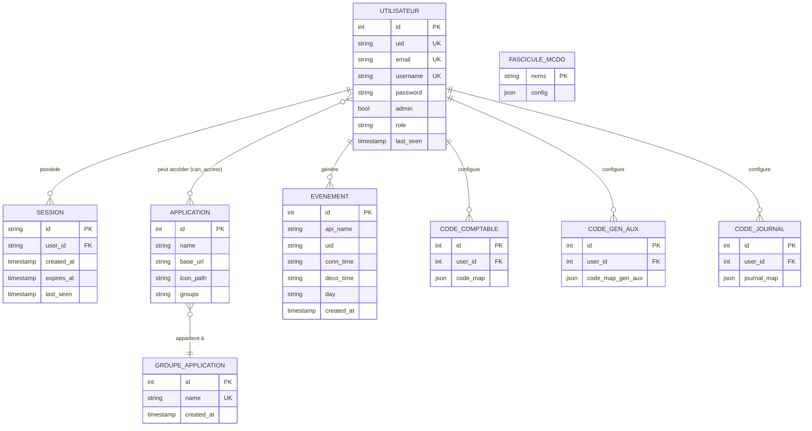

# Modélisation des données — MCD / MLD / MPD

> Source : code réel du projet (PostgreSQL).
> Fichiers analysés :
> - `backend/internal/db/postgres.go` (CREATE TABLE)
> - `backend/internal/services/admin/repository/repository.go`
> - `backend/internal/services/auth/repository/repository.go`
> - `backend/internal/services/Macdos/repository/repository.go`
> - `api/schemas/model.py` (SQLAlchemy)

---

## 0. Vérification code vs Référentiel TP CDA (CP7)

Critères CP7 (« Concevoir et mettre en place une base de données relationnelle ») et leur couverture par le code :

| Critère CP7 | Couvert par le code | Preuve |
|---|---|---|
| Schéma conceptuel respectant les règles du relationnel | Partiel | Voir §1. Une association N:N (`user_application_permissions`) est correctement décomposée en table de jonction. Une autre (`applications.groups` ↔ `application_groups`) est dénormalisée en `TEXT` simple → **anomalie** |
| Schéma physique conforme aux besoins du cahier des charges | Oui | `backend/internal/db/postgres.go` — fonction `InitSchema` |
| Règles de nommage respectées | Partiel | Snake_case côté Postgres OK. **Anomalie** : table `"Fascicule McDo"` contient un espace et une majuscule (référencée dans `Macdos/repository/repository.go:14`) |
| Intégrité, sécurité, confidentialité | Partiel | FK déclarées sur `sessions.user_id` et `user_application_permissions`. **Anomalies** : aucune FK sur `events.uid`, ni sur les tables Python (`user_code_maps`, `user_code_maps_gen_aux`, `code_journal`) qui pointent vers `users.id` au lieu de `users.uid` — incohérent avec les autres FK |
| Création d'un jeu d'essai dans une base de test, restauration | Couvert par les fixtures de test Go (`auth/repository_test.go`, `admin/repository_test.go`) — utilise `sqlmock` |
| Script de création | Oui | `InitSchema` — voir §3 (MPD) |

### Anomalies détectées entre le code et la documentation existante (`dossier_projet.md`)

| Élément documenté | Réel dans le code | Impact |
|---|---|---|
| `utilisateurs.uid VARCHAR PK` | `users.id SERIAL PK` + `users.uid TEXT UNIQUE` | Doc obsolète |
| `sessions.token VARCHAR NOT NULL` | Pas de colonne `token` — l'`id` (TEXT) joue ce rôle | Doc inexacte |
| `evenements.details JSONB` | `events.api_name / conn_time / deco_time / day TEXT` | Schéma différent |
| `evenements.date TIMESTAMP` | `events.created_at TIMESTAMPTZ` + 3 colonnes textuelles `conn_time/deco_time/day` | Type & sémantique différents |
| Table `config_mcdo (nom_config, donnees JSONB)` | Table `"Fascicule McDo" (noms TEXT, config TEXT/JSON)` | Nom et types différents |
| FK `evenements.uid_utilisateur → utilisateurs(uid)` | Aucune FK déclarée sur `events.uid` | Intégrité référentielle non garantie |
| Tables `codes_comptables / codes_journal / codes_gen_aux` avec FK vers `utilisateurs(uid)` | `user_code_maps / user_code_maps_gen_aux / code_journal` avec FK vers `users.id` (entier) | Type de FK incohérent avec le reste |
| `users.entreprise` (déclaré dans `models.User` Go) | **Absent** de `CREATE TABLE users` | Champ struct mort |

**Conclusion** : le code couvre les compétences CP7 mais comporte des écarts vis-à-vis de la doc existante et quelques infractions aux règles de nommage / d'intégrité. Les schémas ci-dessous reflètent **le code réel**, pas la doc obsolète.

---

## 1. MCD (Modèle Conceptuel de Données)

### 1.1 Représentation Mermaid (vue d'ensemble)



### 1.2 Notation Merise (à reproduire dans Looping)

**Entités** — l'identifiant est préfixé par `#` :

```
UTILISATEUR
  #id_utilisateur : Entier (auto)
   uid             : Chaîne (unique)
   email           : Chaîne (unique)
   username        : Chaîne (unique)
   mot_de_passe    : Chaîne (haché)
   admin           : Booléen
   role            : Chaîne
   derniere_connexion : Date/Heure

SESSION
  #id_session     : Chaîne
   cree_le        : Date/Heure
   expire_le      : Date/Heure
   vu_le          : Date/Heure

APPLICATION
  #id_application : Entier (auto)
   nom            : Chaîne
   base_url       : Chaîne
   chemin_icone   : Chaîne

GROUPE_APPLICATION
  #id_groupe      : Entier (auto)
   nom            : Chaîne (unique)
   cree_le        : Date/Heure

EVENEMENT
  #id_evenement   : Entier (auto)
   nom_api        : Chaîne
   heure_connexion: Chaîne
   heure_deconnexion : Chaîne
   jour           : Chaîne
   cree_le        : Date/Heure

CODE_COMPTABLE
  #id_code_c      : Entier (auto)
   mapping        : JSON

CODE_GEN_AUX
  #id_code_g      : Entier (auto)
   mapping        : JSON

CODE_JOURNAL
  #id_code_j      : Entier (auto)
   mapping        : JSON

FASCICULE_MCDO         (table « technique » isolée, non liée)
  #noms           : Chaîne
   config         : JSON
```

**Associations** avec cardinalités (notation min,max) :

| Association | Entité A | Cardinalité A | Entité B | Cardinalité B | Attribut porté |
|---|---|---|---|---|---|
| POSSEDER       | UTILISATEUR        | 1,1 | SESSION        | 0,N | — |
| ACCEDER        | UTILISATEUR        | 0,N | APPLICATION    | 0,N | `peut_acceder` (booléen) |
| APPARTENIR     | APPLICATION        | 0,1 | GROUPE_APPLICATION | 0,N | — |
| GENERER        | UTILISATEUR        | 1,1 | EVENEMENT      | 0,N | — |
| CONFIGURER_CC  | UTILISATEUR        | 1,1 | CODE_COMPTABLE | 0,N | — |
| CONFIGURER_CG  | UTILISATEUR        | 1,1 | CODE_GEN_AUX   | 0,N | — |
| CONFIGURER_CJ  | UTILISATEUR        | 1,1 | CODE_JOURNAL   | 0,N | — |

> **Remarque** : l'association `APPARTENIR` est dénormalisée dans le code (la colonne `applications.groups` est un `TEXT` libre, pas une FK). Le MCD conceptuel la modélise correctement ; le MPD (§3) reflète la réalité physique.
>
> **Remarque** : l'association `GENERER` n'a pas de contrainte d'intégrité référentielle dans le code (pas de FK sur `events.uid`). Le MCD la modélise au niveau métier.

---

## 2. MLD (Modèle Logique de Données)

Notation textuelle Merise — `#` = clé primaire, `*` = clé étrangère.

```
utilisateur (#id_utilisateur, uid [UNIQUE], email [UNIQUE], username [UNIQUE],
             mot_de_passe, admin, role, derniere_connexion)

session (#id_session, *user_id → utilisateur(uid), cree_le, expire_le, vu_le)

application (#id_application, nom, base_url, chemin_icone, groupe_libelle)
  -- groupe_libelle = libellé textuel (référence faible vers groupe_application.nom)

groupe_application (#id_groupe, nom [UNIQUE], cree_le)

acceder (#*user_id → utilisateur(uid),
         #*application_id → application(id_application),
         peut_acceder)

evenement (#id_evenement, nom_api, uid [pas de FK déclarée], heure_connexion,
           heure_deconnexion, jour, cree_le)

code_comptable (#id_code_c, *user_id → utilisateur(id_utilisateur), mapping)
code_gen_aux   (#id_code_g, *user_id → utilisateur(id_utilisateur), mapping)
code_journal   (#id_code_j, *user_id → utilisateur(id_utilisateur), mapping)

fascicule_mcdo (#noms, config)
```

> **Attention** : `acceder` (table `user_application_permissions` dans le code) référence `utilisateur(uid)` côté user, mais `application(id_application)` côté app — cohérent avec le code.
> Les tables `code_*` côté Python pointent vers `utilisateur.id` (entier), pas `uid` — c'est une incohérence du code mais c'est ce qui est implémenté.

---

## 3. MPD (Modèle Physique de Données — PostgreSQL)

Script SQL exécutable, reflet exact de `backend/internal/db/postgres.go` + `api/schemas/model.py`.

```sql
-- =====================================================================
-- MPD — Intranet/Portail Cabinet Martini
-- SGBD : PostgreSQL (>= 12)
-- =====================================================================

-- 1. Utilisateurs ------------------------------------------------------
CREATE TABLE users (
    id          SERIAL      PRIMARY KEY,
    uid         TEXT        UNIQUE NOT NULL,
    email       TEXT        UNIQUE NOT NULL,
    username    TEXT        UNIQUE NOT NULL,
    password    TEXT        NOT NULL,           -- haché (bcrypt)
    admin       BOOLEAN     NOT NULL DEFAULT FALSE,
    role        TEXT        DEFAULT 'user',
    last_seen   TIMESTAMP   DEFAULT CURRENT_TIMESTAMP
);

-- 2. Sessions ----------------------------------------------------------
CREATE TABLE sessions (
    id          TEXT        PRIMARY KEY,        -- jeton de session
    user_id     TEXT        NOT NULL,
    created_at  TIMESTAMP   NOT NULL,
    expires_at  TIMESTAMP   NOT NULL,
    last_seen   TIMESTAMP,
    CONSTRAINT fk_sessions_user
        FOREIGN KEY (user_id) REFERENCES users(uid)
);
CREATE INDEX idx_sessions_expires ON sessions(expires_at);

-- 3. Groupes d'applications -------------------------------------------
CREATE TABLE application_groups (
    id          SERIAL      PRIMARY KEY,
    name        TEXT        UNIQUE NOT NULL,
    created_at  TIMESTAMP   DEFAULT CURRENT_TIMESTAMP
);
INSERT INTO application_groups (name) VALUES ('Compta') ON CONFLICT DO NOTHING;
INSERT INTO application_groups (name) VALUES ('Social') ON CONFLICT DO NOTHING;

-- 4. Applications ------------------------------------------------------
CREATE TABLE applications (
    id          SERIAL      PRIMARY KEY,
    name        TEXT        NOT NULL,
    base_url    TEXT        NOT NULL,
    icon_path   TEXT,
    groups      TEXT                              -- libellé du groupe (référence faible)
);

-- 5. Permissions utilisateur ↔ application (table de jonction N:N) ----
CREATE TABLE user_application_permissions (
    id              SERIAL      PRIMARY KEY,
    user_id         TEXT        NOT NULL,
    application_id  INTEGER     NOT NULL,
    can_access      BOOLEAN     DEFAULT FALSE,
    CONSTRAINT fk_uap_user
        FOREIGN KEY (user_id) REFERENCES users(uid),
    CONSTRAINT fk_uap_app
        FOREIGN KEY (application_id) REFERENCES applications(id),
    UNIQUE (user_id, application_id)
);

-- 6. Événements d'analytics -------------------------------------------
CREATE TABLE events (
    id          SERIAL          PRIMARY KEY,
    api_name    TEXT,
    uid         TEXT            NOT NULL,        -- pas de FK déclarée (cf. anomalie)
    conn_time   TEXT            NOT NULL,
    deco_time   TEXT            NOT NULL,
    day         TEXT            NOT NULL,
    created_at  TIMESTAMPTZ     DEFAULT NOW()
);
CREATE INDEX idx_events_created ON events(created_at);

-- 7. Codes comptables (gérés côté API Python / SQLAlchemy) -----------
CREATE TABLE user_code_maps (
    id          SERIAL      PRIMARY KEY,
    user_id     INTEGER     NOT NULL,
    code_map    JSON        NOT NULL DEFAULT '{}',
    CONSTRAINT fk_ucm_user FOREIGN KEY (user_id) REFERENCES users(id)
);

CREATE TABLE user_code_maps_gen_aux (
    id                  SERIAL      PRIMARY KEY,
    user_id             INTEGER     NOT NULL,
    code_map_gen_aux    JSON        NOT NULL,
    CONSTRAINT fk_ucmga_user FOREIGN KEY (user_id) REFERENCES users(id)
);

CREATE TABLE code_journal (
    id          SERIAL      PRIMARY KEY,
    user_id     INTEGER     NOT NULL,
    journal_map JSON        NOT NULL,
    CONSTRAINT fk_cj_user FOREIGN KEY (user_id) REFERENCES users(id)
);

-- 8. Configuration métier McDo (table existante, non créée par InitSchema)
CREATE TABLE "Fascicule McDo" (
    noms    TEXT    CONSTRAINT unique_noms UNIQUE,
    config  TEXT                          -- JSON sérialisé
);
```

---

## 4. À reporter dans Looping

Ordre conseillé pour saisir le projet dans Looping :

1. **Créer les entités** (§1.2) avec leurs attributs ; cocher l'attribut identifiant.
2. **Créer les associations** binaires (tableau §1.2) et placer les cardinalités.
3. Pour l'association porteuse `ACCEDER`, ajouter l'attribut `peut_acceder` (booléen).
4. Générer le MLD via Looping (menu Modèles → Générer le MLD) — il doit produire un schéma proche du §2.
5. Générer le script SQL — comparer au MPD §3 et ajuster les types (`SERIAL`, `TIMESTAMPTZ`, `JSON`).
6. La table `FASCICULE_MCDO` peut être ajoutée séparément (entité isolée, sans association).
