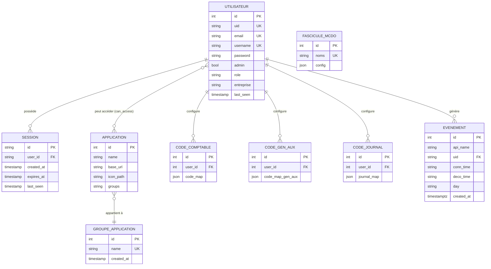

# Modélisation des données — MCD / MLD / MPD

> Source : code réel du projet (PostgreSQL).
> Fichiers analysés :
> - `backend/internal/db/postgres.go` (CREATE TABLE + `InitSchema`)
> - `backend/internal/db/migrations/001_fix_anomalies.sql` (correctifs)
> - `backend/internal/db/migrations/002_add_fascicule_pk.sql` (clé primaire fascicule)
> - `backend/internal/services/admin/repository/repository.go`
> - `backend/internal/services/auth/repository/repository.go`
> - `backend/internal/services/Macdos/repository/repository.go`
> - `api/schemas/model.py` (SQLAlchemy)
>
> **Mise à jour 2026-05-22** : la migration `001_fix_anomalies.sql` a corrigé la
> plupart des anomalies relevées dans la version précédente de ce document
> (colonne `entreprise`, FK `events.uid`, renommage `fascicule_mcdo`, FK sur les
> tables JSON Python). Les schémas ci-dessous reflètent cet état corrigé.
>
> **Mise à jour 2026-06-11** : ajout d'une clé primaire de substitution `id` sur
> `fascicule_mcdo` (migration `002_add_fascicule_pk.sql`). Le périmètre présenté
> est par ailleurs précisé ci-dessous.

> ### Périmètre présenté
>
> Les modèles **conceptuel (§1)**, **logique (§2)** et **physique (§3)** ci-dessous
> couvrent l'ensemble du système : le **hub** (auth, catalogue d'applications,
> permissions), l'**API métier Python** (codes comptables, configuration McDo) et
> l'**analytics** — table `events` et service `backend/internal/services/analyse`.

---

## 0. Vérification code vs Référentiel TP CDA (CP7)

Critères CP7 (« Concevoir et mettre en place une base de données relationnelle ») et leur couverture par le code :

| Critère CP7 | Couvert par le code | Preuve |
|---|---|---|
| Schéma conceptuel respectant les règles du relationnel | Oui | Voir §1. L'association N:N (`user_application_permissions`) est correctement décomposée en table de jonction. La liaison `applications.groups` ↔ `application_groups` reste un `TEXT` (choix de dénormalisation assumé, cf. §3) |
| Schéma physique conforme aux besoins du cahier des charges | Oui | `backend/internal/db/postgres.go` — fonction `InitSchema` |
| Règles de nommage respectées | Oui | Snake_case côté Postgres. La table autrefois `"Fascicule McDo"` a été renommée `fascicule_mcdo` (migration 001, §3) et est désormais créée par `InitSchema` ; référencée dans `Macdos/repository/repository.go` |
| Intégrité, sécurité, confidentialité | Oui | FK déclarées sur `sessions.user_id`, `user_application_permissions`, `events.uid` (`ON DELETE CASCADE`) et les tables Python (`user_code_maps`, `user_code_maps_gen_aux`, `code_journal`) via la migration 001 |
| Création d'un jeu d'essai dans une base de test, restauration | Couvert par les fixtures de test Go (`auth/repository_test.go`, `admin/repository_test.go`) — utilise `sqlmock` |
| Script de création | Oui | `InitSchema` + `migrations/001_fix_anomalies.sql` — voir §3 (MPD) |

### Anomalies détectées (et leur correctif)

La version précédente de ce document relevait des écarts entre le code et la doc
historique (`dossier_projet.md`). La migration `001_fix_anomalies.sql` (2026-05-22)
a corrigé la majorité d'entre eux. État actuel :

| Élément historique | Réel dans le code (état actuel) | Statut |
|---|---|---|
| `utilisateurs.uid VARCHAR PK` | `users.id SERIAL PK` + `users.uid TEXT UNIQUE` | ⚠️ Doc historique obsolète (code inchangé) |
| `sessions.token VARCHAR NOT NULL` | Pas de colonne `token` — l'`id` (TEXT) joue ce rôle | ⚠️ Doc historique inexacte |
| `evenements.details JSONB` | `events.api_name / conn_time / deco_time / day TEXT` | ⚠️ Schéma différent (par conception) |
| `evenements.date TIMESTAMP` | `events.created_at TIMESTAMPTZ` + colonnes textuelles `conn_time/deco_time/day` | ⚠️ Type & sémantique différents (par conception) |
| Table `config_mcdo (nom_config, donnees JSONB)` | Table `fascicule_mcdo (noms TEXT, config TEXT/JSON)` | ✅ Renommée snake_case, créée par `InitSchema` |
| FK `events.uid → users(uid)` absente | FK `fk_events_user` ajoutée `ON DELETE CASCADE` | ✅ Corrigé (migration 001 §2) |
| Tables JSON Python sans FK matérialisée | FK `fk_user_code_maps_user` / `_gen_aux_user` / `fk_code_journal_user` vers `users(id)` | ✅ Corrigé (migration 001 §4) |
| `users.entreprise` champ struct mort | Colonne `entreprise TEXT` ajoutée à `CREATE TABLE users` + `ALTER ... IF NOT EXISTS` | ✅ Corrigé (migration 001 §1) |

> **Note sur les FK des tables Python** : elles pointent vers `users(id)` (entier),
> alors que les FK Go pointent vers `users(uid)` (texte). Ce choix est conservé
> volontairement car la couche SQLAlchemy (`api/schemas/model.py`) joint sur `users.id`.

**Conclusion** : le code couvre les compétences CP7 ; les anomalies d'intégrité et
de nommage ont été corrigées par la migration 001. Les schémas ci-dessous reflètent
**le code réel à jour**.

---

## 1. MCD (Modèle Conceptuel de Données)

### 1.1 Représentation Mermaid (vue d'ensemble)


```mermaid
erDiagram
    UTILISATEUR ||--o{ SESSION : "possède"
    UTILISATEUR }o--o{ APPLICATION : "peut accéder (can_access)"
    APPLICATION }o--|| GROUPE_APPLICATION : "appartient à"
    UTILISATEUR ||--o{ CODE_COMPTABLE : "configure"
    UTILISATEUR ||--o{ CODE_GEN_AUX : "configure"
    UTILISATEUR ||--o{ CODE_JOURNAL : "configure"
    UTILISATEUR ||--o{ EVENEMENT : "génère"

    UTILISATEUR {
        int id PK
        string uid UK
        string email UK
        string username UK
        string password
        bool admin
        string role
        string entreprise
        timestamp last_seen
    }
    SESSION {
        string id PK
        string user_id FK
        timestamp created_at
        timestamp expires_at
        timestamp last_seen
    }
    APPLICATION {
        int id PK
        string name
        string base_url
        string icon_path
        string groups
    }
    GROUPE_APPLICATION {
        int id PK
        string name UK
        timestamp created_at
    }
    CODE_COMPTABLE {
        int id PK
        int user_id FK
        json code_map
    }
    CODE_GEN_AUX {
        int id PK
        int user_id FK
        json code_map_gen_aux
    }
    CODE_JOURNAL {
        int id PK
        int user_id FK
        json journal_map
    }
    EVENEMENT {
        int id PK
        string api_name
        string uid FK
        string conn_time
        string deco_time
        string day
        timestamptz created_at
    }
    FASCICULE_MCDO {
        int id PK
        string noms UK
        json config
    }
```

### 1.2 Notation Merise (à reproduire dans Looping)

**Entités** — l'identifiant est préfixé par `#` :

```
UTILISATEUR
  #id_utilisateur : Entier (auto)
   uid             : Chaîne (unique)
   email           : Chaîne (unique)
   username        : Chaîne (unique)
   mot_de_passe    : Chaîne (haché)
   admin           : Booléen
   role            : Chaîne
   entreprise      : Chaîne
   derniere_connexion : Date/Heure

SESSION
  #id_session     : Chaîne
   cree_le        : Date/Heure
   expire_le      : Date/Heure
   vu_le          : Date/Heure

APPLICATION
  #id_application : Entier (auto)
   nom            : Chaîne
   base_url       : Chaîne
   chemin_icone   : Chaîne

GROUPE_APPLICATION
  #id_groupe      : Entier (auto)
   nom            : Chaîne (unique)
   cree_le        : Date/Heure

CODE_COMPTABLE
  #id_code_c      : Entier (auto)
   mapping        : JSON

CODE_GEN_AUX
  #id_code_g      : Entier (auto)
   mapping        : JSON

CODE_JOURNAL
  #id_code_j      : Entier (auto)
   mapping        : JSON

EVENEMENT
  #id_evenement   : Entier (auto)
   api_name       : Chaîne
   heure_conn     : Chaîne
   heure_deco     : Chaîne
   jour           : Chaîne
   cree_le        : Date/Heure (avec fuseau)

FASCICULE_MCDO         (table « technique » isolée, non liée)
  #id_fascicule   : Entier (auto)
   noms           : Chaîne (unique)
   config         : JSON
```

**Associations** avec cardinalités (notation min,max) :

| Association | Entité A | Cardinalité A | Entité B | Cardinalité B | Attribut porté |
|---|---|---|---|---|---|
| POSSEDER       | UTILISATEUR        | 1,1 | SESSION        | 0,N | — |
| ACCEDER        | UTILISATEUR        | 0,N | APPLICATION    | 0,N | `peut_acceder` (booléen) |
| APPARTENIR     | APPLICATION        | 0,1 | GROUPE_APPLICATION | 0,N | — |
| CONFIGURER_CC  | UTILISATEUR        | 1,1 | CODE_COMPTABLE | 0,N | — |
| CONFIGURER_CG  | UTILISATEUR        | 1,1 | CODE_GEN_AUX   | 0,N | — |
| CONFIGURER_CJ  | UTILISATEUR        | 1,1 | CODE_JOURNAL   | 0,N | — |
| GENERER        | UTILISATEUR        | 1,1 | EVENEMENT      | 0,N | — |

> **Remarque** : l'association `APPARTENIR` est dénormalisée dans le code (la colonne `applications.groups` est un `TEXT` libre, pas une FK). Le MCD conceptuel la modélise correctement ; le MPD (§3) reflète la réalité physique.
>
> **Remarque** : l'entité `EVENEMENT` (table `events`) porte l'analytics ; sa FK `uid` référence `utilisateur(uid)` avec `ON DELETE CASCADE`.

---

## 2. MLD (Modèle Logique de Données)

Notation textuelle Merise — `#` = clé primaire, `*` = clé étrangère.

```
utilisateur (#id_utilisateur, uid [UNIQUE], email [UNIQUE], username [UNIQUE],
             mot_de_passe, admin, role, entreprise, derniere_connexion)

session (#id_session, *user_id → utilisateur(uid), cree_le, expire_le, vu_le)

application (#id_application, nom, base_url, chemin_icone, groupe_libelle)
  -- groupe_libelle = libellé textuel (référence faible vers groupe_application.nom)

groupe_application (#id_groupe, nom [UNIQUE], cree_le)

acceder (#*user_id → utilisateur(uid),
         #*application_id → application(id_application),
         peut_acceder)

code_comptable (#id_code_c, *user_id → utilisateur(id_utilisateur), mapping)
code_gen_aux   (#id_code_g, *user_id → utilisateur(id_utilisateur), mapping)
code_journal   (#id_code_j, *user_id → utilisateur(id_utilisateur), mapping)

evenement (#id_evenement, api_name, *uid → utilisateur(uid), heure_conn, heure_deco, jour, cree_le)

fascicule_mcdo (#id_fascicule, noms [UNIQUE], config)
```

> **Attention** : `acceder` (table `user_application_permissions` dans le code) référence `utilisateur(uid)` côté user, mais `application(id_application)` côté app — cohérent avec le code.
> Les tables `code_*` côté Python pointent vers `utilisateur.id` (entier), pas `uid`. Ces FK sont désormais matérialisées en base (migration 001), avec `ON DELETE CASCADE`.

---

## 3. MPD (Modèle Physique de Données — PostgreSQL)

Script SQL exécutable, reflet exact de `backend/internal/db/postgres.go` (`InitSchema`),
`backend/internal/db/migrations/001_fix_anomalies.sql`,
`backend/internal/db/migrations/002_add_fascicule_pk.sql` et `api/schemas/model.py`.

> Ce MPD documente le **schéma physique réellement déployé** (code complet),
> analytics incluse : la table `events` figure au MCD (§1), au MLD (§2) et ci-dessous.

```sql
-- =====================================================================
-- MPD — Intranet/Portail Cabinet Martini
-- SGBD : PostgreSQL (>= 12)
-- =====================================================================

-- 1. Utilisateurs ------------------------------------------------------
CREATE TABLE IF NOT EXISTS users (
    id          SERIAL      PRIMARY KEY,
    uid         TEXT        UNIQUE NOT NULL,
    email       TEXT        UNIQUE NOT NULL,
    username    TEXT        UNIQUE NOT NULL,
    password    TEXT        NOT NULL,           -- haché (bcrypt)
    admin       BOOLEAN     NOT NULL,
    role        TEXT        DEFAULT 'user',
    entreprise  TEXT,                            -- ajout migration 001
    last_seen   TIMESTAMP   DEFAULT CURRENT_TIMESTAMP
);
-- ALTER idempotents appliqués par InitSchema (anciennes bases) :
--   ALTER TABLE users ADD COLUMN IF NOT EXISTS last_seen TIMESTAMP DEFAULT CURRENT_TIMESTAMP;
--   ALTER TABLE users ADD COLUMN IF NOT EXISTS entreprise TEXT;

-- 2. Sessions ----------------------------------------------------------
CREATE TABLE IF NOT EXISTS sessions (
    id          TEXT        PRIMARY KEY,        -- jeton de session
    user_id     TEXT        NOT NULL,
    created_at  TIMESTAMP   NOT NULL,
    expires_at  TIMESTAMP   NOT NULL,
    last_seen   TIMESTAMP,
    FOREIGN KEY (user_id) REFERENCES users(uid)
);

-- 3. Groupes d'applications -------------------------------------------
CREATE TABLE IF NOT EXISTS application_groups (
    id          SERIAL      PRIMARY KEY,
    name        TEXT        UNIQUE NOT NULL,
    created_at  TIMESTAMP   DEFAULT CURRENT_TIMESTAMP
);
INSERT INTO application_groups (name) VALUES ('Compta') ON CONFLICT (name) DO NOTHING;
INSERT INTO application_groups (name) VALUES ('Social') ON CONFLICT (name) DO NOTHING;

-- 4. Applications ------------------------------------------------------
CREATE TABLE IF NOT EXISTS applications (
    id          SERIAL      PRIMARY KEY,
    name        TEXT        NOT NULL,
    base_url    TEXT        NOT NULL,
    icon_path   TEXT,
    groups      TEXT                              -- libellé du groupe (référence faible)
);

-- 5. Permissions utilisateur ↔ application (table de jonction N:N) ----
CREATE TABLE IF NOT EXISTS user_application_permissions (
    id              SERIAL      PRIMARY KEY,
    user_id         TEXT        NOT NULL,
    application_id  INTEGER     NOT NULL,
    can_access      BOOLEAN     DEFAULT FALSE,
    FOREIGN KEY (user_id) REFERENCES users(uid),
    FOREIGN KEY (application_id) REFERENCES applications(id),
    UNIQUE (user_id, application_id)
);

-- 6. Événements d'analytics (service Go `analyse`) --------------------
CREATE TABLE IF NOT EXISTS events (
    id          SERIAL          PRIMARY KEY,
    api_name    TEXT,
    uid         TEXT            NOT NULL REFERENCES users(uid) ON DELETE CASCADE,
    conn_time   TEXT            NOT NULL,
    deco_time   TEXT            NOT NULL,
    day         TEXT            NOT NULL,
    created_at  TIMESTAMPTZ     DEFAULT NOW()
);
-- Contrainte nommée équivalente (bases existantes, migration 001) :
--   ALTER TABLE events ADD CONSTRAINT fk_events_user
--       FOREIGN KEY (uid) REFERENCES users(uid) ON DELETE CASCADE;

-- 7. Codes comptables (gérés côté API Python / SQLAlchemy) -----------
--    FK matérialisées par la migration 001 (vers users.id, entier).
CREATE TABLE IF NOT EXISTS user_code_maps (
    id          SERIAL      PRIMARY KEY,
    user_id     INTEGER     NOT NULL,
    code_map    JSON        NOT NULL DEFAULT '{}',
    CONSTRAINT fk_user_code_maps_user
        FOREIGN KEY (user_id) REFERENCES users(id) ON DELETE CASCADE
);

CREATE TABLE IF NOT EXISTS user_code_maps_gen_aux (
    id                  SERIAL      PRIMARY KEY,
    user_id             INTEGER     NOT NULL,
    code_map_gen_aux    JSON        NOT NULL,
    CONSTRAINT fk_user_code_maps_gen_aux_user
        FOREIGN KEY (user_id) REFERENCES users(id) ON DELETE CASCADE
);

CREATE TABLE IF NOT EXISTS code_journal (
    id          SERIAL      PRIMARY KEY,
    user_id     INTEGER     NOT NULL,
    journal_map JSON        NOT NULL,
    CONSTRAINT fk_code_journal_user
        FOREIGN KEY (user_id) REFERENCES users(id) ON DELETE CASCADE
);

-- 8. Configuration métier McDo ---------------------------------------
--    Renommée "Fascicule McDo" -> fascicule_mcdo (migration 001),
--    désormais créée par InitSchema.
CREATE TABLE IF NOT EXISTS fascicule_mcdo (
    id      SERIAL  PRIMARY KEY,           -- ajout migration 002
    noms    TEXT    CONSTRAINT uq_fascicule_mcdo_noms UNIQUE,
    config  TEXT                          -- JSON sérialisé
);
```

---

## 4. À reporter dans Looping

Ordre conseillé pour saisir le projet dans Looping :

1. **Créer les entités** (§1.2) avec leurs attributs ; cocher l'attribut identifiant.
2. **Créer les associations** binaires (tableau §1.2) et placer les cardinalités.
3. Pour l'association porteuse `ACCEDER`, ajouter l'attribut `peut_acceder` (booléen).
4. Générer le MLD via Looping (menu Modèles → Générer le MLD) — il doit produire un schéma proche du §2.
5. Générer le script SQL — comparer au MPD §3 et ajuster les types (`SERIAL`, `TIMESTAMPTZ`, `JSON`).
6. La table `FASCICULE_MCDO` peut être ajoutée séparément (entité isolée, sans association).
